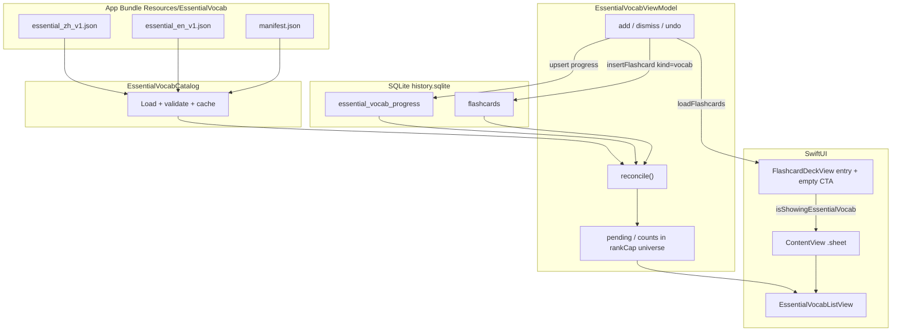
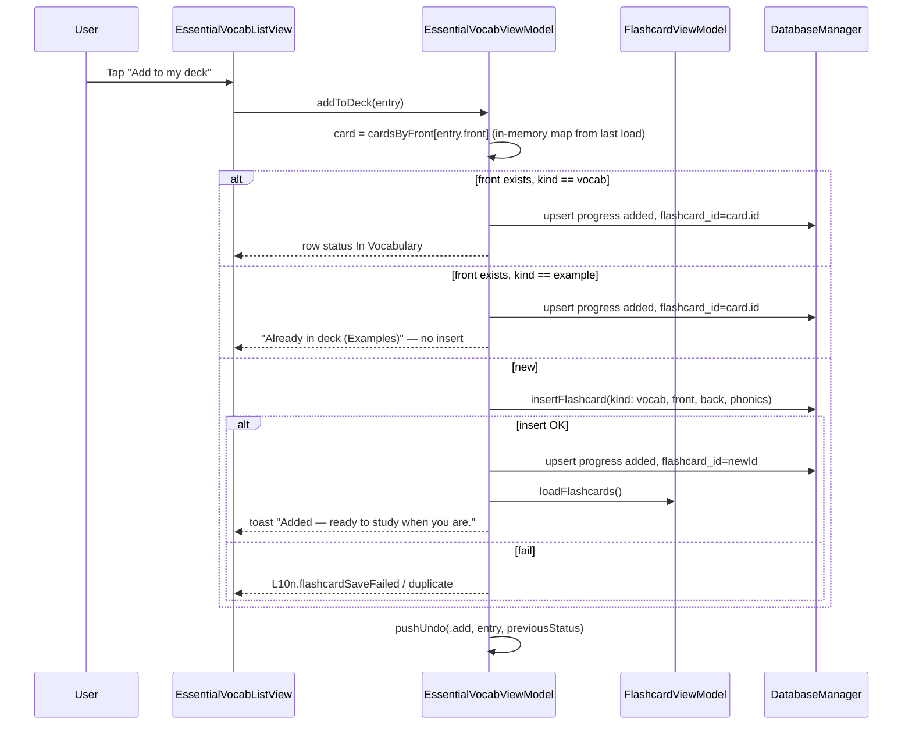

# Design: Essential Common Vocabulary Onboarding List

| Field | Value |
|-------|--------|
| **Status** | Implemented (core + Top 500 catalogs; personal-use content, no legal gate) |
| **Author** | — |
| **Date** | 2026-07-12 |
| **App** | DeveloperChatbot (`chatbot-app/`, SwiftUI, macOS/iOS) |
| **Related** | `/flashcard_system.md`, `docs/design-library-vs-gym.md` |

---

## Overview

New and existing learners often open an empty Vocabulary library with no curated starting point. This feature ships a **bundled, frequency-ranked essential word list** (Chinese and English) that users can triage at their own pace:

1. **Add to my deck** → create a `kind = vocab` flashcard (FSRS library; never Examples).
2. **I already know this** → dismiss from the essential pending list without creating a card.

Progress is durable across launches. The essential list is **not** a third deck kind and is **not** multi-deck product — it is a **onboarding / enrichment funnel** into the existing Vocabulary library. Offline-first: lists ship in the app bundle as versioned JSON.

**v1 is implementable without product pings:** product defaults are locked in [v1 Decision Table](#v1-decision-table-locked) and [Key Decisions](#key-decisions). Algorithms for load, reconcile, batching, and progress metrics are fully specified under [Algorithms](#algorithms-implementable-pseudocode).

---

## Background & Motivation

### Current state

| Area | Reality (code) |
|------|----------------|
| Library | `FlashcardKind.vocab` — user-curated headwords |
| Gym | `FlashcardKind.example` — saved AI practice sentences |
| Create | Chat selection → `FlashcardCreateSheet`, or manual draft via `FlashcardViewModel` |
| Empty vocab | `FlashcardDeckView` empty state: “No flashcards yet” + chat-select hint (`L10n.noFlashcards` / `noFlashcardsHint`) |
| Uniqueness | Global `UNIQUE` index on `flashcards.front` (`idx_flashcards_front`) |
| UI language | `AppLanguage` `.en` / `.zh` via `LanguageToggle` — **UI** language, not explicit learning target |
| STT language | Separate `STTLanguage` (`chinese` \| `english` \| `auto`) — not used for list default in v1 |
| Pinyin | `String+Pinyin` / `FlashcardTranslator.autoFillPhonics` for Chinese fronts |
| Sheets | Hosted from `ContentView` via `@Published` flags on view models (create / review / practice / speaking) |
| Onboarding | **None** — no first-run flow beyond defaults for prompts/endpoints |
| Package | `Package.swift` executable has **no** `resources:`; test target depends only on `FSRS` |
| Xcode gen | `create_xcodeproj.py` emits Swift **Sources** only — no Copy Bundle Resources phase |

Mental model already in product:

> **Vocabulary is the library. Examples are the gym.**

Essential words that are **added** must land in the library (`vocab`). Dismissed words must **not** create cards.

### Pain points

1. Empty Vocabulary has no scaffold for “what should I learn first?”
2. Chat-driven card creation assumes the user already encounters useful words in conversation.
3. Existing users with sparse decks have no progressive path to cover high-frequency gaps.
4. Forcing a quiz/FSRS session on first launch would feel coercive and conflicts with self-paced triage.

---

## Goals & Non-Goals

### Goals

1. Ship curated **most common** word lists for **Chinese** and **English** learning.
2. Let users **progressively triage** each entry: add as `vocab` | dismiss as known | leave pending.
3. Persist progress offline; resume later without losing place.
4. Integrate cleanly with `FlashcardViewModel`, `DatabaseManager`, `FlashcardDeckView`, `L10n`, and the unique-`front` constraint.
5. Offer discovery for **empty-deck / new users** (primary CTA) and an **always-available** compact deck entry point.
6. Offline-first bundled lists with versioning and a license-safe authoring pipeline.

### Non-goals

- Named multi-deck / deck manager (rejected for library/gym; still rejected here).
- Forced quiz or FSRS review of essential words on first launch.
- Creating `example` cards from essential list actions.
- Server-synced progress or accounts.
- Full dictionary, POS tagging as a product surface, or graded reader.
- Auto-adding the entire list (or Top 100) to the deck.
- Replacing chat-based card creation.
- **User-provided / importable custom lists** (v1).
- **“Add but suspend”** FSRS scheduling (new cards behave like manual create — immediately due).
- Bulk “I know all on this screen”.
- Top 1000 tier UI until content ships (pipeline may prepare ranks; UI hides 1000 in v1).
- Global first-run marketing sheet on every cold start (deferred to PR7, off by default).

---

## v1 Decision Table (locked)

Defaults below ship until product overrides. Implementers must not re-open these as blockers.

| ID | Topic | v1 lock |
|----|--------|---------|
| V1 | **List language first open** | Full-screen **picker inside Essential sheet** if `essentialVocab.listLanguage` unset: “What are you learning?” → Chinese / English. **No silent heuristic.** Persist choice on select. **Cancel / interactive dismiss** closes the Essential sheet **without** writing `listLanguage`; next open shows picker again. Never show triage UI without a language. |
| V2 | **Global first-run sheet** | **Out of v1 core (PR5).** PR7 may add optional soft prompt, **off by default** until flag enabled. |
| V3 | **Undo** | **In-session undo of last action** (add or dismiss) required in v1 UI (PR4). Stack depth = 1. |
| V4 | **Chinese script** | **Simplified only.** |
| V5 | **English front casing** | **Surface forms** useful as cards: capitalize proper/pronoun forms as in samples (`I`, `OK` if present); otherwise conventional written form. Not forced all-lowercase lemmas. |
| V6 | **Rank cap UI** | **Top 100 / Top 500** only. Default **500**. Hide 1000 until content + later PR. |
| V7 | **Delete vocab card** | Reconcile **re-opens pending** (delete progress row when no card id and no matching front). See D13 + Algorithms. |
| V8 | **Batch model** | **Option A — snapshot batch.** Size **20**. Session-only ordered `batchEntryIds` snapshot of pending ids (not a sliding `prefix` over live pending). **Continue** takes a new snapshot. See [Batch / resume state machine](#batch--resume-state-machine). |
| V9 | **Presentation** | **`.sheet` on both platforms**, hosted from **`ContentView`** (same as create/review). macOS `minWidth: 480, minHeight: 520`. |
| V10 | **Empty CTA** | **Primary** bordered-prominent button when vocab count == 0. |
| V11 | **Header entry** | **Icon-only** `text.book.closed` on narrow/iOS; optional labeled control on macOS wide. See layout rules. |
| V12 | **English content bias** | Frequency-honest list **with** function words tagged `function`; default filter **All**. Optional toggle “Hide function words” in v1.1; samples in PR1 must include **mixed** function + content and document tags. |
| V13 | **Example front collision** | Mark progress `added` (cannot insert vocab); UI copy must **not** say “In Vocabulary” — say “Already in deck (Examples)”. |
| V14 | **FSRS after bulk add** | **Intentional:** new cards are immediately due (same as manual create). Toast: “Added — ready to study when you are.” No throttling. |

---

## Proposed Design

### Product mental model

```
Essential words (catalog)     User progress              Vocabulary library
  bundled JSON          →   pending | added | dismissed  →  kind = vocab flashcards
  ranked by frequency       (SQLite, per list lang)         FSRS as today
```

Triage is **selection**, not study. Study remains “Study Now” on cards already in the library.

### Primary interaction model: **List with row actions**

| Option | Pros | Cons |
|--------|------|------|
| **A. List + Add / Know** (chosen) | Matches `FlashcardDeckView` / `FlashcardDeckRow`; excellent resume & progress; macOS-friendly; scannable bilingual rows | Less “game-like”; large lists need chunking |
| B. Card-stack swipe triage | Fast bulk triage; mobile-native | Poor scan/resume; swipe on macOS is awkward; feels like forced quiz |
| C. Checklist only | Simple | Weak progressive feel; no focused bilingual presentation |

**Decision:** Primary UI is a **scrollable pending list** with per-row actions and a **snapshot batch** of 20 rank-ordered pending ids (Option A — not a live sliding window). See [Batch / resume state machine](#batch--resume-state-machine).

### Architecture



### Sequence: Add to deck



### Sequence: I already know this

```mermaid
sequenceDiagram
  participant U as User
  participant EVM as EssentialVocabViewModel
  participant DB as DatabaseManager

  U->>EVM: dismiss(entry)
  EVM->>DB: upsert progress status=dismissed, flashcard_id=null
  EVM->>EVM: pushUndo(.dismiss, entry, previousStatus)
  Note over EVM: No flashcard insert; row leaves pending
```

---

## UI / UX Plan

### Discovery & entry points

| Entry | When | Behavior |
|-------|------|----------|
| **Empty Vocabulary CTA** | `selectedDeckKind == .vocab` && vocab count == 0 | **Primary** (`.borderedProminent`) button: “Browse essential words” under existing empty copy |
| **Header control** | Vocabulary tab, any deck size | Compact control — see [Header layout](#header-layout-crowded-chrome) |
| **Soft banner** | Deferred PR7 | Vocab count &lt; 20 and pending &gt; 0; dismissible; UserDefaults |
| **Global first-run sheet** | Deferred PR7, **off by default** | Non-blocking offer with Skip |

**Do not** auto-present Essential on every launch. Catalog load failure must **not** set onboarding flags or re-offer PR7 prompts; errors only appear inside the Essential sheet when opened.

### Header layout (crowded chrome)

Verified: `defaultHeaderActions` already packs Practice Select, Practice style picker, Practice with AI, Speak with AI, and Study Now inside a horizontal `ScrollView` (comment notes iPhone clipping risk).

**v1 rules:**

1. Place Essential control **leading** in the header action cluster (before Practice Select), still inside the existing `ScrollView`.
2. **iOS / narrow width:** icon-only button, SF Symbol `text.book.closed`, `.buttonStyle(.bordered)`, accessibility label / help = `L10n.essentialWords(lang)`.
3. **macOS (and wide regular size class):** same icon + short label “Essential” (not the full phrase if space is tight).
4. **Never** place a full-width labeled control between Practice and Study on iPhone.
5. Enabled whenever Vocabulary tab is selected (empty or not). Hidden/disabled on Examples tab.
6. Empty-state **primary CTA** remains the main discovery path for new users; header is the always-available path for existing users.

### Screen structure: Essential words

Presented as a **`.sheet`** from **`ContentView`**, driven by `FlashcardViewModel.isShowingEssentialVocab` (mirrors `isShowingCreateSheet` / practice sheets). Do **not** attach the primary sheet solely on `FlashcardDeckView`.

```
┌──────────────────────────────────────────────────────────────────┐
│  Essential words · Chinese                    [EN list ▾]  [Done]│
│  ████████░░░░░░░░  42 / 500 reviewed · pending 300               │
│  120 added · 80 known · 300 pending   (within Top 500 universe)  │
├──────────────────────────────────────────────────────────────────┤
│  Rank: [ Top 100 | Top 500 ]   Filter: [ Pending ▾ ]   Search…   │
├──────────────────────────────────────────────────────────────────┤
│  #12  的 · de · particle                                         │
│       of / possessive                                            │
│                    [ + Add to my deck ]  [ ✓ I know this ]       │
├──────────────────────────────────────────────────────────────────┤
│  … (snapshot batch: up to 20 fixed entry ids)                    │
│                                                                  │
│  [ Continue ]  ← only when snapshot fully triaged & pending left │
└──────────────────────────────────────────────────────────────────┘
```

**First open (list language unset):**

```
┌──────────────────────────────────────┐
│     What are you learning?           │
│  [ Chinese 常用词 ]  [ English words ] │
│              [ Cancel ]              │
└──────────────────────────────────────┘
```

**Picker dismiss rules (V1):**

| Action | Effect |
|--------|--------|
| Choose Chinese / English | Write `essentialVocab.listLanguage`; `showLanguagePicker = false`; load catalog + progress; `takeBatchSnapshot()` |
| **Cancel** button | Dismiss Essential sheet (`isShowingEssentialVocab = false`); **do not** write `listLanguage` |
| Swipe-down / interactive sheet dismiss | Same as Cancel |
| Re-open Essential later without choice | Picker again; no empty triage list |

#### Row content (bilingual)

| Learning list | Front (learn) | Phonics | Back (gloss) |
|---------------|---------------|---------|--------------|
| Chinese (`zh`) | Simplified Chinese headword | Pinyin (catalog first; fallback `FlashcardTranslator.autoFillPhonics`) | English gloss (internally written) |
| English (`en`) | English surface form | Optional IPA / empty | Chinese gloss (internally written) |

- Front: `.monospaced` / semibold like `FlashcardDeckRow`
- Phonics: italic caption
- Optional POS capsule; frequency rank as subtle “#12”
- Function words: `tags` contains `"function"` — subtle secondary label “function word” optional

#### Row actions by filter / status

| Row state | Primary actions | Notes |
|-----------|-----------------|-------|
| **Pending** | Add to my deck · I know this | Default filter |
| **Dismissed** | Add to my deck · Keep as known | Add promotes to vocab + status `added`; Keep is no-op (stays dismissed) |
| **Added + vocab front** | Badge “In Vocabulary” · **Show in Vocabulary** | Add disabled |
| **Added + example front only** | Badge “Already in deck (Examples)” | Add disabled; no false “Vocabulary” claim |
| **Undo** | Toolbar / snackbar “Undo” after last action | Reverts last add or dismiss in-session |

Context menu (macOS secondary click / long-press): same as row actions. **No** redundant “Skip for now” (leaving pending is the default by not acting).

**Show in Vocabulary:** dismiss Essential sheet → `selectedDeckKind = .vocab` → set `searchText` to entry `front` so the deck list filters to that card (existing search). No scroll-to-id API required.

#### Progress indicators (rankCap universe)

All counts use **active universe** = catalog entries with `rank <= rankCap` for the active list:

| Metric | Definition |
|--------|------------|
| `universeSize` | `count(entries where rank <= rankCap)` |
| `addedInUniverse` | progress `added` whose entry is in universe |
| `dismissedInUniverse` | progress `dismissed` whose entry is in universe |
| `reviewedInUniverse` | `addedInUniverse + dismissedInUniverse` (plus fronts reconciled as added) |
| `pendingInUniverse` | `universeSize - reviewedInUniverse` (entries with no effective reviewed status) |
| **Progress bar** | `reviewedInUniverse / universeSize` |
| **Summary line** | `N added · M known · P pending` within universe |
| **Pass line** | `This pass: K left of B · P pending overall` where `K = snapshotStillPending().count`, `B = batchEntryIds.count` (0 after Continue until snapshot taken) |

Progress rows for `rank > rankCap` remain stored but **do not** affect the bar until the user raises the cap.

**All triaged (universe):** `pendingInUniverse == 0`. If `rankCap == 100` and Top 500 exists, show CTA “Show Top 500”. If `rankCap == 500` and finished, done state.

#### Batch / resume state machine (Option A — snapshot batch)

**Why not `pending.prefix(20)` / `dropFirst(batchOffset)`?**  
A live sliding window **refills** as each row is triaged, so the 20-row list never empties while pending remains. Continue / `batchExhaustedWithMorePending` would be dead. v1 uses a **frozen id snapshot** instead.

| Concept | Rule |
|---------|------|
| Pending set | Entries in universe that are **not** effectively reviewed (no progress `added`/`dismissed` after reconcile) |
| Sort | Ascending `rank` |
| `batchSize` | **20** (constant v1) |
| `batchEntryIds` | **Session-only** ordered `[String]` of entry ids. **Not persisted.** |
| `takeBatchSnapshot()` | `batchEntryIds = Array(pending.prefix(batchSize).map(\.id))` from **current** pending at call time |
| When snapshot is taken | Sheet open after language chosen; after **Continue**; after **rankCap** change; after **list language** change (post-load) |
| Visible pending (filter = pending, no search) | `batchEntryIds` mapped to entries that are **still pending**, order preserved. Rows leave the list when triaged; **next pending ranks do not slide in** until Continue. |
| `batchExhaustedWithMorePending` | `visiblePendingSnapshot.isEmpty && pendingCount > 0` |
| After snapshot fully triaged | If more pending → show **Continue** (and optional “Batch complete”). If no pending → **all-triaged** done state for universe. |
| Continue | User tap only (no auto). Calls `takeBatchSnapshot()` again on remaining pending. |
| Done | Dismisses sheet at any time (mid-batch OK). |
| Search active | Ignore snapshot; show up to **50** matches under current filter. Clear search → restore snapshot view (**do not** retake snapshot). |
| Filter ≠ pending | No snapshot window; matching rows, cap 100 + search. |
| Undo | If undone entry’s id is still in `batchEntryIds` and becomes pending again, it **reappears** in the snapshot list (same pass). Undo does **not** call `takeBatchSnapshot()`. |
| Resume later | SQLite progress only; next open runs `takeBatchSnapshot()` so lowest-rank pending form the new pass. |

#### Empty / done states

| State | UI |
|-------|-----|
| **All triaged (Top 500)** | “You’ve reviewed all essential words in Top 500.” Counts added vs known. CTA: Done / Open Vocabulary |
| **All triaged (Top 100 only)** | “Top 100 complete.” CTA: **Show Top 500** |
| **Catalog load failed** | Error inside sheet only: “Essential word list missing from app bundle.” Log via `onLog`. Do **not** flip onboarding UserDefaults. |
| **Language not chosen** | Picker (V1) |

### Integration points on `FlashcardDeckView`

1. **Empty state:** primary CTA “Browse essential words” → `flashcardVM.isShowingEssentialVocab = true`.
2. **Header:** compact Essential control (icon-first) → same flag.
3. **Examples tab:** no Essential entry.
4. **Presentation host:** `ContentView` observes flag and presents sheet (required).

### Wireframe: empty Vocabulary with CTA

```
┌─────────────────────────────────────────┐
│  Flashcards                             │
│  Vocabulary 0 · 0 due                   │
│  [📖] [Practice…] [Speak] [Study Now]   │  ← 📖 = Essential icon-only
├─────────────────────────────────────────┤
│     Vocabulary | Examples               │
│                                         │
│         □□  (rectangle icon)            │
│      No flashcards yet                  │
│  Select text in a conversation…         │
│                                         │
│   [ Browse essential words ]  ← PRIMARY │
│                                         │
└─────────────────────────────────────────┘
```

### Platform notes

- Colors: `platformControlBackground` / `platformWindowBackground`.
- Sheet: V9 (`.sheet`, ContentView host).
- All strings via `L10n` + `AppLanguage`.

### FSRS due-queue after bulk add (intentional)

Adding many words creates **new** FSRS cards via `FSRSManager.createEmptyCard` — same as `Flashcard` init / manual create — which are typically **immediately due**. This increases Study Now and practice seed availability.

| Policy | Detail |
|--------|--------|
| v1 | **Accept as intentional** — user chose library ownership. |
| UX | Toast after each add or debounced after burst: “Added — ready to study when you are.” |
| Non-goal | Suspended / future-due imports; rate limits. |
| Contrast | Auto-import Top 100 without triage remains rejected (pollutes library with known words). |

---

## Data Model

### 1. Bundled catalog (not SQLite)

**Path:** `chatbot-app/Resources/EssentialVocab/`

| File | Purpose |
|------|---------|
| `essential_zh_v1.json` | Chinese learning list |
| `essential_en_v1.json` | English learning list |
| `manifest.json` | Versions, sizes, licenses |
| ~~`ATTRIBUTION.md`~~ | Removed — personal-use project; no legal sign-off gate |

#### Packaging (required — not optional)

| Surface | Requirement |
|---------|-------------|
| **SPM** | `Package.swift` executable (or library — see Tests) includes `resources: [.process("../Resources/EssentialVocab")]` or package-root `Resources` process rule so files land in the resource bundle |
| **Xcode app** | **`create_xcodeproj.py` must** add a `PBXResourcesBuildPhase` copying `Resources/EssentialVocab/**` into the `.app` — **not** “if needed” |
| **Lookup helper** | `EssentialVocabCatalog.resourceURL(name:ext:)` tries: (1) `Bundle.module` if library target, (2) `Bundle.main` subdirectory `EssentialVocab`, (3) `Bundle.main` url for resource name. Fail closed with `loadError` |
| **PR1 acceptance** | Catalog loads under `swift test` / `swift run` **and** under the `.app` from `create_xcodeproj.py` + `build.sh` |

#### Manifest shape

```json
{
  "schemaVersion": 1,
  "lists": [
    {
      "id": "essential_zh",
      "version": 1,
      "language": "zh",
      "title": { "en": "Essential Chinese", "zh": "常用中文词汇" },
      "entryCount": 500,
      "sourceNote": "Top 500 high-frequency simplified Chinese vocabulary for personal study"
    },
    {
      "id": "essential_en",
      "version": 1,
      "language": "en",
      "title": { "en": "Essential English", "zh": "常用英文词汇" },
      "entryCount": 500,
      "sourceNote": "Top 500 high-frequency English vocabulary for personal study"
    }
  ]
}
```

#### Entry shape

```json
{
  "listId": "essential_zh",
  "listVersion": 1,
  "language": "zh",
  "entries": [
    {
      "id": "zh_0001",
      "rank": 1,
      "front": "的",
      "back": "of; possessive particle",
      "phonics": "de",
      "pos": "particle",
      "tags": ["function"]
    }
  ]
}
```

| Field | Required | Notes |
|-------|----------|--------|
| `id` | yes | Stable progress key; never reuse for a different word |
| `rank` | yes | 1 = most common; unique & monotonic in file |
| `front` | yes | Unique within list; becomes `Flashcard.front` |
| `back` | yes | **Internally written** gloss only — not copied dictionary text |
| `phonics` | no | Chinese: pinyin; English: optional |
| `pos` | no | Display only |
| `tags` | no | `function`, content markers, etc. |

#### Load-time validation (catalog)

Fail closed if any check fails:

1. Unique `id` per file  
2. Unique `front` per file  
3. Ranks unique, positive integers  
4. Non-empty `front` and `back` after trim  
5. `entryCount` matches `entries.count` (warn or fail — **fail** in debug/tests)

#### Swift models

```swift
enum EssentialListLanguage: String, Codable, CaseIterable, Identifiable {
    case zh, en
    var id: String { rawValue }
    var listId: String { self == .zh ? "essential_zh" : "essential_en" }
}

struct EssentialVocabManifest: Codable { /* as above */ }
struct EssentialVocabListMeta: Codable, Identifiable { /* as above */ }
struct EssentialVocabListFile: Codable { /* as above */ }

struct EssentialVocabEntry: Codable, Identifiable, Equatable {
    let id: String
    let rank: Int
    let front: String
    let back: String
    let phonics: String?
    let pos: String?
    let tags: [String]?
    var isFunctionWord: Bool { tags?.contains("function") == true }
}

enum EssentialVocabStatus: String, Codable {
    case added
    case dismissed
    // pending = absence of row (lazy)
}

struct EssentialProgressRow: Equatable {
    let listId: String
    let entryId: String
    var status: EssentialVocabStatus
    var flashcardId: String?
    var updatedAt: Date
}

enum EssentialFilter: String, CaseIterable {
    case pending, added, dismissed, all
}
```

### 2. Per-user progress (SQLite)

```sql
CREATE TABLE IF NOT EXISTS essential_vocab_progress (
    list_id TEXT NOT NULL,
    entry_id TEXT NOT NULL,
    status TEXT NOT NULL CHECK (status IN ('added', 'dismissed')),
    flashcard_id TEXT,
    updated_at REAL NOT NULL,
    PRIMARY KEY (list_id, entry_id)
);

CREATE INDEX IF NOT EXISTS idx_essential_progress_list_status
  ON essential_vocab_progress(list_id, status);
```

**Lazy pending:** no row ⇒ pending.

| Column | Meaning |
|--------|---------|
| `list_id` | e.g. `essential_zh` |
| `entry_id` | stable catalog id |
| `status` | `added` \| `dismissed` |
| `flashcard_id` | set on successful add / reconcile when a card exists |
| `updated_at` | epoch seconds |

#### Relationship to `flashcards` + delete reconcile (D13)

- **Add** → `insertFlashcard` with `kind = .vocab`, fresh FSRS.
- **No** essential metadata columns on `flashcards`.
- **Delete vocab card → re-open pending** (locked V7 / D13). Algorithm in [reconcile](#algorithm-reconcile).

Critical fix vs rev1: do **not** require `flashcard_id == nil` to re-open. After delete, `flashcard_id` is often still set while the card is gone — check **id map and front map**.

#### Unique `front` + resolve-by-front API

**Preferred DB helper (PR2):**

```swift
/// Exact front match (same semantics as unique index / flashcardExists).
func flashcard(forFront front: String) -> Flashcard?

/// Optional convenience.
func flashcard(id: String) -> Flashcard?
```

**Runtime path in ViewModel:** on each `load()` / after mutations, build:

```swift
var cardsById: [String: Flashcard]
var cardsByFront: [String: Flashcard]  // last-wins if impossible dupes
```

from `fetchFlashcards()` (or refresh from `FlashcardViewModel.flashcards`). Use maps for add/reconcile to avoid N+1. `flashcard(forFront:)` is for single-shot callers and tests; hot path uses maps.

**Normalization:** exact string match only (no case-folding), matching SQLite unique index today.

### 3. List language preference

| Preference | Storage | Default |
|------------|---------|---------|
| Active list language | UserDefaults `essentialVocab.listLanguage` | **Unset → picker (V1)**; then last choice |
| Rank cap | UserDefaults `essentialVocab.rankCap` | `500` |
| Onboarding / banner | `essentialVocab.onboardingOffered.v1`, `bannerDismissed.v1` | PR7 only |

### 4. List versioning

- Progress keys: `(list_id, entry_id)`. Stable ids survive rank reshuffles.
- Orphan progress for removed ids: ignored.
- Breaking rewrite: new `list_id` (`essential_zh_v2`).

---

## Algorithms (implementable pseudocode)

### Algorithm: `load()`

```
load():
  clear loadError
  if UserDefaults listLanguage missing:
    showLanguagePicker = true
    entries = []
    batchEntryIds = []
    // No triage UI. Cancel / sheet dismiss → isShowingEssentialVocab = false
    // without writing listLanguage (see V1).
    return
  showLanguagePicker = false
  listId = language.listId
  file = Catalog.load(listId)          // validate unique id/front/ranks
  if file failed:
    loadError = ...
    entries = []
    batchEntryIds = []
    return
  entries = file.entries
  progressById = DB.fetchEssentialProgress(listId)
  cards = FVM.flashcards or DB.fetchFlashcards()
  rebuild cardsById, cardsByFront
  reconcile()
  recomputeUniverseMetrics()
  takeBatchSnapshot()                  // NOT batchOffset — frozen id list
```

### Algorithm: `takeBatchSnapshot()` / `continueBatch()`

```
pendingRanked():
  return universe
    .filter { effectiveStatus($0) == nil }
    .sorted { $0.rank < $1.rank }

takeBatchSnapshot():
  batchEntryIds = Array(pendingRanked().prefix(batchSize).map(\.id))

continueBatch():
  // Only when batchExhaustedWithMorePending
  takeBatchSnapshot()

batchExhaustedWithMorePending:
  return snapshotStillPending().isEmpty && pendingCount > 0

snapshotStillPending():
  return batchEntryIds.compactMap { entriesById[$0] }
    .filter { effectiveStatus($0) == nil }
```

### Algorithm: `reconcile()` (D13)

```
reconcile():
  // 1) Catalog fronts already in deck → ensure progress added
  for entry in entries:
    if let card = cardsByFront[entry.front]:
      if progressById[entry.id] == nil
         OR progressById[entry.id].status != .added
         OR progressById[entry.id].flashcardId != card.id:
        upsert(listId, entry.id, status: .added, flashcardId: card.id)
        progressById[entry.id] = ...

  // 2) Progress added rows: verify card still exists
  for (entryId, row) in progressById where row.status == .added:
    let entry = entriesById[entryId]   // if missing catalog id, skip (orphan)
    let byId = row.flashcardId.flatMap { cardsById[$0] }
    let byFront = entry.flatMap { cardsByFront[$0.front] }

    if byId == nil && byFront == nil:
      // Card deleted (or never existed) → re-open pending
      DB.deleteEssentialProgress(listId, entryId)
      progressById.remove(entryId)
    else if let card = byFront ?? byId:
      // Stale flashcard_id or recreated card with same front
      if row.flashcardId != card.id:
        upsert(..., flashcardId: card.id)
```

**Notes:**

- Step 1 runs for **any** kind (vocab or example) so unique-front collisions are marked reviewed.
- UI distinguishes vocab vs example via `cardsByFront[front]?.kind` when rendering badges (V13).
- Dismissed rows are **not** cleared if a card later appears with that front — step 1 upgrades them to `added` (user already has the headword in deck).

### Algorithm: `addToDeck(entry)`

```
addToDeck(entry):
  previous = progressById[entry.id]?.status  // nil = pending
  if let card = cardsByFront[entry.front]:
    upsert added, flashcardId: card.id
    pushUndo(.add, entry, previous)
    recompute; return true  // no insert; toast kind-specific
  phonics = entry.phonics ?? autoFill(entry.front)
  card = Flashcard(front:, back:, phonics:, kind: .vocab)
  if DB.insertFlashcard(card) == nil:
    // rare race: re-fetch by front
    if let existing = DB.flashcard(forFront: entry.front):
      upsert added, existing.id; refresh maps; return true
    show save error; return false
  upsert added, card.id
  FVM.loadFlashcards()
  rebuild maps
  pushUndo(.add, entry, previous)
  toast ready-to-study
  recompute; return true
```

### Algorithm: `dismiss(entry)`

```
dismiss(entry):
  previous = progressById[entry.id]?.status
  upsert dismissed, flashcardId: nil
  pushUndo(.dismiss, entry, previous)
  recompute
```

### Algorithm: `undoLast()`

```
undoLast():
  guard let action = undoStack.pop() else { return }
  switch action:
    case .add(entry, previous):
      // If we inserted a card this session and previous was pending:
      if action.didInsertCard, let id = action.flashcardId:
        DB.deleteFlashcard(id: id)   // only if still exists and front matches
        FVM.loadFlashcards()
      restore progress to previous (delete row if previous pending; else upsert)
    case .dismiss(entry, previous):
      restore progress to previous
  recompute
```

**v1 undo scope:** only the **last** action; undoing an add that inserted a card **deletes that flashcard** if it still exists with the same id (user just added it). If user already studied/graded it, still delete on undo (in-session mis-tap recovery). Document in UI help.

### Algorithm: `visibleEntries`

```
universe = entries.filter { $0.rank <= rankCap }

func effectiveStatus(_ entry) -> EssentialVocabStatus? {
  progressById[entry.id]?.status  // nil = pending
}

if search non-empty:
  pool = universe matching search under current filter (or all if filter all)
  return Array(pool.sorted by rank.prefix(50))

switch filter:
  case .pending:
    // Snapshot: only ids captured at takeBatchSnapshot(); do NOT refill from live pending
    return snapshotStillPending()   // preserves batchEntryIds order
  case .added:
    return universe.filter { effectiveStatus($0) == .added }.sorted by rank, prefix(100)
  case .dismissed:
    return universe.filter { effectiveStatus($0) == .dismissed }.sorted by rank, prefix(100)
  case .all:
    return universe.sorted by rank, prefix(100)  // encourage search for more
```

**Invariant (pending filter, no search):** After N triages in a fresh snapshot of size B, visible count is `B - N` (clamped ≥ 0), **not** always `min(20, pendingCount)`. When N == B and `pendingCount > 0`, Continue is available.

### Algorithm: metrics

```
universeSize = universe.count
addedInUniverse = count status added in universe
dismissedInUniverse = count status dismissed in universe
pendingInUniverse = count status nil in universe
// invariant: added + dismissed + pending == universeSize
progress = reviewed / universeSize where reviewed = added + dismissed
```

---

## Word Lists

### Content policy (personal use)

This app is treated as **personal-use** development. There is **no legal attribution / sign-off gate**. Catalogs ship short original glosses and editorial high-frequency ordering. Expand or edit JSON freely; keep `validate_list.py` green (unique id/front/rank, non-empty fields).

### Content bias (English & Chinese)

| Policy | Detail |
|--------|--------|
| **Frequency-honest** | Include high-frequency function words; tag `function`. |
| **Samples** | PR1 samples **must mix** function + content words so implementers don’t treat “the/be/to” as the only vision. |
| **Chinese** | Simplified; high-frequency characters/words including particles tagged `function`. |
| **Filter** | v1.1 optional “Hide function words”; not required for PR4. |

### Recommended sizes

| Tier | Size | v1 UI | Default |
|------|------|-------|---------|
| Core | 100 | Yes | — |
| Standard | 500 | Yes | **Yes** |
| Extended | 1000 | Hidden until content | — |

### Authoring pipeline

```
tools/essential_vocab/
  sources/              # gitignored raw downloads
  build_list.py         # merge, rank, dedupe, emit JSON
  validate_list.py      # unique id/front, ranks, non-empty backs
  review_sheet.csv
  out/
    essential_zh_v1.json
    essential_en_v1.json
```

Validation script (PR6 / CI):

- unique `id`, unique `front`, unique `rank`
- non-empty `front`/`back`
- simplified Chinese check for `zh` (no traditional-only chars preferred)
- `entryCount` match

### Sample entries — Chinese (`essential_zh`, representative ~40)

Tags include `function` where applicable. Glosses are original short glosses for shape illustration.

```json
{
  "listId": "essential_zh",
  "listVersion": 1,
  "language": "zh",
  "entries": [
    {"id":"zh_0001","rank":1,"front":"的","back":"possessive / descriptive particle","phonics":"de","pos":"particle","tags":["function"]},
    {"id":"zh_0002","rank":2,"front":"是","back":"to be","phonics":"shì","pos":"verb","tags":[]},
    {"id":"zh_0003","rank":3,"front":"不","back":"not; no","phonics":"bù","pos":"adverb","tags":["function"]},
    {"id":"zh_0004","rank":4,"front":"我","back":"I; me","phonics":"wǒ","pos":"pronoun","tags":[]},
    {"id":"zh_0005","rank":5,"front":"了","back":"completed-action particle","phonics":"le","pos":"particle","tags":["function"]},
    {"id":"zh_0006","rank":6,"front":"在","back":"at; in; be doing","phonics":"zài","pos":"prep/verb","tags":[]},
    {"id":"zh_0007","rank":7,"front":"有","back":"to have; there is","phonics":"yǒu","pos":"verb","tags":[]},
    {"id":"zh_0008","rank":8,"front":"他","back":"he; him","phonics":"tā","pos":"pronoun","tags":[]},
    {"id":"zh_0009","rank":9,"front":"这","back":"this","phonics":"zhè","pos":"pronoun","tags":[]},
    {"id":"zh_0010","rank":10,"front":"人","back":"person; people","phonics":"rén","pos":"noun","tags":[]},
    {"id":"zh_0011","rank":11,"front":"们","back":"plural marker","phonics":"men","pos":"particle","tags":["function"]},
    {"id":"zh_0012","rank":12,"front":"来","back":"to come","phonics":"lái","pos":"verb","tags":[]},
    {"id":"zh_0013","rank":13,"front":"个","back":"general measure word","phonics":"gè","pos":"measure","tags":["function"]},
    {"id":"zh_0014","rank":14,"front":"上","back":"up; on; above","phonics":"shàng","pos":"noun","tags":[]},
    {"id":"zh_0015","rank":15,"front":"大","back":"big; large","phonics":"dà","pos":"adj","tags":[]},
    {"id":"zh_0016","rank":16,"front":"和","back":"and; with","phonics":"hé","pos":"conj","tags":["function"]},
    {"id":"zh_0017","rank":17,"front":"国","back":"country; nation","phonics":"guó","pos":"noun","tags":[]},
    {"id":"zh_0018","rank":18,"front":"到","back":"to arrive; to (a place)","phonics":"dào","pos":"verb","tags":[]},
    {"id":"zh_0019","rank":19,"front":"说","back":"to say; to speak","phonics":"shuō","pos":"verb","tags":[]},
    {"id":"zh_0020","rank":20,"front":"时","back":"time; when","phonics":"shí","pos":"noun","tags":[]},
    {"id":"zh_0021","rank":21,"front":"要","back":"to want; will; need","phonics":"yào","pos":"verb","tags":[]},
    {"id":"zh_0022","rank":22,"front":"就","back":"then; right away","phonics":"jiù","pos":"adverb","tags":["function"]},
    {"id":"zh_0023","rank":23,"front":"出","back":"to go out; exit","phonics":"chū","pos":"verb","tags":[]},
    {"id":"zh_0024","rank":24,"front":"会","back":"can; will; meeting","phonics":"huì","pos":"verb","tags":[]},
    {"id":"zh_0025","rank":25,"front":"也","back":"also; too","phonics":"yě","pos":"adverb","tags":["function"]},
    {"id":"zh_0026","rank":26,"front":"你","back":"you","phonics":"nǐ","pos":"pronoun","tags":[]},
    {"id":"zh_0027","rank":27,"front":"对","back":"correct; toward","phonics":"duì","pos":"adj","tags":[]},
    {"id":"zh_0028","rank":28,"front":"生","back":"life; raw; student (in compounds)","phonics":"shēng","pos":"noun","tags":[]},
    {"id":"zh_0029","rank":29,"front":"能","back":"can; able","phonics":"néng","pos":"verb","tags":[]},
    {"id":"zh_0030","rank":30,"front":"子","back":"child; noun suffix","phonics":"zi","pos":"noun","tags":[]},
    {"id":"zh_0031","rank":31,"front":"那","back":"that","phonics":"nà","pos":"pronoun","tags":[]},
    {"id":"zh_0032","rank":32,"front":"得","back":"must; result particle","phonics":"děi / de","pos":"verb","tags":["function"]},
    {"id":"zh_0033","rank":33,"front":"着","back":"ongoing-aspect particle","phonics":"zhe","pos":"particle","tags":["function"]},
    {"id":"zh_0034","rank":34,"front":"下","back":"down; below; next","phonics":"xià","pos":"noun","tags":[]},
    {"id":"zh_0035","rank":35,"front":"年","back":"year","phonics":"nián","pos":"noun","tags":[]},
    {"id":"zh_0036","rank":36,"front":"过","back":"to pass; experience particle","phonics":"guò","pos":"verb","tags":[]},
    {"id":"zh_0037","rank":37,"front":"后","back":"after; behind","phonics":"hòu","pos":"noun","tags":[]},
    {"id":"zh_0038","rank":38,"front":"作","back":"to do; to make","phonics":"zuò","pos":"verb","tags":[]},
    {"id":"zh_0039","rank":39,"front":"里","back":"inside","phonics":"lǐ","pos":"noun","tags":[]},
    {"id":"zh_0040","rank":40,"front":"用","back":"to use","phonics":"yòng","pos":"verb","tags":[]},
    {"id":"zh_0041","rank":41,"front":"道","back":"way; path; to say","phonics":"dào","pos":"noun","tags":[]},
    {"id":"zh_0042","rank":42,"front":"水","back":"water","phonics":"shuǐ","pos":"noun","tags":[]},
    {"id":"zh_0043","rank":43,"front":"看","back":"to look; to watch","phonics":"kàn","pos":"verb","tags":[]},
    {"id":"zh_0044","rank":44,"front":"天","back":"day; sky","phonics":"tiān","pos":"noun","tags":[]},
    {"id":"zh_0045","rank":45,"front":"学","back":"to study; learning","phonics":"xué","pos":"verb","tags":[]},
    {"id":"zh_0046","rank":46,"front":"吃","back":"to eat","phonics":"chī","pos":"verb","tags":[]},
    {"id":"zh_0047","rank":47,"front":"好","back":"good; well","phonics":"hǎo","pos":"adj","tags":[]},
    {"id":"zh_0048","rank":48,"front":"吗","back":"question particle","phonics":"ma","pos":"particle","tags":["function"]},
    {"id":"zh_0049","rank":49,"front":"家","back":"home; family","phonics":"jiā","pos":"noun","tags":[]},
    {"id":"zh_0050","rank":50,"front":"去","back":"to go","phonics":"qù","pos":"verb","tags":[]}
  ]
}
```

### Sample entries — English (`essential_en`, mixed function + content)

```json
{
  "listId": "essential_en",
  "listVersion": 1,
  "language": "en",
  "entries": [
    {"id":"en_0001","rank":1,"front":"the","back":"定冠词：指特定的人或物","phonics":null,"pos":"article","tags":["function"]},
    {"id":"en_0002","rank":2,"front":"be","back":"是；在；成为","phonics":null,"pos":"verb","tags":["function"]},
    {"id":"en_0003","rank":3,"front":"to","back":"到；向；不定式标记","phonics":null,"pos":"prep","tags":["function"]},
    {"id":"en_0004","rank":4,"front":"of","back":"的；属于","phonics":null,"pos":"prep","tags":["function"]},
    {"id":"en_0005","rank":5,"front":"and","back":"和；并且","phonics":null,"pos":"conj","tags":["function"]},
    {"id":"en_0006","rank":6,"front":"a","back":"不定冠词：一个","phonics":null,"pos":"article","tags":["function"]},
    {"id":"en_0007","rank":7,"front":"in","back":"在…里","phonics":null,"pos":"prep","tags":["function"]},
    {"id":"en_0008","rank":8,"front":"I","back":"我","phonics":null,"pos":"pronoun","tags":[]},
    {"id":"en_0009","rank":9,"front":"you","back":"你；你们","phonics":null,"pos":"pronoun","tags":[]},
    {"id":"en_0010","rank":10,"front":"it","back":"它","phonics":null,"pos":"pronoun","tags":[]},
    {"id":"en_0011","rank":11,"front":"have","back":"有；已经","phonics":null,"pos":"verb","tags":[]},
    {"id":"en_0012","rank":12,"front":"for","back":"为了；对于","phonics":null,"pos":"prep","tags":["function"]},
    {"id":"en_0013","rank":13,"front":"not","back":"不；没有","phonics":null,"pos":"adverb","tags":["function"]},
    {"id":"en_0014","rank":14,"front":"on","back":"在…上","phonics":null,"pos":"prep","tags":["function"]},
    {"id":"en_0015","rank":15,"front":"with","back":"和；用；带有","phonics":null,"pos":"prep","tags":["function"]},
    {"id":"en_0016","rank":16,"front":"he","back":"他","phonics":null,"pos":"pronoun","tags":[]},
    {"id":"en_0017","rank":17,"front":"she","back":"她","phonics":null,"pos":"pronoun","tags":[]},
    {"id":"en_0018","rank":18,"front":"they","back":"他们；她们；它们","phonics":null,"pos":"pronoun","tags":[]},
    {"id":"en_0019","rank":19,"front":"we","back":"我们","phonics":null,"pos":"pronoun","tags":[]},
    {"id":"en_0020","rank":20,"front":"do","back":"做；助动词","phonics":null,"pos":"verb","tags":[]},
    {"id":"en_0021","rank":21,"front":"say","back":"说","phonics":null,"pos":"verb","tags":[]},
    {"id":"en_0022","rank":22,"front":"go","back":"去","phonics":null,"pos":"verb","tags":[]},
    {"id":"en_0023","rank":23,"front":"get","back":"得到；变得","phonics":null,"pos":"verb","tags":[]},
    {"id":"en_0024","rank":24,"front":"make","back":"做；制作","phonics":null,"pos":"verb","tags":[]},
    {"id":"en_0025","rank":25,"front":"know","back":"知道；认识","phonics":null,"pos":"verb","tags":[]},
    {"id":"en_0026","rank":26,"front":"think","back":"想；认为","phonics":null,"pos":"verb","tags":[]},
    {"id":"en_0027","rank":27,"front":"take","back":"拿；乘坐","phonics":null,"pos":"verb","tags":[]},
    {"id":"en_0028","rank":28,"front":"see","back":"看见","phonics":null,"pos":"verb","tags":[]},
    {"id":"en_0029","rank":29,"front":"come","back":"来","phonics":null,"pos":"verb","tags":[]},
    {"id":"en_0030","rank":30,"front":"want","back":"想要","phonics":null,"pos":"verb","tags":[]},
    {"id":"en_0031","rank":31,"front":"look","back":"看；显得","phonics":null,"pos":"verb","tags":[]},
    {"id":"en_0032","rank":32,"front":"use","back":"使用","phonics":null,"pos":"verb","tags":[]},
    {"id":"en_0033","rank":33,"front":"find","back":"找到；发现","phonics":null,"pos":"verb","tags":[]},
    {"id":"en_0034","rank":34,"front":"give","back":"给","phonics":null,"pos":"verb","tags":[]},
    {"id":"en_0035","rank":35,"front":"tell","back":"告诉","phonics":null,"pos":"verb","tags":[]},
    {"id":"en_0036","rank":36,"front":"work","back":"工作；起作用","phonics":null,"pos":"verb","tags":[]},
    {"id":"en_0037","rank":37,"front":"call","back":"呼叫；打电话","phonics":null,"pos":"verb","tags":[]},
    {"id":"en_0038","rank":38,"front":"try","back":"尝试","phonics":null,"pos":"verb","tags":[]},
    {"id":"en_0039","rank":39,"front":"ask","back":"问；请求","phonics":null,"pos":"verb","tags":[]},
    {"id":"en_0040","rank":40,"front":"need","back":"需要","phonics":null,"pos":"verb","tags":[]},
    {"id":"en_0041","rank":41,"front":"feel","back":"感觉","phonics":null,"pos":"verb","tags":[]},
    {"id":"en_0042","rank":42,"front":"become","back":"变成","phonics":null,"pos":"verb","tags":[]},
    {"id":"en_0043","rank":43,"front":"leave","back":"离开；留下","phonics":null,"pos":"verb","tags":[]},
    {"id":"en_0044","rank":44,"front":"put","back":"放","phonics":null,"pos":"verb","tags":[]},
    {"id":"en_0045","rank":45,"front":"mean","back":"意思是；意味着","phonics":null,"pos":"verb","tags":[]},
    {"id":"en_0046","rank":46,"front":"keep","back":"保持；继续","phonics":null,"pos":"verb","tags":[]},
    {"id":"en_0047","rank":47,"front":"let","back":"让","phonics":null,"pos":"verb","tags":[]},
    {"id":"en_0048","rank":48,"front":"begin","back":"开始","phonics":null,"pos":"verb","tags":[]},
    {"id":"en_0049","rank":49,"front":"seem","back":"似乎","phonics":null,"pos":"verb","tags":[]},
    {"id":"en_0050","rank":50,"front":"help","back":"帮助","phonics":null,"pos":"verb","tags":[]}
  ]
}
```

---

## Integration with Existing App

### Touch map

| Component | Role |
|-----------|------|
| `Flashcard` / `FlashcardKind` | Add path always `kind: .vocab` |
| `DatabaseManager` | Progress CRUD; `flashcard(forFront:)`; `flashcard(id:)`; existing insert/exists |
| `FlashcardViewModel` | `isShowingEssentialVocab`; `loadFlashcards()` after add/undo-delete; optional `insertVocabCard` helper |
| `FlashcardDeckView` | Empty primary CTA + compact header control |
| `ContentView` | **Required** `.sheet` host for Essential list |
| `Localization` | All new strings EN/ZH |
| `FlashcardTranslator` | Phonics fallback |
| `create_xcodeproj.py` | Resources build phase (**required**) |
| `Package.swift` | Resources + testable library wiring (**required**) |

### Module split

```
Sources/
  EssentialVocabModels.swift
  EssentialVocabCatalog.swift
  EssentialVocabViewModel.swift
  EssentialVocabListView.swift
  DatabaseManager.swift          // + progress + flashcard(forFront:)
  FlashcardViewModel.swift       // + isShowingEssentialVocab
  FlashcardDeckView.swift
  ContentView.swift              // sheet
  Localization.swift
Resources/EssentialVocab/
  manifest.json
  essential_zh_v1.json
  essential_en_v1.json
tools/essential_vocab/
  validate_list.py
  build_list.py
```

### Package / test target wiring (required for claimed unit tests)

Today tests depend only on `FSRS` and cannot import app types.

**Chosen approach (PR1):**

1. Introduce a **library** target e.g. `DeveloperChatbotCore` containing Sources + EssentialVocab resources.  
2. Executable `DeveloperChatbot` depends on Core (thin `App.swift` entry).  
3. `DeveloperChatbotTests` depends on Core with `@testable import DeveloperChatbotCore`.  
4. Alternative acceptable if smaller diff: single target with test support via compiling selected files — **prefer library split**.

`DatabaseManager(databasePath:)` already supports temp DBs — use in PR2 tests once import works.

### DatabaseManager APIs (complete)

```swift
func upsertEssentialProgress(
    listId: String,
    entryId: String,
    status: EssentialVocabStatus,
    flashcardId: String?
)
func fetchEssentialProgress(listId: String) -> [String: EssentialProgressRow]
func deleteEssentialProgress(listId: String, entryId: String)
func flashcard(forFront front: String) -> Flashcard?
func flashcard(id: String) -> Flashcard?
// existing: insertFlashcard, flashcardExists, fetchFlashcards, deleteFlashcard
```

### Localization examples

```swift
static func essentialWords(_ lang: AppLanguage) -> String {
    lang == .zh ? "常用词" : "Essential words"
}
static func essentialBrowse(_ lang: AppLanguage) -> String {
    lang == .zh ? "浏览常用词" : "Browse essential words"
}
static func essentialAddToDeck(_ lang: AppLanguage) -> String {
    lang == .zh ? "加入词库" : "Add to my deck"
}
static func essentialIKnowThis(_ lang: AppLanguage) -> String {
    lang == .zh ? "已会" : "I know this"
}
static func essentialAlreadyInVocab(_ lang: AppLanguage) -> String {
    lang == .zh ? "已在词库" : "In Vocabulary"
}
static func essentialAlreadyInExamples(_ lang: AppLanguage) -> String {
    lang == .zh ? "已在例句库（正面相同）" : "Already in deck (Examples)"
}
static func essentialAddedToast(_ lang: AppLanguage) -> String {
    lang == .zh ? "已加入 — 可随时开始学习" : "Added — ready to study when you are."
}
static func essentialLearningPickerTitle(_ lang: AppLanguage) -> String {
    lang == .zh ? "你在学什么？" : "What are you learning?"
}
static func essentialUndo(_ lang: AppLanguage) -> String {
    lang == .zh ? "撤销" : "Undo"
}
static func essentialShowInVocabulary(_ lang: AppLanguage) -> String {
    lang == .zh ? "在词库中显示" : "Show in Vocabulary"
}
```

### EssentialVocabViewModel surface

```swift
@MainActor
final class EssentialVocabViewModel: ObservableObject {
    @Published private(set) var listLanguage: EssentialListLanguage?
    @Published private(set) var showLanguagePicker: Bool = false
    @Published private(set) var entries: [EssentialVocabEntry] = []
    @Published private(set) var progressById: [String: EssentialProgressRow] = [:]
    @Published var filter: EssentialFilter = .pending
    @Published var rankCap: Int = 500  // 100 or 500 only
    @Published var searchText: String = ""
    /// Ordered entry ids for the current short pass (Option A snapshot). Not persisted.
    @Published private(set) var batchEntryIds: [String] = []
    let batchSize: Int = 20
    @Published private(set) var loadError: String?
    @Published private(set) var canUndo: Bool = false
    @Published var toastMessage: String?

    // metrics in rankCap universe
    @Published private(set) var universeSize: Int = 0
    @Published private(set) var addedCount: Int = 0
    @Published private(set) var dismissedCount: Int = 0
    @Published private(set) var pendingCount: Int = 0

    var visibleEntries: [EssentialVocabEntry] { /* snapshotStillPending or filter alg */ }
    /// True when every id in `batchEntryIds` is reviewed and pending remains outside the snapshot.
    var batchExhaustedWithMorePending: Bool { /* snapshot empty && pendingCount > 0 */ }

    func load(using flashcards: [Flashcard])
    func setListLanguage(_ lang: EssentialListLanguage)  // persist, load, takeBatchSnapshot
    func cancelLanguagePicker()  // dismiss sheet via FVM; do not persist language
    func setRankCap(_ cap: Int)  // 100 or 500; then takeBatchSnapshot()
    func addToDeck(_ entry: EssentialVocabEntry) -> Bool
    func dismiss(_ entry: EssentialVocabEntry)
    func undoLast()
    func continueBatch()  // takeBatchSnapshot() when batchExhaustedWithMorePending
    func showInVocabulary(_ entry: EssentialVocabEntry) // callback to FVM
}
```

Presentation:

```swift
// FlashcardViewModel
@Published var isShowingEssentialVocab = false
```

```swift
// ContentView
.sheet(isPresented: $flashcardVM.isShowingEssentialVocab) {
    EssentialVocabListView(essentialVM: ..., flashcardVM: flashcardVM)
        .environment(\.appLanguage, viewModel.appLanguage)
}
```

---

## Alternatives Considered

### 1. Multi-deck “Essentials deck”
Preload cards as a deck. **Rejected** — floods due queue; violates library ownership; multi-deck already rejected for library/gym.

### 2. Card-stack swipe as primary UX
**Rejected for v1 primary** — weak macOS/resume.

### 3. UserDefaults-only progress
**Rejected** — poor fit for hundreds of ids + flashcard links.

### 4. LLM glosses on add
**Rejected** — offline and quality.

### 5. Auto-import Top 100
**Rejected** — pollutes library with known words; opposite of triage.

### 6. Seed Top 100 as suspended FSRS cards + “known” in Study
Cousin of auto-import. **Rejected** — still creates cards user didn’t choose; needs scheduler semantics we don’t have.

### 7. Single list language tied only to STT
**Rejected for default** — STT can be `auto`; UI language ≠ learning target. v1 uses **explicit picker**.

### 8. User-provided list import
**Non-goal v1** — useful later; out of scope for onboarding funnel.

---

## Security & Privacy Considerations

| Topic | Approach |
|-------|----------|
| Data | Local SQLite + bundle JSON only |
| PII | No accounts |
| Malformed JSON | Fail closed; `loadError` in sheet only |
| SQL | Parameterized binds |
| Licensing | Original glosses; attribution; no proprietary dictionary paste |
| Onboarding flags | Never set from catalog failure path |

---

## Observability

| Event | Log |
|-------|-----|
| Open | `Essential vocab opened (list=essential_zh, pending=300, cap=500)` |
| Add | `Essential add: "是" → vocab id=…` |
| Dismiss | `Essential dismiss: "的"` |
| Undo | `Essential undo: add/dismiss …` |
| Duplicate / example | `Essential add skipped (existing front, kind=example): "…"` |
| Reconcile | `Essential reconcile: reopened N; linked M fronts` |
| Load fail | `Essential catalog load failed: …` |

---

## Rollout Plan

1. PR1–5 ship feature with sample lists (≤100 entries OK if PR6 delayed); default `rankCap` may be 100 until 500 content ready — **if samples &lt; 500, set default rankCap to min(500, maxRankInFile)** at load.
2. PR6 full Top 500 — **done**.
3. PR7 optional soft onboarding (off by default).
4. **Rollback:** remove entry points; progress table orphaned; user vocab cards retained.

### Risks

| Risk | Severity | Mitigation |
|------|----------|------------|
| Unique front collisions | Medium | Maps + reconcile + kind-aware copy |
| Function words clutter | Low | `function` tags; optional hide later |
| Wrong list language | Low | First-open picker (V1) |
| Bundle missing in `.app` | **High** | Required `create_xcodeproj.py` resources phase; PR1 acceptance both SPM and app |
| Tests can’t import app | **High** | Library target in PR1 |
| 500-row UI jank | Low | Batch 20 + Lazy list |
| Progress orphan after delete | Medium | D13 reconcile by id **and** front |
| Example front blocks vocab | Low | V13 messaging |
| Bulk-add due spike | Medium | Document intentional; toast; no auto-import |
| License block on PR6 | Medium | Ship UI on samples; rankCap auto-min |

---

## Key Decisions

| # | Decision | Rationale |
|---|----------|-----------|
| D1 | **List + row actions** primary UX | Deck patterns; resume; macOS |
| D2 | **Separate progress table** until Add | Dismiss must not create cards |
| D3 | **Lazy pending** | No mass insert |
| D4 | **Adds always `kind = vocab`** | Library vs gym |
| D5 | **Bundled versioned JSON** offline | No network |
| D6 | **Default rankCap 500** (100 available) | Coverage + finishable core |
| D7 | **Stable `entry_id`** | Progress survives reshuffles |
| D8 | **No multi-deck** | Align library-vs-gym |
| D9 | **Reconcile existing fronts as added** | Chat cards shouldn’t reappear pending |
| D10 | **Non-blocking discovery** | Empty primary CTA + compact header; no forced quiz |
| D11 | **Catalog phonics first**, translator fallback | Quality + offline |
| D12 | **Refresh via `loadFlashcards()`** after mutations | Due badges stay correct |
| D13 | **Delete card → re-open pending** via id+front reconcile | Correct after delete when `flashcard_id` is stale |
| D14 | **First open: language picker only** (no heuristic) | UI language ≠ learning target |
| D15 | **In-session undo (depth 1) in v1** | Mis-tap dismiss is high cost |
| D16 | **ContentView sheet host** | Match create/review/practice |
| D17 | **Frequency-honest + `function` tags** | Honest corpus; not content-only by default |
| D18 | **Bulk-add due immediately** | Consistent with manual create |
| D19 | **Package library + resources + xcodeproj resources phase** | Unblock tests and `.app` loads |
| D20 | **Personal-use catalogs; no legal sign-off** | Owner preference — iterate content freely |
| D21 | **Snapshot batch (Option A), not live `prefix(20)`** | Live window refills; Continue would never show. Frozen `batchEntryIds` makes “finish these 20” real |
| D22 | **Language picker Cancel dismisses sheet without persisting** | Avoid stuck empty triage; next open re-prompts |

---

## Open Questions

Previous open questions are **closed for v1** via the [v1 Decision Table](#v1-decision-table-locked). Remaining **non-blocking** product polish:

1. Whether PR7 soft banner uses vocab count threshold 10 vs 20.  
2. Whether “Hide function words” ships in v1.1 or never.  
3. Top 1000 timing after content pipeline matures.  
4. Analytics for completion rates (no stack today).  

Implementers proceed on locked defaults; product may override later without schema breaks.

---

## Testing Checklist

- [ ] Fresh install: empty vocab shows **primary** Essential CTA; icon header control present on Vocabulary  
- [ ] First Essential open: language picker; choice persists  
- [ ] Add word → Vocabulary + FSRS new/due; pending decrements; toast shown  
- [ ] Dismiss → no flashcard; pending decrements  
- [ ] Undo dismiss restores pending; undo add removes just-inserted card  
- [ ] Duplicate vocab front → no second insert; In Vocabulary  
- [ ] Example-only same front → badge Examples, not Vocabulary  
- [ ] Kill app mid-triage → progress restored; new open takes fresh snapshot of lowest-rank pending  
- [ ] Switch ZH/EN lists → independent progress; new snapshot  
- [ ] Delete added vocab card → **reconcile re-opens pending** (D13), even when progress still has stale `flashcard_id`  
- [ ] Recreate card with same front → progress `added` with new id  
- [ ] Rank cap Top 100 done → offer Top 500; bar uses universe  
- [ ] Search ignores snapshot; clear search restores same `batchEntryIds`  
- [ ] Snapshot batch: triage all 20 → list empty while pending remains → Continue → new 20 ids  
- [ ] Mid-batch: visible count decreases; higher-rank pending do **not** slide into the list  
- [ ] Language picker Cancel dismisses sheet; no `listLanguage` written; reopen shows picker  
- [ ] Examples tab has no Essential entry  
- [ ] Catalog missing → error in sheet only; no onboarding flag spam  
- [ ] `swift test` covers decode + validate + temp-DB progress + reconcile  
- [ ] Xcode `.app` from `create_xcodeproj.py` loads JSON from bundle  
- [ ] L10n EN/ZH for all chrome  

---

## References

- `/Users/otto/Programming/conversation/flashcard_system.md`
- `/Users/otto/Programming/conversation/chatbot-app/docs/design-library-vs-gym.md`
- `/Users/otto/Programming/conversation/chatbot-app/Sources/Flashcard.swift`
- `/Users/otto/Programming/conversation/chatbot-app/Sources/DatabaseManager.swift`
- `/Users/otto/Programming/conversation/chatbot-app/Sources/FlashcardViewModel.swift`
- `/Users/otto/Programming/conversation/chatbot-app/Sources/FlashcardDeckView.swift`
- `/Users/otto/Programming/conversation/chatbot-app/Sources/ContentView.swift`
- `/Users/otto/Programming/conversation/chatbot-app/Sources/Localization.swift`
- `/Users/otto/Programming/conversation/chatbot-app/Package.swift`
- `/Users/otto/Programming/conversation/chatbot-app/create_xcodeproj.py`

---

## PR Plan

### PR1 — Catalog, resources packaging, library target, sample JSON

| | |
|--|--|
| **Title** | Essential vocab: Core library, bundle resources, sample catalogs |
| **Files** | `Package.swift` (library + resources + tests depend on Core), `create_xcodeproj.py` (**required** Resources phase), `EssentialVocabModels.swift`, `EssentialVocabCatalog.swift` + Bundle lookup, `Sources/EssentialVocab/*`, `validate_list.py`, unit tests for decode/validation |
| **Depends on** | — |
| **Description** | Models, loader, validation, ~50 mixed samples per language. Acceptance: `swift test` green; generated `.app` contains JSON and loader finds it. |

### PR2 — Progress schema + resolve-by-front APIs

| | |
|--|--|
| **Title** | Essential vocab: progress table + flashcard(forFront:) |
| **Files** | `DatabaseManager.swift`, temp-DB unit tests |
| **Depends on** | PR1 (status enum / models) |
| **Description** | `essential_vocab_progress` CRUD; `flashcard(forFront:)` / `flashcard(id:)`. |

### PR3 — EssentialVocabViewModel algorithms

| | |
|--|--|
| **Title** | Essential vocab: ViewModel load/reconcile/add/dismiss/undo |
| **Files** | `EssentialVocabViewModel.swift`, `FlashcardViewModel` insert helper + `isShowingEssentialVocab` flag, unit tests for reconcile D13 + metrics + batch |
| **Depends on** | PR1, PR2 |
| **Description** | Full algorithms including delete→pending, example-front handling, undo stack depth 1, rankCap universe metrics, **snapshot batch** (`batchEntryIds` / `takeBatchSnapshot` / Continue). |

### PR4 — EssentialVocabListView + L10n + undo chrome

| | |
|--|--|
| **Title** | Essential vocab: triage UI, language picker, undo |
| **Files** | `EssentialVocabListView.swift`, `Localization.swift` |
| **Depends on** | PR3 |
| **Description** | Sheet UI, language picker (Cancel dismisses sheet), filters, snapshot-batch Continue chrome, toasts, row actions by status. DEBUG entry or Preview until PR5. |

### PR5 — Deck entry + ContentView sheet host

| | |
|--|--|
| **Title** | Essential vocab: deck CTA, header icon, ContentView sheet |
| **Files** | `FlashcardDeckView.swift`, **`ContentView.swift` (required sheet)**, L10n tweaks |
| **Depends on** | PR4 |
| **Description** | Primary empty CTA; compact header control; wire `isShowingEssentialVocab`; Show in Vocabulary → search. |

### PR6 — Top 500 content + validation CI

| | |
|--|--|
| **Title** | Essential vocab: curated Top 500 ZH/EN + validate_list |
| **Files** | JSON lists, `tools/essential_vocab/*` |
| **Depends on** | PR1 format |
| **Description** | **Done:** 500 entries each ZH/EN; validation script green; no legal gate. |

### PR7 — Optional soft onboarding (off by default)

| | |
|--|--|
| **Title** | Essential vocab: optional first-run banner/sheet |
| **Files** | Soft prompt UI, UserDefaults flags |
| **Depends on** | PR5 |
| **Description** | Off by default; never re-offer on catalog failure. Undo already in PR3/4 — not deferred here. |

### Merge order

```
PR1 → PR2 → PR3 → PR4 → PR5 → PR7
         ↘ PR6 (Top 500 content — done) anytime after PR1
```

---

*End of design document (rev 3).*
