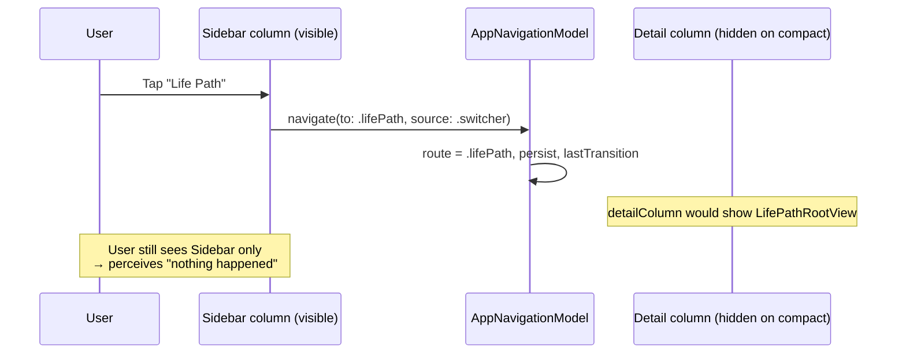
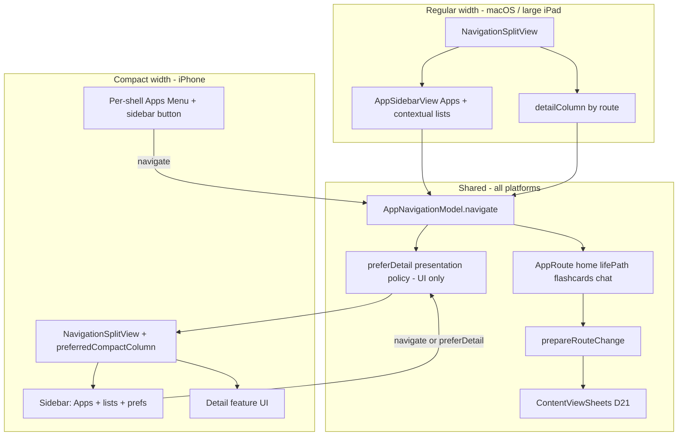
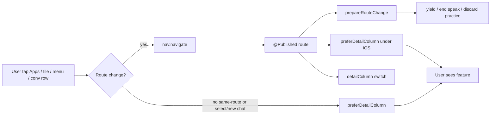
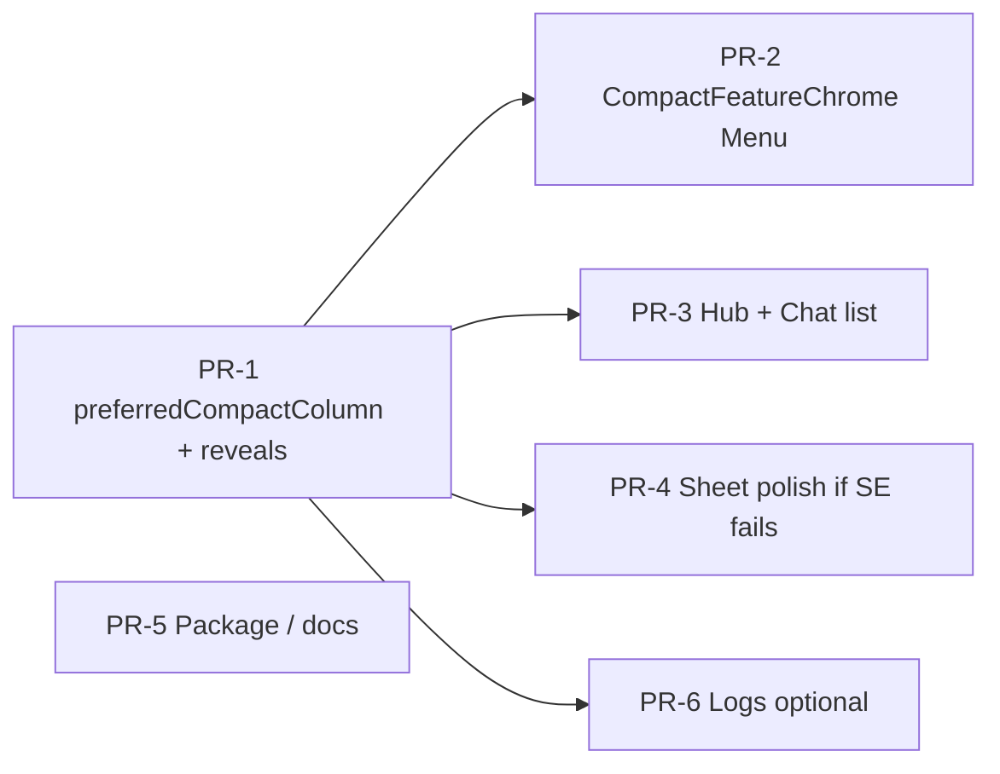

# Make iOS Usable: Fix Navigation & Improve Compact UX

| Field | Value |
|-------|--------|
| **Author** | TBD — assign owner before scheduling PR-1 kickoff |
| **Date** | 2026-07-13 |
| **Status** | Ready for implementation |
| **App** | DeveloperChatbot (`chatbot-app/`) |
| **Packages** | `DeveloperChatbot` (executable), `DeveloperChatbotCore` (`Sources/`) |
| **Related** | `docs/design-multi-feature-home-nav.md` (prior multi-feature nav; iOS was best-effort) |
| **Supersedes (iOS scope only)** | Prior design § Platform notes / iOS row: "best-effort only; do not design a separate TabView product" — product goal has changed; iOS must be **usable** |

---

## Overview

DeveloperChatbot is a dual-platform SwiftUI app (macOS primary historically; iOS via the Xcode monorepo target). After the multi-feature home navigation redesign, top-level destinations are driven by `AppNavigationModel` and rendered in a `NavigationSplitView` sidebar + detail. On iPhone, **tapping sidebar Apps rows (Life Path, Flashcards, Chat, Home) appears to do nothing**: the route may update, but the compact column stays on the sidebar, so the user never sees the feature.

This design makes iOS **usable** with an incremental plan:

1. **P0 — Fix broken navigation** by driving compact column presentation via **`preferredCompactColumn`** (primary) and `columnVisibility` only if needed, showing detail after route changes **and** after non-route sidebar actions (conversation select / New Chat), with a reliable way back to the sidebar — while preserving the existing `navigate(to:source:)` choke-point and leave-feature teardown.
2. **P1 — Compact UX** so feature switching (per-shell toolbar chrome), contextual lists, home hub, and back navigation feel intentional on phone widths.
3. **P2 — Platform hygiene** (honest dual-packaging docs, optional `Package.swift` iOS declaration, Simulator QA).

**Primary chrome decision (see Key Decisions K1 — product owner confirmed):** **Option B — Adaptive**, built on a hardened NavigationSplitView substrate (**Option A′**: `preferredCompactColumn`-first P0). macOS / regular width keep the current sidebar product. Compact width keeps the same `AppRoute` model but adds always-reachable feature chrome and auto-shows detail after navigation. **Option C (TabView as primary on iOS) is rejected for v1** — higher rewrite cost, conflicts with contextual sidebar lists and root-hosted D21 sheets, and splits product chrome without fixing the P0 bug faster. This is a **closed** product decision, not an open alternative.

---

## Background & Motivation

### Current architecture (verified 2026-07-13)

```
WindowGroup
└── ContentView
    ├── @StateObject ChatViewModel
    ├── @StateObject FlashcardViewModel
    ├── @StateObject SpeakingSessionViewModel
    ├── @StateObject AppNavigationModel(defaultRoute: .home)
    └── NavigationSplitView
        ├── Sidebar: AppSidebarView
        │   ├── List (Apps section: Home / Life Path / Flashcards / Chat)
        │   │   └── sidebarRouteRow → Button { nav.navigate(...) }.buttonStyle(.plain)
        │   ├── Contextual section (flashcards list | conversations list)
        │   └── Footer: LanguageToggle + restoreLastRouteOnLaunch
        └── Detail: switch nav.route
            ├── .home → HomeHubView (tiles → navigate)
            ├── .lifePath → LifePathRootView (inner NavigationStack)
            ├── .flashcards → FlashcardsShellView → FlashcardDeckView
            └── .chat → ChatShellView
    └── ContentViewSheets (D21 root-hosted practice/speak/review/etc.)
```

**Key files:**

| File | Role |
|------|------|
| `Sources/ContentView.swift` | Root: VMs, `NavigationSplitView`, `detailColumn` switch, `prepareRouteChange(from:to:)`, D21 helpers, sheets; detail applies `.navigationTitle("")` + iOS `.navigationBarTitleDisplayMode(.inline)` |
| `Sources/AppNavigation.swift` | `AppRoute`, `AppNavigationSource`, `AppNavigationModel.navigate(to:source:)` choke-point (**no-ops when `newRoute == route`**), last-route restore |
| `Sources/AppSidebarView.swift` | Apps rows via plain `Button` (not `List(selection:)` / not `NavigationLink`); contextual lists; footer prefs |
| `Sources/HomeHubView.swift` | Feature cards → `nav.navigate(to:source: .homeTile)` |
| `Sources/LifePathViews.swift` | `LifePathRootView` wraps content in **its own** `NavigationStack` + toolbar "Home" / "End round" via `onExit` |
| `Sources/FlashcardsShellView.swift` | Thin host of `FlashcardDeckView` (no outer `NavigationStack`) |
| `Sources/ChatShellView.swift` | Chat chrome; iOS trailing toolbar with tools **only when** `activeConversation != nil`; empty state has **no** toolbar and only "Start New Chat" (no recent list) |
| `Sources/Platform+Colors.swift` | `platformControlBackground` / `platformWindowBackground` with `#if os` |
| `Package.swift` | platforms: **macOS 15 only** (no iOS); SPM library + macOS executable |
| `create_xcodeproj.py` | **iPhone** target: `SDKROOT = iphoneos`, `IPHONEOS_DEPLOYMENT_TARGET = 18.0`, `TARGETED_DEVICE_FAMILY = 1`; monorepo single module including `Sources/App.swift` |
| `Tests/AppNavigationTests.swift` | Unit tests for route model only (no UI / split-view tests) |
| `docs/design-multi-feature-home-nav.md` | Multi-feature redesign; iOS explicitly **best-effort** |

### Dual packaging (verified)

| Path | What it is | Platforms |
|------|------------|-----------|
| **SPM** (`Package.swift`) | Library `DeveloperChatbotCore` from `Sources/` (excludes `Sources/App.swift`); executable `App/App.swift` imports core | Declared **macOS 15 only** today |
| **Xcode monorepo** (`create_xcodeproj.py`) | Single app target compiles listed Sources + `Sources/App.swift` as one module | **iPhone** (`iphoneos` / simulator, iOS 18.0, device family 1) |

iOS ship/debug is **only** via the Xcode project. SPM does not produce an iOS app today and will not after a platforms declaration alone.

### User-reported failure

- Tapping any sidebar Apps item does nothing (Life Path, Flashcards, etc.).
- App is dual-platform; **iOS is not usable**.
- macOS remains the historical primary; regressions there are unacceptable.

### Root-cause analysis (class validated against code)

This is a classic **compact `NavigationSplitView` + imperative route mutation** failure mode—not a broken `AppNavigationModel`.

| # | Hypothesis | Evidence in codebase | Likelihood |
|---|------------|----------------------|------------|
| 1 | Route updates detail content while compact column stays on **sidebar** | `ContentView` binds detail to `nav.route` but never sets `preferredCompactColumn` or `columnVisibility`. Sidebar uses `Button` → `nav.navigate`, which does not push a split-view column transition. | **Very high** — matches "tap does nothing" |
| 2 | Plain `Button` + `.buttonStyle(.plain)` in `List` has hit-testing issues | `sidebarRouteRow` in `AppSidebarView.swift` | Medium — may contribute; usually still receives taps |
| 3 | No compact-column presentation policy | No `preferredCompactColumn` / `columnVisibility` state anywhere | High (same family as #1) |
| 4 | Nested `NavigationStack` only in Life Path / sheets | `LifePathRootView`, `EssentialVocabListView`, `EndpointConfigModalView` — Flashcards/Chat detail lack a stack for toolbar/back | Medium for secondary UX; not primary "sidebar does nothing" |
| 5 | Home tiles work when already on detail; sidebar fails | Cold start default is `.home` (detail content). If preferred compact column is detail, tiles may work while Apps rows leave user on sidebar after highlight change only | High split-path asymmetry |
| 6 | Non-route sidebar actions leave user on sidebar | Conversation `onTapGesture` → `selectConversation` / New Chat do not change `nav.route` (already `.chat`), so route-`onChange` never reveals detail | **High** for F3 “select conversation” path |

**Mental model of the bug:**



macOS / regular width shows both columns, so the same code path **works**. That explains dual-platform asymmetry without any platform-specific navigate bug.

### Pain points beyond the P0 bug

1. **No intentional compact chrome.** Prior design deferred iOS; no toolbar feature switcher, no auto-collapse policy, no compact list strategy.
2. **Platform packaging mismatch.** SPM declares macOS only; Xcode project is iPhone-only; no iPad target. Adding iOS to `Package.swift` does not replace Simulator/`xcodebuild` validation.
3. **Contextual lists live only in sidebar.** On compact, conversations / flashcard rows are invisible while viewing detail unless user reveals sidebar. Chat empty state (`ChatShellView.emptyState`) only offers "Start New Chat" — no recent conversation list.
4. **Inconsistent navigation containers / toolbars.** Life Path has `NavigationStack` + own toolbar; Chat has conditional trailing tools; Home/Flashcards have no inner stack. Outer `detailColumn` toolbar is **not** guaranteed to host chrome inside Life Path’s stack.
5. **Sheet min sizes** (`frame(minWidth:…)` on practice/review/speak sheets) are macOS-oriented; only a few places use iOS presentation detents (e.g. endpoint config). Worth smoke-testing on SE.

---

## Goals & Non-Goals

### Goals

1. **P0:** On iPhone (compact width), tapping Home / Life Path / Flashcards / Chat **shows that feature's UI** within one interaction. Sidebar selection highlight alone is not enough.
2. **P0:** Non-route sidebar actions that imply “work in detail” (New Chat, select conversation; flashcard row tap if applicable) **also** show the detail column on compact.
3. **P0:** macOS sidebar + detail behavior remains correct (no double-push, no stuck column, teardown still runs). Binding presentation state must not force sidebar collapse on macOS.
4. **P1:** Compact users can switch features without hunting for a hidden sidebar column (Apps Menu visible on every feature, including Chat empty and Life Path).
5. **P1:** Chat conversation list remains reachable on compact (sidebar reveal in P0; in-detail list in PR-3).
6. **P1:** Home hub usable on phone (readable tiles, tappable cards, restore toggle).
7. **P2:** Document dual packaging honestly; optionally declare iOS in `Package.swift` for declared-support alignment; keep `#if os` patterns coherent.
8. Preserve **`AppNavigationModel.navigate` choke-point**, **`prepareRouteChange` leave-feature teardown**, **D21 root sheets**, **L10n / `AppLanguage`**.
9. **Incremental PRs** — each mergeable; no full rewrite.

### Non-Goals

- Full visual redesign / marketing polish for iOS.
- Separate iOS-only feature set or forked navigation model (`AppRoute` remains shared).
- Multi-window or iPad-optimized multi-column product (iPad may work via regular-width split; not a v1 focus; target remains iPhone family).
- Deep linking, URL schemes, Continuity.
- Moving practice/speak sheets off root (D21 stays).
- Promoting Essential Vocab to top-level.
- Replacing macOS sidebar with tabs.
- Automated UI tests for NavigationSplitView (optional later; manual QA matrix is required for v1).
- Full SPM typecheck of iOS `#if` branches via host `swift test` (not achievable without iOS SDK build).

---

## Goals priority ladder

| Priority | Outcome | Exit criteria |
|----------|---------|---------------|
| **P0** | Navigation works on iPhone (Apps rows + cold start + same-route + conversation/new-chat reveal) | Acceptance § Navigation N1–N10 + macOS M* |
| **P1** | Compact UX intentional | Feature Menu on all routes; lists reachable; home hub comfortable |
| **P2** | Platform hygiene | Dual-packaging docs accurate; optional Package platforms line |

---

## Proposed Design

### Key product decision: compact chrome strategy

Three options were evaluated (full trade-offs in Alternatives). **Chosen: B — Adaptive**, implemented in two layers:

| Layer | What | When |
|-------|------|------|
| **Substrate (P0 / A′)** | Keep single `NavigationSplitView` root; bind **`preferredCompactColumn`** (primary); on navigate and other “show work UI” actions set `.detail`; sidebar affordance sets `.sidebar`; add `columnVisibility` only if Simulator proves preferred-column insufficient | PR-1 |
| **Chrome (P1)** | On compact width only: always-visible **feature switcher** via **per-shell** toolbar injection (not a single outer Group toolbar assumption); optional in-detail Chat list | PR-2+ |



**Why not TabView primary (C) in v1:** Four top-level routes already exist, but Chat and Flashcards depend on **sidebar contextual lists**. A TabView forces either (a) nesting lists inside each tab (large UI restructure) or (b) retaining a split inside tabs (worse nesting). Prior design's "no separate TabView product" still holds as a **cost** argument even though the **usability** goal changed—we achieve usability without forking chrome.

**Why not A alone long-term:** Pure preferred-column fix unblocks P0, but leaves feature switching behind a sidebar column that users must learn to re-open. P1 adaptive chrome makes switching obvious.

---

### P0 — Fix broken navigation

#### 1. Primary lever: `preferredCompactColumn` (K2)

Apple’s API for *which column is shown in compact layouts* is:

```swift
@State private var preferredCompactColumn: NavigationSplitViewColumn = .detail
// Optional secondary lever — only if QA shows preferred-column alone is insufficient:
@State private var columnVisibility: NavigationSplitViewVisibility = .automatic
```

**Recommended P0 root shape (iOS presentation gated; macOS unbound or automatic-only):**

```swift
// ContentView
@State private var preferredCompactColumn: NavigationSplitViewColumn = .detail

#if os(iOS)
@Environment(\.horizontalSizeClass) private var horizontalSizeClass
private var isCompactWidth: Bool { horizontalSizeClass == .compact }
#endif

public var body: some View {
    #if os(iOS)
    NavigationSplitView(preferredCompactColumn: $preferredCompactColumn) {
        sidebar
    } detail: {
        detailColumn
    }
    #else
    // macOS: keep unbound split — avoid behavioral drift from binding columnVisibility
    NavigationSplitView {
        sidebar
    } detail: {
        detailColumn
    }
    .frame(minWidth: 800, minHeight: 600)
    #endif
    .environment(\.appLanguage, viewModel.appLanguage)
}
```

**Policy (presentation only — not in `AppNavigationModel`):**

| Event | Compact iOS action | macOS |
|-------|-------------------|--------|
| Successful `navigate` (route changed) | `preferredCompactColumn = .detail` | No-op |
| Same-route Apps re-tap | `preferredCompactColumn = .detail` via `onPreferDetail` | No-op |
| New Chat / select conversation / flashcard row (sidebar) | `onPreferDetail()` | No-op |
| Cold start `onAppear` | `preferredCompactColumn = .detail` always (unless DEBUG sidebar-first flag) | No-op |
| User wants lists / Apps sidebar | `preferredCompactColumn = .sidebar` (toolbar sidebar button or system back) | N/A |

**Fallback if preferred-column is insufficient on a given OS build:**

```swift
// Only after Simulator proves need:
NavigationSplitView(
    columnVisibility: $columnVisibility,
    preferredCompactColumn: $preferredCompactColumn
) { ... } detail: { ... }

// Then also set columnVisibility = .detailOnly when preferring detail.
// Sidebar reveal: preferredCompactColumn = .sidebar; columnVisibility = .automatic
// (.all and .doubleColumn are equivalent for two-column splits — pick one, comment it.)
```

**Life Path nested-stack risk:** Writes to preferred compact column while `LifePathRootView` hosts an inner `NavigationStack` have been associated with desync bugs in community reports. **QA risk (PR-1):** After navigating to Life Path, confirm detail shows and Life Path toolbars still work. **Fallback plan:** (1) preferDetail only from sidebar/onChange, not from inside Life Path; (2) if still broken, try also setting `columnVisibility`; (3) last resort, temporarily present Life Path without changing preferred column mid-session (still set once on enter).

#### 2. Presentation helper (UI-owned)

```swift
// Prefer keeping AppNavigationModel pure (route only). New private helper in ContentView
// or Sources/AppNavigationPresentation.swift (SwiftUI-aware, not unit-tested with model tests).

@MainActor
enum AppNavigationPresentation {
    static func preferDetail(column: Binding<NavigationSplitViewColumn>) {
        column.wrappedValue = .detail
    }

    static func preferSidebar(column: Binding<NavigationSplitViewColumn>) {
        column.wrappedValue = .sidebar
    }
}
```

Wire from `ContentView`:

```swift
private func preferDetailColumn() {
    #if os(iOS)
    AppNavigationPresentation.preferDetail(column: $preferredCompactColumn)
    #endif
}

private func preferSidebarColumn() {
    #if os(iOS)
    AppNavigationPresentation.preferSidebar(column: $preferredCompactColumn)
    #endif
}
```

**Hard requirement:** All presentation mutations live under `#if os(iOS)`. Do **not** gate only on `horizontalSizeClass` without the OS compile-time gate — on macOS size class is a poor control surface and accidental shared paths are the main regression vector (K12).

#### 3. Route `onChange` — teardown first, then prefer detail

Merge with existing `prepareRouteChange` (single handler preferred):

```swift
.onChange(of: nav.route) { oldRoute, newRoute in
    prepareRouteChange(from: oldRoute, to: newRoute)
    #if os(iOS)
    preferDetailColumn()
    #endif
}
```

Notes:

- Teardown must still run **exactly once** per transition.
- `navigate` no-ops when `newRoute == route` → this `onChange` **will not fire** on same-route re-tap (see §4).

#### 4. Sidebar: same-route + non-route reveal (canonical)

Pass presentation callback into sidebar:

```swift
AppSidebarView(
    nav: nav,
    viewModel: viewModel,
    flashcardVM: flashcardVM,
    speakingVM: speakingVM,
    selectedFlashcard: $selectedFlashcard,
    configureSpeaking: { configureSpeakingFromChat() },
    onPreferDetail: { preferDetailColumn() }  // NEW
)
```

**Canonical Apps row (include same-route branch — this is the snippet implementers must copy):**

```swift
@ViewBuilder
private func sidebarRouteRow(_ route: AppRoute, title: String, systemImage: String) -> some View {
    Button {
        if nav.route == route {
            // navigate() no-ops; onChange will not fire — still show detail on compact.
            onPreferDetail()
        } else {
            nav.navigate(to: route, source: .switcher)
            // preferDetail also runs from ContentView onChange(route) after successful navigate
        }
    } label: {
        Label(title, systemImage: systemImage)
            .frame(maxWidth: .infinity, alignment: .leading)
            .fontWeight(nav.route == route ? .semibold : .regular)
            .contentShape(Rectangle())
    }
    .buttonStyle(.plain)
    .listRowBackground(
        nav.route == route
            ? Color.accentColor.opacity(0.15)
            : Color.clear
    )
}
```

**Canonical conversation / New Chat rows (route may already be `.chat`):**

```swift
// New Chat
Button {
    viewModel.startNewConversation()
    onPreferDetail()
} label: {
    Label(L10n.newChat(lang), systemImage: "plus.bubble")
        .font(.headline)
}

// Existing conversation
.onTapGesture {
    viewModel.selectConversation(conversation)
    onPreferDetail()
}
```

**Flashcard sidebar row tap** (optional consistency): after `selectedFlashcard = card`, call `onPreferDetail()` so compact users who open the list column see the deck detail again. Low priority if deck is already the detail content for `.flashcards`.

Keep button-driven rows (prior design avoided dual `List(selection: AppRoute)`). Do **not** introduce `NavigationLink` for top-level routes in P0 (double-stack risk with Life Path's inner `NavigationStack` and imperative `route`).

| Approach | Pros | Cons |
|----------|------|------|
| **Keep Button; preferredCompactColumn + onPreferDetail** | Minimal; matches prior design | Must wire all reveal call sites |
| **`NavigationLink(value:)`** | System push | Fights single-route model; double navigation risk |
| **`List(selection: $routeProxy)`** | Native selection chrome | Awkward with multi-section list |

#### 5. Cold start (initial route does not fire `onChange`)

Restore sets `route` in `AppNavigationModel.init` **before** the view appears; `onChange(of: nav.route)` does **not** run for that initial value. System compact default is often **sidebar**, which would reintroduce the “invisible detail” bug for restored Life Path / Chat / Flashcards.

**Mandate:** Always call `preferDetailColumn()` on compact cold start in the **same** place as existing `detailColumn.onAppear` work (flashcard load, persist route, restore log) — **independent of** `didRestoreRouteOnLaunch` (including when landing on `.home`).

```swift
// detailColumn.onAppear (extend existing block)
flashcardVM.loadFlashcards()
nav.persistCurrentRouteIfNeeded()
if nav.didRestoreRouteOnLaunch {
    viewModel.log("Nav: cold start restored \(nav.route.rawValue)", tag: "NAV")
}
#if os(iOS)
preferDetailColumn()  // always on launch; DEBUG flag may skip for bug repro
#endif
```

Optional DEBUG: `UserDefaults` `app.navigation.debugCompactSidebarFirst` to force `.sidebar` for reproducing the original bug.

#### 6. Back to sidebar / back to home

| Surface | Compact behavior (P0) | Notes |
|---------|----------------------|-------|
| System split back | May show back-to-sidebar when detail is preferred | Verify on SE + Pro Max |
| Explicit leading control | If system back missing: toolbar sidebar button → `preferSidebarColumn()` | Hosted via **per-shell chrome injector** (see P1 / K5a) — P0 may add injector with **sidebar only**, Menu in PR-2 |
| Life Path "Home" toolbar | Already calls `onExit` → `nav.goHome` | After goHome, onChange prefers detail (Home hub) — correct |
| Chat / Flashcards | No in-feature "Home" today | P0: sidebar reveal; P1: Apps Menu |

P0 exit criterion: user can always return to sidebar lists on compact (system control **or** explicit leading button). Prefer verifying system first; add explicit button in PR-1 if missing.

#### 7. Nested `NavigationStack` policy (K5 + K5a)

| View | Today | Policy |
|------|-------|--------|
| Root `detailColumn` | No stack; empty `navigationTitle` | **No root `NavigationStack` wrapping all routes** |
| `LifePathRootView` | Own `NavigationStack` | Keep; inject compact chrome **inside** this stack’s root content toolbar |
| `EssentialVocabListView` / Endpoint sheets | Own stack inside sheet | Keep (sheet-scoped) |
| `FlashcardsShellView` / `ChatShellView` / `HomeHubView` | No stack | Inject compact chrome on the shell root via shared `ViewModifier` (shells may use a lightweight local stack **only if** required for bar hosting — Life Path remains separate) |

**Rule (K5):** At most one `NavigationStack` between window root and feature primary chrome. Sheets may have their own.

**Rule (K5a):** **No root stack.** Compact chrome (sidebar button, Apps Menu) is applied **per feature shell** that owns the visible bar — not assumed on outer `Group` in `detailColumn`. See P1 hosting strategy.

#### 8. Leave-feature teardown (unchanged semantics)

`prepareRouteChange(from:to:)` in `ContentView` already:

- Yields shared audio hardware
- Ends speaking / discards practice / ends review / closes create + essential vocab when leaving `.flashcards`
- Clears Life Path ephemeral audio when leaving `.lifePath`
- Reloads flashcards when entering `.flashcards` or `.home`
- DEBUG asserts on speak UI / playback leaks

**P0 must not bypass this.** Column presentation changes must not call teardown; only `nav.route` changes do.



---

### P1 — Compact UX

#### Feature switcher hosting strategy (concrete — required for PR-2)

**Problem:** Applying `.toolbar` only on outer `detailColumn` `Group` is **route-dependent** and unreliable:

| Route | Bar owner today | Outer Group toolbar likely? |
|-------|-----------------|------------------------------|
| Home | No inner stack; detail title empty | May show on split detail bar |
| Flashcards | No inner stack (`FlashcardDeckView` custom header) | May show |
| Chat (active) | `ChatShellView` iOS trailing tools when `activeConversation != nil` | Risk of **double trailing** / order fight with `ChatToolsMenuButton` |
| Chat (empty) | **No** toolbar in `emptyState` | Outer bar may be only chance — but empty state must **also** get chrome if outer fails |
| Life Path | **Inner** `NavigationStack` + cancellation/primary toolbars | Outer modifiers often **do not** appear inside stack chrome → Menu/sidebar missing |

**Decision (K5a / PR-2 hosting):**

1. Introduce a shared modifier, e.g. `CompactFeatureChrome`, taking:
   - `nav: AppNavigationModel`
   - `onPreferSidebar: () -> Void`
   - `showSidebarButton: Bool` (true when compact)
   - language for L10n
2. Apply it **inside** each detail root that owns the bar:
   - `HomeHubView` body
   - `FlashcardsShellView` / top of `FlashcardDeckView`
   - `ChatShellView` body (**both** empty and active paths)
   - `LifePathRootView` **inside** the existing `NavigationStack` content (compose with existing `.toolbar` items)
3. Do **not** rely solely on `ContentView.detailColumn` toolbar for Menu visibility.

**Placement rules:**

| Item | Placement | Notes |
|------|-----------|-------|
| Sidebar reveal | `.topBarLeading` (iOS) | Only if compact; hide when not needed on regular |
| Apps Menu | `.topBarTrailing` | On Chat active: place Apps Menu **before** tools, or nest tools under a single overflow if crowded — **must not remove** `ChatToolsMenuButton` |
| Life Path | Leading already has Home / Cancel / End round | Prefer Apps Menu on **trailing**; if End-round uses primaryAction, put Menu as secondary trailing. Sidebar reveal: only if system back missing and not conflicting with Home |

**Visibility requirement (PR-2 acceptance):** Apps Menu visible on:

- Home hub  
- Flashcards deck  
- Life Path home (not necessarily mid-round if toolbar is saturated — prefer still visible)  
- Chat empty state  
- Chat with active conversation (tools still available)

#### Shared route chrome mapping (required, not optional)

New small helper (file e.g. `Sources/AppRoute+Chrome.swift`) used by **sidebar and Menu**:

```swift
enum AppRouteChrome {
    static func title(_ route: AppRoute, lang: AppLanguage, dueCount: Int? = nil) -> String {
        switch route {
        case .home: return L10n.home(lang)
        case .lifePath: return L10n.lifePathTitle(lang)
        case .flashcards:
            if let due = dueCount {
                return L10n.flashcardsWithDue(lang, due: due)
            }
            return L10n.flashcards(lang)
        case .chat: return L10n.conversations(lang)
        }
    }

    static func systemImage(_ route: AppRoute) -> String {
        switch route {
        case .home: return "square.grid.2x2"
        case .lifePath: return "figure.and.child.holdinghands"
        case .flashcards: return "rectangle.on.rectangle.angled"
        case .chat: return "bubble.left.and.bubble.right"
        }
    }
}
```

**L10n keys (PR-2, non-optional where missing):**

| Key | Purpose |
|-----|---------|
| Existing `appsSection` | Menu label (“Apps” / “功能”) |
| Existing route titles | Menu rows via `AppRouteChrome.title` |
| `showSidebar` (new if needed) | a11y for leading sidebar button |
| `appsMenu` (new if needed) | a11y for Menu control if distinct from `appsSection` |

#### Feature Menu sample (implementation-ready)

```swift
// Inside CompactFeatureChrome — iOS compact only
Menu {
    ForEach(AppRoute.allCases) { route in
        Button {
            if nav.route == route {
                // Already on feature; no navigate no-op needed for presentation
            } else {
                nav.navigate(to: route, source: .switcher)
            }
        } label: {
            Label {
                HStack {
                    Text(AppRouteChrome.title(route, lang: lang, dueCount: flashcardDue))
                    if nav.route == route {
                        Image(systemName: "checkmark")
                    }
                }
            } icon: {
                Image(systemName: AppRouteChrome.systemImage(route))
            }
        }
    }
} label: {
    Label(L10n.appsSection(lang), systemImage: "square.grid.2x2")
}
```

- Due badge on Flashcards row: pass `flashcardVM.dueCount` into chrome (sidebar already uses `L10n.flashcardsWithDue`).
- Checkmark marks current route for affordance.
- Same-route Menu pick while already on detail: no-op is fine (user is already there).
- macOS: **no** Menu required (sidebar always visible).

#### Home hub on phone

`HomeHubView` uses `LazyVGrid` with `GridItem(.adaptive(minimum: 220))` and `padding(32)` — acceptable on most iPhones but tight on SE width.

P1 tweaks (PR-3a / small):

- Reduce horizontal padding on compact (`16` vs `32`).
- Consider `minimum: 160` or single column when compact.
- Ensure card min height still meets ~44pt touch targets (already large cards).
- Same-route tile tap (already on that feature): call `preferDetail` if ever shown from sidebar-first — uncommon; optional.

#### Contextual lists on compact

**Problem:** Conversation list and flashcard list live only in `AppSidebarView`. Chat empty state only has Start New Chat.

**Acceptance bar split (explicit — Issue 4 resolution):**

| Milestone | Chat bar |
|-----------|----------|
| **After PR-1 (first internal “nav works”)** | F3 = **Start New Chat** from empty detail **or** New Chat / select conversation from **sidebar** with preferDetail → message send. Selecting an existing conversation **from detail** is **not** required. Sidebar reveal control must exist so lists are reachable (N10). |
| **After PR-3 (full usable Chat)** | C2: in-detail recent conversation list (or equivalent) so switching threads does not require discovering sidebar. Marketing “iOS usable” for Chat multi-thread should wait for this if product cares about existing users with many conversations. |

**P1 list options:**

| Option | Description | Effort | Recommendation |
|--------|-------------|--------|----------------|
| **P1-a Sidebar-as-list** | Sidebar reveal + preferDetail on rows (PR-1) | Low | **Ship in PR-1** |
| **P1-b In-detail lists** | Compact Chat empty/select list in `ChatShellView` | Medium | **PR-3** |
| **P1-c Sheets** | Conversations list sheet | Low–Med | Interim only if P1-b slips |

Flashcards: deck already lists cards in detail (`FlashcardDeckView`); sidebar list is secondary.

#### Life Path / sheets

- Life Path is relatively mobile-friendly (scroll, large buttons).
- Known large `minWidth` frames (smoke on SE; fix in PR-4 if they clip):

| View | Approx min frame | Risk |
|------|------------------|------|
| `LifePathLevelUpView` | minWidth 400 | Medium on SE |
| `FlashcardReviewView` | 520×480 | Medium |
| `PracticePreviewSheet` / `PracticeSessionView` | 560×500+ | Medium |
| `SpeakingSetupSheet` / `SpeakingSessionView` | 440–560 | Medium |
| `EssentialVocabListView` | 480×520 | Medium |
| `EndpointConfigModalView` | has `presentationDetents` on iOS | Lower |

Do **not** claim broad “iOS-tuned detents”; only endpoint config (and similar one-offs) use detents today.

---

### P2 — Platform hygiene

#### Package.swift (honest benefits)

Optional addition:

```swift
platforms: [
    .macOS("15.0"),
    .iOS("18.0")
]
```

| Claim | Accurate? |
|-------|-----------|
| Aligns **declared** SPM support with Xcode iOS 18 deployment target | Yes |
| Documents dual-platform intent | Yes |
| Makes host `swift test` typecheck iOS `#if` branches fully | **No** — macOS host still typechecks the macOS slice |
| Changes `create_xcodeproj.py` / Xcode target | **No** |
| Makes SPM executable an iOS ship vehicle | **No** |
| Replaces Simulator QA | **No** |

**iOS validation remains `xcodebuild` / Xcode Simulator.** SPM remains the macOS library/executable path. PR-5 is non-blocking documentation/alignment only.

Risks: false confidence that SPM covers iOS; multi-destination `swift build` confusion. Mitigate with a one-line comment in `Package.swift` and build docs: “iOS app = Xcodeproj only.”

#### Xcode project

- `create_xcodeproj.py` remains the iOS app packaging path.
- Keep regenerating when adding Swift files.
- Document: **macOS ship** via SPM/`build.sh`; **iOS ship/debug** via Xcode scheme `DeveloperChatbot`.
- `TARGETED_DEVICE_FAMILY = 1` (iPhone only) is acceptable for v1.

#### Shared vs platform chrome checklist

| Concern | Shared | Platform-specific |
|---------|--------|-------------------|
| `AppRoute` / `navigate` / teardown | ✅ | |
| Feature VMs & DB | ✅ | |
| D21 sheets | ✅ | Verify large minWidth on SE; few detents today |
| Sidebar layout | Structure shared | `listStyle(.sidebar)`, minWidth soft on iOS |
| Compact chrome modifier | | iOS compact only |
| Chat tools | | iOS menu vs macOS header (exists) |
| Log console | | macOS only (exists) |
| Audio session | | `AudioPlayer` / `AudioRecorder` already `#if os(iOS)` |

#### Testing strategy

| Layer | What | Where |
|-------|------|-------|
| Unit | Existing `AppNavigationTests` — model only; split-view presentation **not** unit-tested | `Tests/AppNavigationTests.swift` |
| Manual | QA matrix below | Simulator + device if available |
| Regression | macOS checklist after PR-1 | Local `build.sh` / run app |
| iOS build | `xcodebuild` / Xcode scheme | Not SPM |

---

## API / Interface Changes

### Unchanged (must preserve)

```swift
// Sources/AppNavigation.swift
enum AppRoute: String, CaseIterable, Identifiable, Codable {
    case home, lifePath, flashcards, chat
}

enum AppNavigationSource: String {
    case coldStart, homeTile, switcher, done, programmatic
}

@MainActor
final class AppNavigationModel: ObservableObject {
    @Published private(set) var route: AppRoute
    func navigate(to newRoute: AppRoute, source: AppNavigationSource) // no-op if same route
    func goHome(source: AppNavigationSource = .done)
    // restoreLastRouteOnLaunch, persistCurrentRouteIfNeeded, lastTransition, ...
}
```

### New / modified (P0–P1)

```swift
// ContentView — presentation state (iOS)
@State private var preferredCompactColumn: NavigationSplitViewColumn = .detail
// optional: columnVisibility only if fallback needed

// AppSidebarView — new callback
var onPreferDetail: () -> Void = {}

// AppRoute+Chrome.swift — shared titles/symbols for sidebar + Menu
// CompactFeatureChrome ViewModifier — sidebar button + Apps Menu (P1; sidebar button may land in P0)

// Localization — showSidebar / appsMenu a11y if needed
```

### Before / after root body (illustrative)

**Before:**

```swift
NavigationSplitView {
    AppSidebarView(...)
} detail: {
    detailColumn
}
```

**After (P0):**

```swift
#if os(iOS)
NavigationSplitView(preferredCompactColumn: $preferredCompactColumn) {
    AppSidebarView(..., onPreferDetail: preferDetailColumn)
} detail: {
    detailColumn  // onAppear: preferDetailColumn(); onChange route: teardown then preferDetail
}
#else
NavigationSplitView {
    AppSidebarView(..., onPreferDetail: {})
} detail: {
    detailColumn
}
#endif
```

---

## Data Model Changes

**None.**

- No schema / SQLite migrations.
- No new `UserDefaults` keys required for P0 (optional DEBUG sidebar-first flag only).
- Do **not** persist `preferredCompactColumn` or `columnVisibility`.

Last-route keys remain:

- `app.navigation.lastRoute.v1`
- `app.navigation.restoreLastRoute.v1`

---

## Alternatives Considered

### A — Fixed NavigationSplitView + `columnVisibility` only

| | |
|--|--|
| **Summary** | Only force `.detailOnly` visibility; no preferred compact column; no adaptive Menu |
| **Pros** | Small diff |
| **Cons** | Less specific compact-column API; still sidebar-centric UX long-term |
| **Verdict** | Incomplete vs Apple compact-column guidance; use only as fallback |

### A′ — `preferredCompactColumn` substrate without adaptive Menu (P0-shaped)

| | |
|--|--|
| **Summary** | Bind `preferredCompactColumn`; prefer `.detail` on navigate / reveal actions; no toolbar Menu yet |
| **Pros** | Correct primary API for compact column choice; smallest *correct* P0; same chrome both platforms |
| **Cons** | Feature switching still sidebar-centric until P1 |
| **Verdict** | **Adopt as P0 substrate** (part of chosen B) |

### B — Adaptive: Split on regular, enhanced chrome on compact (CHOSEN)

| | |
|--|--|
| **Summary** | A′ + per-shell Apps Menu + list reachability |
| **Pros** | Fixes P0 quickly; intentional phone UX; single navigate choke-point; no TabView rewrite |
| **Cons** | Size-class / per-shell branches to test |
| **Verdict** | **Primary product direction** |

### C — TabView as primary on iOS

| | |
|--|--|
| **Summary** | `#if os(iOS) TabView` per `AppRoute` |
| **Pros** | Idiomatic iOS top-level tabs |
| **Cons** | Separate chrome; list redesign; sheet/stack nesting; larger rewrite |
| **Verdict** | **Reject for v1** |

### D — Replace imperative route with `NavigationPath` graph

| | |
|--|--|
| **Summary** | Full path-based feature graph |
| **Pros** | System back stack |
| **Cons** | Rewrites teardown, restore, sidebar; high regression risk |
| **Verdict** | Out of scope |

### E — `List(selection:)` / `NavigationLink` hybrid for routes

| | |
|--|--|
| **Summary** | Native selection or links, optionally only on iOS compact |
| **Pros** | System styling / push |
| **Cons** | Does not alone fix compact column policy; multi-section selection conflicts; link + imperative route double-nav risk |
| **Verdict** | Not sufficient; not P0 |

---

## Security & Privacy Considerations

| Topic | Notes |
|-------|--------|
| **Auth** | No change; app remains local + user-configured endpoints |
| **Mic** | Existing `NSMicrophoneUsageDescription` in generated Info.plist; verify still present after any project regen |
| **Network** | Endpoint config unchanged; iOS ATS defaults apply (existing) |
| **Data** | SQLite / audio on device; no new PII surfaces |
| **Threat** | Navigation chrome changes do not expand attack surface |

---

## Observability

Existing NAV logging in `prepareRouteChange`:

```text
Nav: {from} → {to} (via {source})
Nav: cold start restored {route}
```

**Additions (recommended, lightweight):**

| Event | When |
|-------|------|
| `Nav: preferDetail` | When setting preferred column to detail (DEBUG or tagged `NAV`, avoid spam) |
| `Nav: preferSidebar` | When user opens sidebar from detail control |

**Metrics / crash:** No new analytics pipeline. Rely on manual QA + existing DEBUG asserts on speak UI / playback.

---

## Rollout Plan

### Feature flags

**No production feature flag required.** Optional DEBUG-only:

```text
app.navigation.debugCompactSidebarFirst  // force sidebar-first on compact to repro the bug
```

### Staging

1. Land PR-1 → iPhone Simulator QA (N*, F3-as-defined, M*).
2. Land PR-2 Menu/chrome → re-QA Menu visibility matrix.
3. Land PR-3 hub + Chat list → C2.
4. PR-4 only if SE sheet QA fails.
5. PR-5 anytime (docs/Package).
6. macOS smoke every PR.

### Rollback

- PR-1 is isolated to presentation + sidebar callbacks: revert restores prior (broken iOS / working macOS).
- Keep `AppNavigationModel` API stable.

### Risk register

| Risk | Severity | Mitigation |
|------|----------|------------|
| macOS sidebar behavior changes from binding presentation state | **High** | Prefer **unbound** `NavigationSplitView` on macOS (`#else` branch); never write preferred column / visibility on macOS |
| Accidental shared preferDetail path without `#if os(iOS)` | **High** | Compile-time gate in helpers; PR-1 checklist |
| Double `NavigationStack` if someone wraps all detail | **High** | K5 / K5a: no root stack; chrome per shell |
| Life Path inner stack + preferredCompactColumn desync | **Med** | QA on enter/exit Life Path; fallback plan in P0 §1 |
| `onChange(route)` does not cover same-route / conversation select | **High** | Canonical `onPreferDetail` on those rows (N9, N10) |
| Outer toolbar missing on Life Path / Chat empty | **High** | Per-shell `CompactFeatureChrome` (PR-2; sidebar button may land P0) |
| Chat multi-thread still awkward after PR-1 | **Med** | Explicit F3 bar; PR-3 for in-detail list |
| Sheet min widths on SE | **Low–Med** | PR-4 checklist of known frames |
| False confidence SPM tests iOS | **Med** | Honest P2 wording; validate via Xcode |
| `navigate` same-route no-op | **Med** | onPreferDetail (K11) |

### PR-1 macOS checklist (hard requirements)

1. Default: both sidebar and detail usable (no unexpected auto-collapse on launch).
2. Switch all four Apps rows; sidebar stays available; detail updates.
3. Restore-last-route cold start works.
4. D21 practice/speak/review sheets still present and mutually exclusive.
5. Leave Life Path clears ephemeral audio.
6. Presentation writes are `#if os(iOS)` only — code review gate.
7. Optional: toggle sidebar from window chrome / drag divider / full screen — no stuck state.

---

## Acceptance Criteria — "iOS usable"

Minimum bar for declaring iOS usable (all on **iPhone 16 / iOS 18 Simulator** and at least one **compact SE-class** simulator):

### Navigation (P0 — blocking for PR-1)

| # | Criterion |
|---|-----------|
| N1 | Cold start shows Home hub **or** restored feature UI in the **detail** column (not Apps-only dead end) |
| N2 | From sidebar, tap **Life Path** → Life Path UI visible within 1s |
| N3 | From sidebar, tap **Flashcards** → deck UI visible |
| N4 | From sidebar, tap **Chat** → chat empty state or active conversation visible |
| N5 | From sidebar, tap **Home** → Home hub visible |
| N6 | From Home hub, each feature tile opens the corresponding feature |
| N7 | Life Path **Home** toolbar returns to Home hub (detail); teardown runs (no stuck TTS) |
| N8 | Switching Flashcards → Chat ends review/practice/speak if open (existing teardown) |
| N9 | Tapping the **already-selected** Apps row while on sidebar still shows detail (same-route reveal) |
| N10 | From sidebar on compact: **New Chat** or **select existing conversation** shows chat detail (preferDetail without route change) |

### Basic feature tasks

| # | Criterion | Gate |
|---|-----------|------|
| F3 | **Chat:** Reach a conversation (empty → Start New Chat, **or** sidebar New Chat / select + N10) → send one text message → see transcript | **PR-1** (start-or-sidebar-select). Multi-thread pick **from detail** is **PR-3**. |
| F1 | **Flashcards:** Open deck → start study/review sheet → rate at least one card → dismiss | PR-1 smoke; sheet layout PR-4 if fail |
| F2 | **Life Path:** Open → stage UI / language picker → end round or back home | PR-1 |
| F4 | Language toggle still works (sidebar footer) | PR-1 |
| F5 | Mic permission prompt still appears when enabling STT | PR-1 |

### Compact UX (P1)

| # | Criterion | Gate |
|---|-----------|------|
| C1 | Apps Menu available on Home, Flashcards, Life Path home, Chat empty, Chat active | **PR-2** |
| C2 | Can switch among existing conversations without depending only on sidebar discovery | **PR-3** |
| C3 | Home hub cards not clipped / tappable on SE width | PR-3 |
| C4 | Flashcard header actions reachable (horizontal scroll OK) | PR-1 smoke |

### macOS regression (blocking every PR)

| # | Criterion |
|---|-----------|
| M1 | Sidebar Apps rows switch detail without collapsing sidebar unexpectedly |
| M2 | Contextual conversation + flashcard lists work |
| M3 | Home tiles work |
| M4 | Practice / Speak D21 mutual exclusion intact |
| M5 | Leave Life Path clears ephemeral audio |
| M6 | PR-1 extended checklist (divider / full screen) if time permits |

---

## Manual QA Matrix

| # | Surface | iPhone SE (compact) | iPhone 16 (compact) | iPad (if run) | macOS |
|---|---------|---------------------|---------------------|---------------|-------|
| 1 | Cold start → detail (Home or restore) | ✓ | ✓ | optional | ✓ |
| 2 | Restore last route on | ✓ | ✓ | | ✓ |
| 3 | Sidebar → each AppRoute | ✓ | ✓ | | ✓ |
| 4 | Home tiles → each route | ✓ | ✓ | | ✓ |
| 5 | Same-route Apps re-tap → detail | ✓ | ✓ | | N/A or no-op OK |
| 6 | New Chat / select conv → detail | ✓ | ✓ | | ✓ |
| 7 | Back/sidebar reveal | ✓ | ✓ | | sidebar always on |
| 8 | Life Path round + Home | ✓ | ✓ | | ✓ |
| 9 | Flashcard review sheet | ✓ | ✓ | | ✓ |
| 10 | Practice / Speak sheets | ✓ | ✓ | | ✓ |
| 11 | Chat send message | ✓ | ✓ | | ✓ |
| 12 | Chat tools / endpoints | ✓ | ✓ | | ✓ |
| 13 | Essential Vocab sheet | ✓ | ✓ | | ✓ |
| 14 | Language toggle en/zh | ✓ | ✓ | | ✓ |
| 15 | Apps Menu all routes (P1) | ✓ | ✓ | | optional |
| 16 | Rotate landscape | ✓ | ✓ | | N/A |

**How to run iOS:** `DeveloperChatbot.xcodeproj`, scheme `DeveloperChatbot`, Simulator iPhone SE (3rd gen) + iPhone 16.  
**How to run macOS:** `build.sh` / SPM executable.  
**Do not** treat `swift test` alone as iOS validation.

---

## Open Questions

Product decisions below are closed where marked **Resolved**. Remaining rows are engineering/process items deferred to PR-1 QA or kickoff — not product debates.

| # | Question | Status / resolution |
|---|----------|---------------------|
| Q1 | Does `preferredCompactColumn` alone suffice on iOS 18 Simulator, or is `columnVisibility` fallback required? | **Open (engineering)** — prove in PR-1 Simulator QA; document result in code comment. (`.all` vs `.doubleColumn` only if using visibility fallback — equivalent for two-column.) |
| Q2 | Does system compact split provide reliable back-to-sidebar without custom leading button? | **Open (engineering)** — verify SE + 16 during PR-1; add leading button if missing |
| Q3 | iPad / `TARGETED_DEVICE_FAMILY`? | **Deferred** — stay iPhone (`1`) for v1; revisit only if product expands |
| Q4 | Life Path mid-round: always show Apps Menu? | **Open (engineering, PR-2)** — prefer yes on trailing; drop only if toolbar overflow is severe |
| Q5 | When is marketing “iOS usable” claimed? | **Resolved: After PR-1 only.** Navigation works: open each feature from sidebar/home, start chat, Life Path, flashcards. Multi-conversation list polish can follow in later PRs (PR-2/PR-3 are polish beyond the usable bar). |
| Q6 | Assign design/implementation owner | **Open (process)** — assign before PR-1 kickoff (header Author) |

---

## Key Decisions

| Decision | Choice | Rationale |
|----------|--------|-----------|
| **K1 Compact chrome** | **B Adaptive** (A′ substrate + per-shell Menu); not TabView primary. **Product owner confirmed** — Adaptive B as designed; no TabView primary. | Usability without forking architecture; closed product decision |
| **K2 P0 mechanism** | **`preferredCompactColumn`** primary (`.detail` / `.sidebar`); `columnVisibility` only as Simulator-proven fallback | Matches Apple’s compact-column API; overview and implementation agree |
| **K3 Navigate choke-point** | Keep `AppNavigationModel.navigate`; presentation policy outside model | Model stays pure; unit tests stay valid |
| **K4 Sidebar rows** | Keep `Button` + plain style; contentShape; same-route + conv/new-chat → `onPreferDetail` | Covers navigate no-op and non-route reveals |
| **K5 Nested stacks** | Do not wrap all detail in a root `NavigationStack` | Protects Life Path’s stack |
| **K5a Chrome host** | **No root stack;** inject compact chrome **per feature shell** (incl. inside Life Path stack; Chat empty + active) | Outer Group toolbar is route-dependent and fails Life Path / empty chat |
| **K6 D21 sheets** | Remain on `ContentView` root | Unchanged speaking/practice coordination |
| **K7 Feature switcher** | Toolbar Apps `Menu` via `CompactFeatureChrome`, source `.switcher` | Always-reachable without TabView |
| **K8 Lists on compact** | PR-1: sidebar reveal + preferDetail on rows; PR-3: Chat in-detail list | Explicit F3 bar split |
| **K9 Package iOS** | Optional `.iOS("18.0")` for declared alignment only; **iOS validation = Xcode** | Honest dual-packaging |
| **K10 TabView** | Rejected for v1 | Cost + lists + sheets |
| **K11 Same-route / non-route reveal** | `onPreferDetail` required for Apps re-tap, New Chat, select conversation | `onChange(route)` alone is insufficient |
| **K12 macOS** | Unbound split on macOS; **no** presentation writes outside `#if os(iOS)` | Prevents sidebar regression |
| **K13 Route chrome mapping** | Shared `AppRouteChrome` for sidebar + Menu | Single source of titles/symbols; due badge optional param |

---

## References

- `docs/design-multi-feature-home-nav.md` — multi-feature home, `AppRoute`, leave-feature policy, iOS best-effort note
- `Sources/ContentView.swift` — root split view, teardown, sheets, detail title
- `Sources/AppNavigation.swift` — navigation model (same-route no-op)
- `Sources/AppSidebarView.swift` — Apps rows + contextual lists
- `Sources/HomeHubView.swift` — home tiles
- `Sources/LifePathViews.swift` — feature stack + exit
- `Sources/FlashcardsShellView.swift` / `FlashcardDeckView.swift` — deck chrome
- `Sources/ChatShellView.swift` — chat chrome + conditional iOS toolbar; empty state
- `Package.swift` / `create_xcodeproj.py` — dual packaging
- `Tests/AppNavigationTests.swift` — route model tests
- Apple: `NavigationSplitView` `preferredCompactColumn` / `NavigationSplitViewColumn` / column visibility (iOS 16+)

---

## PR Plan

Incremental, independently reviewable PRs. **Stakeholder “iOS usable” = after PR-1 only** (Q5 resolved): N1–N10 + M* + F2 smoke + F3 start-or-sidebar-select. PR-2/PR-3 improve intentional compact chrome and multi-conversation polish; they are **beyond** the usable bar, not blockers for the claim.

### PR-1 — P0: Compact preferred column + all reveal call sites

| | |
|--|--|
| **Title** | fix(ios): show detail column on compact navigate and sidebar actions |
| **Depends on** | None |
| **Files / components** | `Sources/ContentView.swift` (`preferredCompactColumn`, iOS vs macOS split init, onChange teardown+preferDetail, onAppear preferDetail, pass `onPreferDetail`); `Sources/AppSidebarView.swift` (canonical same-route Apps rows; New Chat / conversation select / optional flashcard row preferDetail; contentShape); optional thin presentation helper; optional leading sidebar button via early `CompactFeatureChrome` **or** verify system back first; L10n a11y if button added |
| **Description** | Bind `preferredCompactColumn` on iOS; keep macOS unbound. Prefer `.detail` after route change, cold start, same-route Apps tap, New Chat, and conversation select. Teardown still once per route change. **Atomic “show detail” PR** — large but must not ship half-broken nav. QA: N1–N10, F3 (start or sidebar-select), F2 smoke, M1–M5 + PR-1 macOS checklist. Fallback to `columnVisibility` only if preferred-column fails in Simulator. |
| **Out of scope** | Apps Menu, hub padding, in-detail Chat list, Package.swift iOS, sheet minWidth rewrites |

### PR-2 — P1: Per-shell Apps Menu + shared route chrome

| | |
|--|--|
| **Title** | feat(ios): compact Apps menu via CompactFeatureChrome |
| **Depends on** | PR-1 |
| **Files / components** | `Sources/AppRoute+Chrome.swift` (required); `CompactFeatureChrome` modifier; apply in `HomeHubView`, `FlashcardsShellView`/`FlashcardDeckView`, `ChatShellView` (empty + active), `LifePathViews` (inside stack); `Localization.swift` a11y keys; compose with existing Chat tools / Life Path toolbars per placement rules |
| **Description** | Always-reachable feature switcher on compact for **all** routes in visibility matrix. Shared titles/symbols with sidebar; optional due badge; checkmark on current route. macOS unchanged. QA: C1 + navigation smoke. |

### PR-3 — P1: Compact home hub + Chat in-detail list

| | |
|--|--|
| **Title** | feat(ios): compact home hub layout and chat conversation access |
| **Depends on** | PR-1 (PR-2 preferred first) |
| **Files / components** | `Sources/HomeHubView.swift` (padding/grid); `Sources/ChatShellView.swift` (recent list in empty/select flow) |
| **Description** | SE-friendly hub. In-detail conversation list so C2 passes. **If Chat list grows beyond a small empty-state List, split into PR-3b** (hub-only vs list-only) to keep reviews tight. QA: C2, C3, F3 multi-thread. |

### PR-4 — P1: Compact sheet / Life Path frame polish (QA-driven)

| | |
|--|--|
| **Title** | fix(ios): relax compact layout constraints in sheets and Life Path |
| **Depends on** | PR-1 (run SE sheet QA after PR-1; land before calling product polished-usable if SE clips) |
| **Files / components** | Only QA-flagged views from known risk list: `LifePathLevelUpView` (~400), review/practice/speak sheets (~520–560), `EssentialVocabListView` (~480), etc. |
| **Description** | Pre-listed risk frames; change only what fails SE. Prefer `#if os(iOS)` flexible frames. Timebox to one PR after first SE pass. |

### PR-5 — P2: Platform hygiene (non-blocking)

| | |
|--|--|
| **Title** | chore: dual-platform packaging docs and optional Package.swift iOS |
| **Depends on** | None (parallel after PR-1 green) |
| **Files / components** | `Package.swift` optional `.iOS("18.0")` + comment that iOS app validation is Xcode-only; short note in existing build docs if present |
| **Description** | Honest dual-packaging. **Does not** claim SPM typechecks iOS `#if` on macOS host. No behavior change. |

### PR-6 — Tests / NAV logging (optional)

| | |
|--|--|
| **Title** | test: NAV logs for preferDetail; document manual QA as split-view source of truth |
| **Depends on** | PR-1 |
| **Files / components** | DEBUG logs in presentation helper; `Tests/AppNavigationTests.swift` only if pure non-UI helpers extracted |
| **Description** | **Cannot** unit-test NavigationSplitView column presentation in this stack; manual QA remains gate. Model tests remain for `navigate` no-op / restore. |



**Suggested merge order:** PR-1 → PR-2 → PR-3 → PR-4 (as needed), PR-5 anytime after PR-1.

**“Usable” definition for stakeholders (Q5 resolved):**

| Claim | Requires | Notes |
|-------|----------|--------|
| **“iOS usable” (marketing / product bar)** | **PR-1 only** | N1–N10 + M* + F2 smoke + F3 start-or-sidebar-select: open each feature from sidebar/home, Life Path, flashcards, start chat. Multi-conversation list polish is **not** required for this claim. |
| Intentional compact chrome (Apps Menu) | **PR-2** | Polish beyond usable bar |
| Multi-conversation Chat without sidebar discovery | **PR-3** | Polish beyond usable bar |
| SE sheet polish | **PR-4** if QA fails | Polish / quality follow-up |

---

*End of design document.*
