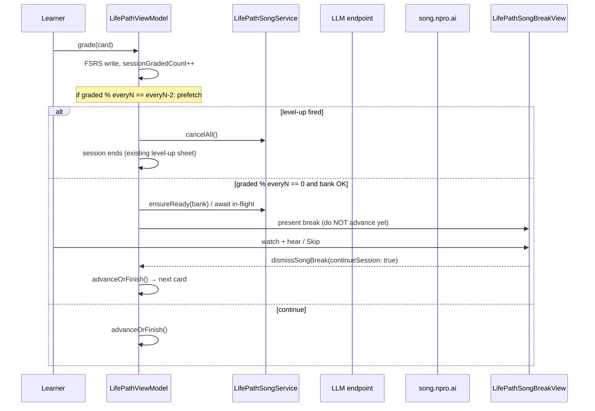
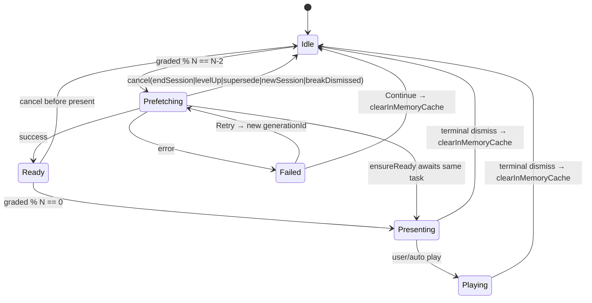
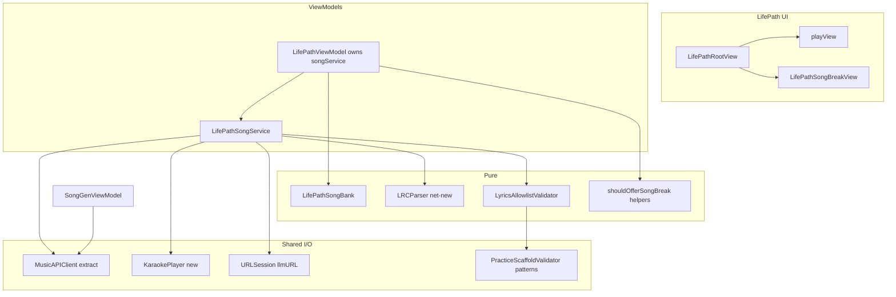

# Design: Life Path Vocabulary Song Mini-Game

| Field | Value |
|-------|--------|
| **Status** | Implemented (v1 client path; flag default off) |
| **Author** | — |
| **Date** | 2026-07-19 |
| **App** | DeveloperChatbot (`chatbot-app/`) |
| **Related** | `docs/design-life-path-fsrs.md`, `docs/song-generation.md`, `docs/design-practice-after-study.md`, `docs/design-practice-known-vocab-sentences.md` |
| **Primary code** | `Sources/LifePathViewModel.swift`, `Sources/LifePathViews.swift`, `Sources/LifePathModels.swift`, `Sources/LifePathScheduler.swift`, `Sources/SongGenViewModel.swift`, `Sources/AudioPlayer.swift`, `Sources/PracticeScaffolding.swift` |

---

## Overview

Life Path study sessions currently run as an unlimited FSRS queue with no mid-session reward beat. This design adds a **vocabulary song mini-game break**: after every **10 graded cards** in a Life Path play session, the app automatically builds a short song from the learner’s **known Life Path vocabulary**, plays it with **karaoke-style lyric highlighting**, then returns the learner to the study queue.

The pipeline reuses the existing DiffRhythm music API (`https://song.npro.ai`) and LLM lyrics path already used by Song Gen (`Sources/SongGenViewModel.swift`), but does **not** open the free-form Song Gen editor. Music networking is extracted into a shared `MusicAPIClient`; LRC parsing is a **net-new** pure helper (Song Gen never parses LRC today). Latency (~15–40s for lyrics + music) is handled with an explicit loading UI, skip/dismiss, and optional background prefetch near the break threshold.

---

## Background & Motivation

### Current state

| Area | Behavior today |
|------|----------------|
| Life Path session | Unlimited FSRS queue via `LifePathScheduler.buildSession`; `startRound()` / `grade(rating:)` / `endSession()` in `LifePathViewModel` |
| Session counters | `sessionIndex` (0-based current card); **`sessionDoneCount` (= `sessionIndex`)** — “cards advanced past”, **not** “grades submitted”; `sessionCorrect`, `sessionWrong` |
| “Known” / stable | `LifePathWordStatus.stable` derived by `LifePathScheduler.meetsGraduationCriteria` (reps ≥ 2, not relearning); profile `totalMastered` counts stable words |
| Catalog | EN 590 / ZH 607 entries; baby ~47; EN toddler 66 / ZH toddler 63; preschool 299 (`life_path_*_v1.json`) |
| Song Gen | LLM → raw LRC string (opaque) → `POST {musicAPIURL}/music/generate` → WAV + private `AVAudioPlayer`; history under Application Support `songs/` — **no LRC parser** |
| AudioPlayer | `Sources/AudioPlayer.swift` — play/stop only; **no** `currentTime` publishing for karaoke |
| Practice scaffolding | `PracticeKnownVocabulary` (library flashcards, `reps >= 1`); validation via **`PracticeScaffoldValidator`** (`diagnoseEnglish` / `diagnoseChinese`, `englishTokens`, `greedyLongestMatchCoveredCount`) |

### Pain points

1. Long unlimited sessions have no celebratory / multi-modal break.
2. Known Life Path words are only reinforced as isolated cards — never recombined into phrases/songs.
3. Song Gen already proves the music pipeline, but requires free-form topic UI unsuitable for an in-session break.
4. Early baby stage has a tiny lexicon; generation must handle sparse banks without inventing out-of-curriculum words.

### Constraints we keep

- Life Path remains a separate FSRS game deck (`baby_to_child_*`); no library flashcard pollution.
- Unlimited session policy unchanged — the song is a **pause**, not a session size cap.
- DiffRhythm API contract unchanged (LRC lyrics, genre, duration 5–30s).
- EN and ZH Life Path languages both supported.
- No requirement to open `SongGenView` / topic editor.

---

## Goals & Non-Goals

### Goals

1. Trigger a song mini-game after every **10 graded** Life Path cards within a play session (see **`sessionGradedCount`**, not `sessionDoneCount`).
2. Generate lyrics constrained to a **known Life Path vocabulary allowlist** (+ closed-class glue words only).
3. Produce music via the existing DiffRhythm API and play with **karaoke lyric highlighting** (line-level; exact phoneme sync out of scope).
4. Present the experience as a modal / full-screen break **inside** Life Path (no Song Gen UI).
5. Return cleanly to the same session queue (preserve `sessionIndex`, FSRS state already written).
6. Handle sparse early vocab, generation failures, skip/dismiss, and offline/API-down cases gracefully.
7. Extract shared **music client** so Song Gen and Life Path share one HTTP path; add **new** LRC/karaoke helpers.
8. Support EN and ZH catalogs and UI languages.

### Non-Goals

- Free-form song topic editing or genre deep-dives during the break.
- Full 95s DiffRhythm songs (API currently serves 5–30s clips — keep short).
- Hard-failing the session if music generation fails.
- Persisting songs into the user’s Vocabulary / Examples library.
- Server-side caching of per-user songs (client-side only for v1).
- Multiplayer / social sharing.
- Changing FSRS parameters, graduation rules, or session composition.
- Auto-launching Song Gen route (`AppRoute.songGen`).
- Home “replay last song” UI (**v1.1**).
- Post-level-up celebration song (**v1.1** optional).
- Offline TTS-only chant mode (**rejected for v1**; error panel + Continue).

---

## Key Decisions

| # | Decision | Choice | Rationale |
|---|----------|--------|-----------|
| K1 | Break trigger unit | **`sessionGradedCount`** increments on every successful grade; break when `sessionGradedCount % 10 == 0` | `sessionDoneCount` is an alias of **pre-advance** `sessionIndex` (0-based). Using it before `advanceOrFinish()` is **off-by-one** (fires on 11th grade). Dedicated graded counter matches product “10 studied cards”. |
| K2 | When to interrupt | **Pause-before-advance**: after FSRS write + graduation check, **before** `advanceOrFinish()` when a song is offered | Prior card fully written; next card not yet TTS/pronunciation-armed. Play chrome is fully covered — no need to advance first for UI consistency. |
| K3 | Known vocabulary definition | **Tiered bank**: session ∪ stable ∪ introduced (`reps ≥ 1`) ∪ **closed-class glue only** | Session guarantees just-studied words; stable preferred; introduced fills sparse early game. Glue is not content escape. |
| K4 | Minimum bank size | **≥ 6 content words** (glue never counts) | Below this, skip break silently. |
| K5 | Lyrics strategy | LLM LRC + **phrase-aware allowlist** + 1 retry + template fallback | Reuse Practice tokenizer patterns; one retry then deterministic fallback. |
| K6 | Music client | Extract **`MusicAPIClient`** only; Life Path does **not** own `SongGenViewModel` | Free-form editor/history stay in Song Gen. |
| K7 | Song duration / genre | **12s**, steps **24**, genre **`pop`** | Short break; reliable on DiffRhythm. |
| K8 | Karaoke tracking | **New `KaraokePlayer`** (do **not** extend shared `AudioPlayer` in v1) | Chat TTS and song karaoke have different session categories and position needs; keep `AudioPlayer` simple. |
| K9 | UI placement | **`fullScreenCover`** while session stays `isPlaying == true` | Immersive; level-up remains `.sheet` and **ends** session. |
| K10 | Prefetch | Start when `sessionGradedCount % everyN == (everyN - 2)` (default **8**); present at multiple of **10** | Hides latency; full cancel lifecycle (§Prefetch). |
| K11 | Skip policy | Always **Skip / Continue studying**; cancel generate task | Never trap on network. |
| K12 | Persistence | Local `life_path_songs/` history, last **20**; **no home replay UI in v1** | Data ready for v1.1; isolation from Song Gen `songs/`. |
| K13 | Level-up priority | **Suppress and cancel** song for that grade — **do not defer** | `checkStageGraduation` sets `isPlaying = false`, `sessionFinished = true`; there is no mid-session queue to resume. Optional v1.1 home celebration song after dismiss. |
| K14 | Again re-queue counting | Each **grade event** increments `sessionGradedCount` | Drill still earns breaks. |
| K15 | Feature flag default | **`lifePath.songBreakEnabled = false`** until dogfood sign-off | Explicit ship gate; flip true after QA. |
| K16 | EN allowlist | Whole-front keys **+** component unigrams from `englishTokens` of each front; validate longest-phrase first | Multi-word fronts must not false-fail. **v1 intentional trade-off:** components of a known multi-word front (e.g. `good` from `good morning`) are also allowlisted — see §EN unigram expansion. |
| K17 | ZH allowlist | Character coverage via package-visible greedy longest-match over content∪glue; `unknownRatio = uncoveredCJK / totalCJK` | Align with `PracticeScaffoldValidator.diagnoseChinese`. **`greedyLongestMatchCoveredCount` is private today — PR2 must extract/share it** (required, not optional). |
| K18 | In-memory artifact cache | Clear after every terminal break; key by **break decade** (`sessionGradedCount / everyN`) | Prevents decade N from replaying decade N−1 song when prefetch fails. History files independent. |
| K19 | Host playback stop | `LifePathViewModel.onStopPlayback` callback wired by root to `chatVM.stopPlayback` | VM has no `chatVM`; `isPlaying` stays true during break so existing TTS stop-on-`isPlaying` hook will not fire. |

---

## Product Flow

### Happy path



### Normative counters (worked table)

**Invariant:** `sessionDoneCount` remains `max(0, sessionIndex)` for existing chrome only.  
**Song cadence** uses dedicated:

```swift
/// Grades successfully applied this play run (Again/Hard/Good/Easy).
/// Reset in `startRound()`. Independent of `sessionIndex` / `sessionDoneCount`.
private(set) var sessionGradedCount: Int = 0
```

| Grade # (1-based) | `sessionGradedCount` after grade | `sessionIndex` still on graded card (before advance) | `sessionDoneCount` (= index) | Prefetch? | Present break? |
|-------------------|----------------------------------|------------------------------------------------------|------------------------------|-----------|----------------|
| 1 | 1 | 0 | 0 | no | no |
| 7 | 7 | 6 | 6 | no | no |
| **8** | **8** | 7 | 7 | **yes** (`% 10 == 8`) | no |
| 9 | 9 | 8 | 8 | no | no |
| **10** | **10** | 9 | 9 | no | **yes** (`% 10 == 0`) |
| 11 | 11 | 10 (after resume advanced) | 10 | no | no |
| **18** | **18** | … | … | **yes** | no |
| **20** | **20** | … | … | no | **yes** |

**Wrong (do not implement):** `sessionDoneCount % 10 == 0` **before** `advanceOrFinish()` — that equals 0, 10, 20… only after the **11th, 21st…** grade because index is still 9 after the 10th grade.

```swift
enum LifePathSongConfig {
    static let songBreakEveryN = 10
    /// Prefetch when `sessionGradedCount % everyN == songPrefetchAtRemainder`.
    static let songPrefetchAtRemainder = 8  // everyN - 2
    // DEBUG overrides: see §DEBUG config
}
```

```swift
static func shouldPrefetchSong(gradedCount: Int, everyN: Int, prefetchRemainder: Int) -> Bool {
    gradedCount > 0 && gradedCount % everyN == prefetchRemainder
}

static func shouldOfferSongBreak(gradedCount: Int, everyN: Int) -> Bool {
    gradedCount > 0 && gradedCount % everyN == 0
}
```

### ViewModel algorithm (normative)

Matches real `applyGrade` / `checkStageGraduation` / `advanceOrFinish` / `finishRound` control flow.

```
applyGrade(rating):
  1. Guard: language, currentCard, row, profile
  2. FSRS review → update row analytics + listRowsByEntryId + profile (existing)
  3. Again re-queue append (existing)
  4. Append entry.id to sessionGradedEntryIds if first time this run
  5. sessionGradedCount += 1
  6. checkStageGraduation()   // may set showLevelUp, isPlaying=false, sessionFinished=true

  7. if showLevelUp:
       songService.cancelAll(reason: .levelUp)
       songBreakPhase = .idle
       isAnswerRevealed = false
       return                    // NO advance, NO song present (K13 suppress)

  8. // Prefetch (non-blocking) — allocate decade generationId once
     if flagEnabled && shouldPrefetchSong(sessionGradedCount, everyN, remainder):
       bank = buildBank(...)
       if bank.contentWords.count >= minContentWords:
         let decade = breakDecade(sessionGradedCount, everyN)  // gradedCount / everyN  (floor)
         let genId = songService.generationIdForDecade(decade) // stable for this decade
         lastSongBankSnapshot = bank                          // held for Retry / ensureReady
         songService.prefetch(bank, stageId, decade: decade, generationId: genId)

  9. // Offer break (blocking present; do not advance yet)
     if flagEnabled && shouldOfferSongBreak(sessionGradedCount, everyN):
       bank = buildBank(...)
       if bank.contentWords.count < minContentWords:
         log song_break_skipped_sparse
         advanceOrFinish()
         return
       cancelPronunciationRecording()
       // isWaitingToAutoRecord cleared inside cancelPronunciationRecording
       onStopPlayback?()           // host → chatVM.stopPlayback(); NOT chatVM on VM
       lastSongBankSnapshot = bank
       let decade = breakDecade(sessionGradedCount, everyN)
       let genId = songService.generationIdForDecade(decade)
       songBreakPhase = .presenting
       Task { await songService.ensureReady(bank, stageId, decade: decade, generationId: genId) }
       return                    // advance deferred to dismissSongBreak

 10. advanceOrFinish()
```

```
/// Floor division: grades 1–10 → decade 1 after count hits 10’s offer path;
/// at gradedCount 8–10 use decade = ceil(gradedCount / everyN) or equivalently
/// (gradedCount + everyN - 1) / everyN so prefetch@8 and present@10 share decade 1.
func breakDecade(_ gradedCount: Int, _ everyN: Int) -> Int {
    max(1, (gradedCount + everyN - 1) / everyN)
}

dismissSongBreak(continueSession: Bool):
  // Idempotent — safe if fullScreenCover set binding and Skip both fire
  guard songBreakPhase != .idle else { return }
  songService.stopPlayback()
  // Always clear in-memory cache so the next decade cannot reuse this artifact.
  // History files under life_path_songs/ are independent and already written on success.
  songService.clearInMemoryCache(reason: .breakDismissed)
  if !continueSession:
    songService.cancelAll(reason: .userEndedSession)
    songBreakPhase = .idle
    endSession()                 // full exit from play
    return
  songService.cancelAll(reason: .breakDismissed)  // drop in-flight if still generating
  songBreakPhase = .idle
  // Counts every presented break (loading shown), including Skip before audio —
  // not “songs heard to end”. Play-through is lp_song_played_to_end in logs.
  songBreaksPresentedThisSession += 1
  advanceOrFinish()              // now show next card / finishRound

endSession():
  songService.cancelAll(reason: .endSession)
  songService.clearInMemoryCache(reason: .endSession)
  songBreakPhase = .idle
  // existing: cancelPronunciationRecording, clear queue, isPlaying=false, ...

startRound():
  sessionGradedCount = 0
  sessionGradedEntryIds = []
  songBreaksPresentedThisSession = 0
  lastSongBankSnapshot = nil
  songService.cancelAll(reason: .newSession)
  songService.clearInMemoryCache(reason: .newSession)
  songBreakPhase = .idle
  // existing queue setup...
```

### Trigger rules (precise)

On each successful grade, after step 6 (graduation):

1. **Level-up** → **suppress/cancel** song (step 7). No present. No deferral flag.
2. Else **prefetch** when `shouldPrefetchSong` and bank ≥ min (step 8).
3. Else if **offer break** when `shouldOfferSongBreak` and bank ≥ min (step 9): set `songBreakPhase = .presenting`, **do not** call `advanceOrFinish` until dismiss.
4. Else step 10 advance.

While break is active: `isPlaying == true`, play UI covered. Pronunciation cancelled; TTS stopped; auto-record disarmed.

### Skip / dismiss / return

| Action | Behavior |
|--------|----------|
| **Skip** during loading | `dismissSongBreak(continueSession: true)` → cancel task → advance |
| **Skip** during playback | Stop audio → same |
| **Song finished** | Auto Continue after ~0.8s **or** tap Continue → `dismissSongBreak(true)` |
| **Swipe-dismiss / binding set false** | Same as Skip (`continueSession: true`); must be **idempotent** with button |
| **End session from break** | `dismissSongBreak(continueSession: false)` → `endSession()` |
| **End round** toolbar under cover | Prefer break-owned controls; if toolbar reachable, `endSession()` cancels song |
| **App background** | Pause karaoke (`scenePhase`); keep break UI; no auto-dismiss |

### Session end interaction

- Natural queue exhaustion does **not** force a final song if not on a multiple of `everyN`.
- Level-up **ends** the session — song is cancelled, never deferred to after level-up in v1.
- v1.1 optional: after `dismissLevelUp()`, one-shot celebration if bank large enough (separate product decision).

---

## Vocab Selection Algorithm

### Types

```swift
/// Pure helpers — `Sources/LifePathSongBank.swift` (no MainActor).
enum LifePathSongBank {
    struct Word: Hashable {
        let entryId: String
        let front: String
        let stageId: String
        let tier: Tier
    }

    enum Tier: Int, Comparable {
        case session = 0
        case stable = 1
        case introduced = 2  // reps >= 1, not stable
        // Glue is NOT a Word tier — separate [String] list
    }

    struct Bank {
        let contentWords: [Word]
        /// Closed-class only (articles, pronouns, copula, particles). Never content verbs.
        let glueWords: [String]
        let language: LifePathLanguage

        /// Keys for validation: normalized whole fronts + EN sub-tokens + glue keys.
        var allowlistKeys: Set<String> { ... }
    }
}
```

### Unlocked filter (same as scheduler)

```swift
// Mirror LifePathScheduler.buildSession unlocked predicate:
func isUnlockedRow(_ row: LifePathListRow, currentStageId: String, stages: [LifePathStageMeta]) -> Bool {
    guard row.status != .locked else { return false }
    let currentOrder = LifePathGame.stageOrderIndex(currentStageId, stages: stages)
    return LifePathGame.stageOrderIndex(row.stageId, stages: stages) <= currentOrder
}
```

Stable / introduced banks only include rows passing `isUnlockedRow`. Session-graded words are included even if just introduced this grade (row already updated in `listRowsByEntryId` before bank build).

### Known definition (locked)

| Tier | Inclusion rule | Source |
|------|----------------|--------|
| **Session** | Entry graded ≥ once this `startRound` | `sessionGradedEntryIds` (unique, first-seen order) |
| **Stable** | Unlocked + `meetsGraduationCriteria` | `listRowsByEntryId` |
| **Introduced** | Unlocked + `reps >= 1`, not already listed as session/stable | same |
| **Glue** | Fixed **closed-class** lists only | static |

**Excluded:** locked; `reps == 0` never graded this run; library flashcards; Essential Vocab; Practice ultra-common **content** escapes.

### Construction algorithm

```
buildBank(language, rows, entriesById, sessionGradedIds, stages, currentStageId) -> Bank:
  content = []
  seenFrontKeys = Set<normalizedFront>()

  // 1. Session first
  for id in sessionGradedIds:
    guard let entry = entriesById[id], let row = rows[id]
    guard isUnlockedRow(row, ...) or row exists post-grade  // just graded ⇒ unlocked
    append unique front as .session

  // 2. Stable unlocked, sort stability desc, stage order, rankInStage
  for row in stable unlocked:
    append unique as .stable

  // 3. Introduced non-stable until maxContentWords (40)
  for row in introduced unlocked sorted by reps desc, stability desc:
    if content.count >= maxContentWords: break
    append unique as .introduced

  glue = closedClassGlue(language)  // NOT content verbs
  return Bank(content, glue, language)
```

Constants:

```swift
enum LifePathSongConfig {
    static let songBreakEveryN = 10
    static let songPrefetchAtRemainder = 8
    static let minContentWordsForSong = 6
    static let maxContentWordsInPrompt = 40
    static let maxSessionHighlightWords = 10
    static let songDurationSeconds: Double = 12
    static let diffusionSteps = 24
    static let defaultGenre = "pop"
    static let lyricsLineTargetMin = 6
    static let lyricsLineTargetMax = 10
    static let lyricsMaxRetries = 1
    static let musicTimeout: TimeInterval = 120
    static let maxPresentWait: TimeInterval = 90  // UI: encourage skip after this
    static let historyLimit = 20
    static let lrcTimestampEpsilon: TimeInterval = 0.5
    static let unknownRatioThreshold: Double = 0.15
}
```

### Glue word lists (closed-class only)

**English closed-class (illustrative; finalize in PR2 tests):**  
`I, you, we, my, your, me, a, an, the, is, are, am, was, were, to, and, or, but, in, on, for, with, it, this, that, here, there, so, too, oh, yes, no`

**Do not put in glue:** `want, like, go, see, have` — these are catalog content; they may appear only if already in content tiers.

**Chinese closed-class (illustrative):**  
`我, 你, 我们, 的, 了, 吗, 吧, 是, 在, 和, 有, 这, 那, 很, 也, 都, 啊, 哦, 呀, 呢, 不`

**Do not put in glue as free content:** `看, 吃, 喝, 来, 去, 好` — catalog content words; allow only via content tiers (note: `不`/`有`/`是` are closed-class enough for grammar; `好` is content in the baby list — prefer **content-tier only** for `好` if it appears as a catalog front; if listed in glue for particle-like use, still **must not** count toward `minContentWords`).

**Test:** bank with **glue only** (zero content) must fail `minContentWords` and never offer a break.

### Sparse early-game policy

| Content words | Behavior |
|---------------|----------|
| 0–5 | Skip break; log `song_break_skipped_sparse` |
| 6–12 | Short 6-line chant; prompt emphasizes repetition |
| 13+ | Normal 8–10 line nursery-pop |

No ultra-common content injection from outside the Life Path catalog.

### Session tracking

```swift
// LifePathViewModel
private(set) var sessionGradedCount: Int = 0
private(set) var sessionGradedEntryIds: [String] = []
/// Breaks whose fullScreenCover was shown this run (includes Skip during loading).
/// Not “songs heard end-to-end” — that is log event `lp_song_played_to_end`.
private(set) var songBreaksPresentedThisSession = 0
/// Last bank used for prefetch/present/Retry (snapshot at break start).
private(set) var lastSongBankSnapshot: LifePathSongBank.Bank?
@Published var songBreakPhase: LifePathSongBreakPhase = .idle

/// Host sets this to `chatVM.stopPlayback` — VM has no ChatViewModel reference.
var onStopPlayback: (() -> Void)?

/// Owned by VM; break view observes the same instance (not a second @StateObject).
let songService = LifePathSongService()
```

---

## Lyrics Generation Prompt Strategy

### Endpoint reuse

- `llmURL` / `llmModel` from `ChatViewModel`, injected in `LifePathRootView` (same pattern as `SongGenView.syncEndpoints()` / pronunciation URL providers).
- Non-streaming OpenAI-compatible `messages` POST.

### Prompt skeleton

```
You write children's song lyrics for a language learner.

LANGUAGE: {en|zh} — lyrics MUST be entirely in this language.
DURATION: {duration}s — space LRC timestamps from [00:02.00] across this duration
  (last line timestamp < duration).

ALLOWED CONTENT WORDS / PHRASES (use these as whole items when multi-word):
{json array of content fronts}

ALLOWED GLUE / FUNCTION WORDS (grammar only):
{json array of closed-class glue}

WORDS JUST PRACTICED (feature several):
{json array of last ≤10 session fronts}

RULES:
1. Output ONLY LRC lines: [mm:ss.xx]lyric text
2. {6-10} lines; each line short (EN ≤ 8 words; ZH ≤ 12 characters preferred)
3. Multi-word allowlist items (e.g. "good morning") may appear as whole phrases
4. Every content token/phrase must be in ALLOWED CONTENT or GLUE
5. Prefer simple nursery / chant style; repetition OK
6. No English if LANGUAGE=zh; no Chinese if LANGUAGE=en
7. No markdown, titles, or commentary
8. First timestamp ≥ 00:02.00; no timestamp ≥ duration
9. Child-safe: no brand names, no adult themes, no violence

Example format:
[00:02.00]mama mama
[00:04.00]baby ball
```

### Allowlist construction (EN phrase-aware)

```swift
func buildAllowlistKeys(contentFronts: [String], glue: [String], language: LifePathLanguage) -> Set<String> {
    var keys = Set<String>()
    for g in glue {
        keys.insert(PracticeScaffolding.normalizeFrontKey(g))
    }
    for front in contentFronts {
        let norm = PracticeScaffolding.normalizeFrontKey(front)
        keys.insert(norm)  // whole phrase, e.g. "good morning", "you're welcome"
        if language == .en {
            for tok in PracticeScaffoldValidator.englishTokens(from: front) {
                keys.insert(tok)  // also "good", "morning", "you're", "welcome"
            }
        }
    }
    return keys
}
```

**Validation EN:** Prefer **greedy left-to-right longest phrase match** over allowlist keys (try multi-word keys first), falling back to `PracticeScaffoldValidator.englishTokens` membership. Do **not** only whitespace-split and require each unigram to equal a full front key (breaks `good morning`).

Reuse `PracticeScaffoldValidator.englishTokens` and contraction normalization rather than ad-hoc punctuation strip that destroys `you're`.

#### EN unigram expansion — intentional v1 trade-off (K16)

Inserting component tokens of multi-word fronts **over-permits** bare unigrams: if the bank only has `good morning`, lyrics may legally use bare `good` or `morning`. This is **accepted for v1** for:

- Simpler allowlist (one set membership check after phrase greed),
- Better LLM song flexibility / fewer false fallbacks,
- ~18 multi-word EN fronts only — bounded leakage.

**Not** “any English word.” Only components of fronts actually in the content bank (plus glue).

**v1.1 optional (not default):** phrase-strict mode where unigrams are free only if they appear as a **standalone content front** or glue — not solely as a token of a multi-word front. PR2 may add a unit-test toggle (`strictStandaloneUnigrams: Bool = false`) documenting both behaviors; product ships `false`.

### Validation ZH (character coverage)

Align with real Practice APIs (**not** a fictional `scoreCoverage`):

- Use the same algorithm as `PracticeScaffoldValidator.diagnoseChinese`.
- **`greedyLongestMatchCoveredCount` is `private static` today** — Life Path **cannot** call it. PR2 **must** either:
  1. **Required preferred:** promote/share a package-visible helper, e.g. `PracticeScaffoldValidator.cjkGreedyCoveredCount(run:keysLongestFirst:)` (or top-level pure function), and refactor `diagnoseChinese` to call it; **or**
  2. **Acceptable fallback:** duplicate the greedy algorithm in `LyricsAllowlistValidator` with a comment `// keep in sync with PracticeScaffoldValidator.greedyLongestMatchCoveredCount`.

This extract/duplicate is **required PR2 work**, not optional polish.

```swift
struct LRCValidationResult {
    let lines: [LRCLine]
    let unknownTokens: [String]   // EN: unmatched tokens/phrases; ZH: unmatched chars or runs
    let unknownRatio: Double
    let timestampsInRange: Bool
    var isAcceptable: Bool {
        timestampsInRange && unknownRatio < LifePathSongConfig.unknownRatioThreshold
    }
}

// ZH:
//   totalCJK = count of CJK chars in all lyric text (ignore timestamps, punctuation, whitespace)
//   covered = greedy longest-match against allowlistKeys (content∪glue normalized)
//   unknownRatio = totalCJK == 0 ? 1.0 : Double(totalCJK - covered) / Double(totalCJK)
// Unmatched chars are unknown.
// If bank has only "妈妈", bare "妈" is NOT fully covered unless "妈" is itself a key.
```

**Glue double-count:** glue keys participate in allowlist coverage only; `minContentWords` counts **contentWords.count** exclusively.

### LRC timestamp validation

After parse:

- Every `line.time` must satisfy `0 <= time <= songDurationSeconds + lrcTimestampEpsilon`.
- First line should be `>= 2.0` (soft: log if not; hard-fail only if `time > duration+ε` or negative).
- If any line is out of range → treat as validation failure → retry once → else **clamp** template/fallback timestamps into range.

### Retry policy

1. Generate once.
2. If parse fails, timestamps OOR, or `unknownRatio ≥ 0.15` → one repair prompt listing unknowns.
3. Still failing → **template fallback** (deterministic, allowlist-safe):

```
[00:02.00]{w0} {w1}
[00:04.00]{w2} {w3}
... timestamps spaced within duration
```

Template still calls music API in v1 (`usedFallbackLyrics = true`).

### LRC parse (**net-new**, not extracted from Song Gen)

```swift
struct LRCLine: Equatable, Identifiable {
    let index: Int
    var id: Int { index }
    let time: TimeInterval
    let text: String
}

enum LRCParser {
    static func parse(_ raw: String) -> [LRCLine]
    static func extractLRCBlock(_ raw: String) -> String  // strip ``` fences / chatter
}
```

Regex per line: `^\[(\d{1,2}):(\d{2})(?:\.(\d{1,3}))?\]\s*(.*)$`.

---

## Music Generation Integration

### Shared client extraction

```swift
// Sources/MusicAPIClient.swift
struct MusicGenerateRequest: Codable {
    let lyrics: String?
    let prompt: String?
    let duration: Double
    let steps: Int
    let genre: String?
}

struct MusicGenerateResponse {
    let audioData: Data
    let generationTimeHeader: String?
    let totalTimeHeader: String?
}

actor MusicAPIClient {
    var baseURL: String  // UserDefaults songGen.musicURL.v1, default https://song.npro.ai
    func health() async throws -> ...
    func generate(_ request: MusicGenerateRequest) async throws -> MusicGenerateResponse
}
```

`SongGenViewModel.generateMusic()` becomes a thin wrapper. **PR1 does not claim to extract LRCParser from Song Gen** — only the music client + WAV RIFF validation.

### Life Path service + generation lifecycle

```swift
@MainActor
final class LifePathSongService: ObservableObject {
    enum Phase: Equatable {
        case idle
        case generatingLyrics
        case generatingMusic
        case ready(LifePathSongArtifact)
        case playing
        case failed(String)
    }

    enum CancelReason: String {
        case endSession, levelUp, breakDismissed, newSession, supersededPrefetch, userEndedSession
    }

    @Published private(set) var phase: Phase = .idle
    @Published private(set) var activeLineIndex: Int = 0
    @Published private(set) var playbackProgress: Double = 0

    var llmURL: String = ""
    var llmModel: String = ""
    var onLog: ((String) -> Void)?

    private let musicClient: MusicAPIClient
    private var generateTask: Task<Void, Never>?
    private var activeGenerationId: UUID?
    /// Decade this cache belongs to (`breakDecade`); must match before reuse.
    private var cachedDecade: Int?
    private var cachedArtifact: LifePathSongArtifact?
    private var cachedBankFingerprint: String?
    /// Per-decade generation ids so prefetch@8 and present@10 share one id.
    private var generationIdByDecade: [Int: UUID] = [:]
    private var lastBankForRetry: LifePathSongBank.Bank?
    private var lastStageIdForRetry: String?
    private var lastRetryDecade: Int?
    private let karaoke = KaraokePlayer()

    /// Only one Life Path music generate in flight; new work cancels previous task.
    func cancelAll(reason: CancelReason)
    /// Nils cachedArtifact / fingerprint / cachedDecade / activeGenerationId for this cycle.
    /// Does **not** delete files under `life_path_songs/`.
    func clearInMemoryCache(reason: CancelReason)
    func generationIdForDecade(_ decade: Int) -> UUID  // create-or-get
    func prefetch(bank: Bank, stageId: String, decade: Int, generationId: UUID)
    func ensureReady(bank: Bank, stageId: String, decade: Int, generationId: UUID) async -> LifePathSongArtifact?
    /// Error-panel Retry: new generationId for same decade, same lastBankForRetry, stay in failed→generating.
    func retryGenerate() async -> LifePathSongArtifact?
    func play(); func pause(); func stop()
}
```

#### Prefetch / generate state machine



#### `ensureReady` ↔ `prefetch` join contract (normative)

VM allocates **one** `generationId` per **decade** via `generationIdForDecade(decade)` and passes it to both `prefetch` and `ensureReady`.

```
ensureReady(bank, stageId, decade, generationId):
  lastBankForRetry = bank
  lastStageIdForRetry = stageId
  lastRetryDecade = decade

  // 1. Reuse Ready artifact only if same decade
  if case .ready(let art) = phase,
     cachedDecade == decade,
     cachedArtifact?.id == art.id:
    return art

  // 2. Join in-flight work for this generationId / decade (v1: ignore bank fingerprint mismatch)
  if let task = generateTask,
     activeGenerationId == generationId,
     cachedDecade == decade || cachedDecade == nil,
     phase is .generatingLyrics | .generatingMusic:
    let art = await task result   // wait; do NOT start second MusicAPIClient.generate
    if activeGenerationId != generationId { return nil }  // superseded while waiting
    return art

  // 3. Stale cache from a previous decade — never serve it
  if cachedDecade != nil && cachedDecade != decade:
    clearInMemoryCache(reason: .supersededPrefetch)

  // 4. Idle / failed / wrong id → start fresh generate (single-flight)
  if generateTask != nil {
    cancelAll(reason: .supersededPrefetch)
  }
  activeGenerationId = generationId
  cachedDecade = decade
  return await startGenerateTask(bank, stageId, generationId, decade)

prefetch(bank, stageId, decade, generationId):
  // Same single-flight rules; if already generating for this generationId, no-op.
  if activeGenerationId == generationId, generateTask != nil { return }
  if cachedDecade == decade, case .ready = phase { return }
  // If another decade in flight, supersede:
  if generateTask != nil { cancelAll(reason: .supersededPrefetch) }
  activeGenerationId = generationId
  cachedDecade = decade
  lastBankForRetry = bank
  lastStageIdForRetry = stageId
  lastRetryDecade = decade
  startGenerateTask(...)  // non-blocking

// Service stores lastRetryDecade when prefetch/ensureReady runs.
retryGenerate():
  guard let bank = lastBankForRetry,
        let stageId = lastStageIdForRetry,
        let decade = lastRetryDecade
  else { return nil }
  // New id for same decade so late WAVs from failed attempt are ignored
  let newId = UUID()
  generationIdByDecade[decade] = newId
  activeGenerationId = newId
  cachedDecade = decade
  phase = .generatingLyrics
  // stay presenting (caller keeps songBreakPhase == .presenting)
  return await startGenerateTask(bank, stageId, newId, decade)

// When generateTask completes:
onGenerateSuccess(art, generationId, decade):
  guard activeGenerationId == generationId else { return }  // late ignore
  cachedArtifact = art
  cachedDecade = decade
  phase = .ready(art)
  // Also persist to life_path_songs/ history here (independent of cache)

onGenerateFailure(generationId):
  guard activeGenerationId == generationId else { return }
  phase = .failed(...)
  // do not leave a Ready artifact from an older decade

clearInMemoryCache(reason):
  generateTask?.cancel()  // if reason requires; cancelAll may already have
  generateTask = nil
  cachedArtifact = nil
  cachedBankFingerprint = nil
  cachedDecade = nil
  activeGenerationId = nil
  // Keep generationIdByDecade entries or clear on newSession/endSession only
  if reason is .newSession | .endSession | .userEndedSession | .levelUp:
    generationIdByDecade.removeAll()
  phase = .idle  // unless caller manages phase; on breakDismissed after stop, idle
```

**Invariant:** After any **terminal** break outcome (played-to-end, Skip, Continue from error, end session, level-up), `cachedArtifact` is **nil**. Decade N+1 must not return decade N’s artifact id without a new successful generate. Unit test: two successive break cycles → two different artifact ids (or second nil until generate completes).

**Cancel points (mandatory):**

| Event | Action |
|-------|--------|
| `endSession()` | `cancelAll` + `clearInMemoryCache` |
| Level-up suppress | `cancelAll(.levelUp)` + `clearInMemoryCache` |
| New `startRound` | `cancelAll(.newSession)` + `clearInMemoryCache` |
| New decade prefetch while prior in flight | `cancelAll(.supersededPrefetch)`; new `generationId` |
| Terminal `dismissSongBreak` | `clearInMemoryCache` (history files kept) |
| `ensureReady` for decade D while cache is D−1 | clear then generate |
| Late WAV for old `generationId` | ignore |

**Single-flight:** Life Path never starts a second `MusicAPIClient.generate` until the previous task is cancelled or finished. Song Gen is a separate feature route — best effort; no global lock v1.

**Stale bank (v1):** Prefetch bank at grade 8 may omit words from grades 9–10. `ensureReady` **reuses** in-flight/ready work for the same decade even if bank fingerprint differs (join contract step 2). Optional later: rebuild if session words grew by ≥3.

**Present wait:** Loading UI always shows Skip. Soft copy after `maxPresentWait` (90s). Client `musicTimeout` 120s.

### Style prompt

- EN: `"gentle children's nursery pop song, soft vocals, warm and simple, educational"`
- ZH: `"温和的儿童流行歌, 简单温柔人声, 适合幼儿学词"`

---

## Karaoke Playback

### Gap today

- `AudioPlayer`: no position.
- Song Gen: private `AVAudioPlayer`, finish-only.

### Design: new `KaraokePlayer` (K8)

```swift
@MainActor
final class KaraokePlayer: ObservableObject {
    @Published private(set) var isPlaying = false
    @Published private(set) var currentTime: TimeInterval = 0
    @Published private(set) var duration: TimeInterval = 0

    var onFinished: (() -> Void)?
    func load(data: Data) throws
    func play(); func pause(); func stop()
    func activeLineIndex(in lines: [LRCLine]) -> Int
}
```

- `AVAudioPlayer.currentTime` + `Timer` every **0.05s**.
- Active line: largest `i` with `lines[i].time <= currentTime + 0.05`; before first line → no highlight / ellipsis.
- **Acceptance:** highlight advances **monotonically** with audio time; **exact phoneme/vocal sync is out of scope**. DiffRhythm may re-spread lyrics server-side — line order still useful; dogfood may fall back to “scrolling lyrics” emphasis if drift is large (no code fork required until then).

### scenePhase + audio session sequencing

**TTS stop path (K19) — critical:** During pause-before-advance, `isPlaying` remains **true**, so `LifePathRootView`’s existing `.onChange(of: vm.isPlaying)` will **not** stop TTS when the break opens. VM must not call `chatVM` directly (no reference today).

**Wire in `LifePathRootView.onAppear`:**

```swift
vm.onStopPlayback = { [weak chatVM] in chatVM?.stopPlayback() }
vm.songService.llmURL = chatVM.llmURL
vm.songService.llmModel = chatVM.llmModel
```

**Also in root:**

```swift
.onChange(of: vm.songBreakPhase) { _, phase in
    if phase == .presenting {
        chatVM.stopPlayback()           // belt-and-suspenders if VM callback missed
        // autoPlayFrontIfNeeded already no-ops when presenting
    }
}
```

On break **enter** (ordered, inside VM step 9 + root):

1. `onStopPlayback?()` → `chatVM.stopPlayback()`
2. `cancelPronunciationRecording()` (clears mic + sets `isWaitingToAutoRecord = false`)
3. Do not arm auto-record while presenting
4. iOS only: set `AVAudioSession` to `.playback` for song (in KaraokePlayer.load/play or break view)
5. Present cover / `ensureReady`

On break **dismiss** before `advanceOrFinish` / next TTS:

1. `karaoke.stop()`
2. iOS only: restore category appropriate for Life Path (`.playAndRecord` with speaker options — same as `AudioPlayer` / recorder) **before** next `autoPlayFrontIfNeeded`
3. `clearInMemoryCache` + `songBreakPhase = .idle`
4. `advanceOrFinish()` → card change → root may arm auto-record + TTS

**macOS:** no `AVAudioSession`; karaoke still uses `AVAudioPlayer` + timer; log console already in `LifePathRootView`.

**Background:**

```swift
// LifePathSongBreakView
@Environment(\.scenePhase) private var scenePhase
.onChange(of: scenePhase) { _, phase in
    if phase != .active { service.pause() }
    // resume only on explicit user Play — do not auto-resume
}
```

### UI highlight

Bold/accent active line; `ScrollViewReader` auto-scroll; progress bar from `currentTime/duration`.

---

## UI Placement Inside Life Path

### Phase enum

```swift
enum LifePathSongBreakPhase: Equatable {
    case idle
    case presenting
}
```

### Ownership / observation

- **`LifePathViewModel` owns** `let songService = LifePathSongService()` (single instance per VM).
- `LifePathSongBreakView` takes `ObservedObject` / `Bindable` **service from VM** — **do not** create `@StateObject LifePathSongService` inside the break view (would duplicate pipeline).
- `LifePathRootView` already owns `@StateObject private var vm = LifePathViewModel()`.

### Presentation

```swift
.fullScreenCover(isPresented: Binding(
    get: { vm.songBreakPhase == .presenting },
    set: { newValue in
        if !newValue {
            vm.dismissSongBreak(continueSession: true)  // idempotent
        }
    }
)) {
    LifePathSongBreakView(
        service: vm.songService,
        lang: lang,
        onSkip: { vm.dismissSongBreak(continueSession: true) },
        onFinished: { vm.dismissSongBreak(continueSession: true) },
        onEndSession: { vm.dismissSongBreak(continueSession: false) }
    )
}
```

**Double-dismiss:** `dismissSongBreak` no-ops when `songBreakPhase == .idle`.

**Level-up:** uses existing `.sheet`; if level-up fires, song never presents (K13). Do not stack.

### Break screens

1. **Loading** — “Making a song from your words…” + word chips + Skip  
2. **Playing** — lyrics + progress + Replay / Skip / Continue  
3. **Error** — message + **Continue studying** (primary) + **Retry** (secondary)

#### Error-panel Retry (normative)

| Control | Behavior |
|---------|----------|
| **Retry** | Call `await songService.retryGenerate()`: allocates a **new** `generationId` for the **same decade**, reuses `lastBankForRetry` / stage snapshot (from VM `lastSongBankSnapshot` if service empty), resets phase from `.failed` → generating lyrics/music, **stays** `songBreakPhase == .presenting`. Resets soft `maxPresentWait` timer. Skip still available. |
| **Continue studying** | `dismissSongBreak(continueSession: true)` → clear cache → advance |
| **Replay** (playing only) | Restart karaoke from `current` Ready artifact; no new network |

Root must **not** call `autoPlayFrontIfNeeded` while `songBreakPhase == .presenting` (guard in root `onChange` of `sessionIndex`, `isPlaying`, and `songBreakPhase`).

### Localization

All user-visible strings in PR4 via `L10n` (`lifePathSong…` prefix), EN/ZH.

### Feature flag

```swift
// LifePathPreferences
static let songBreakEnabledKey = "lifePath.songBreakEnabled"
/// Default false until dogfood sign-off (K15).
static var songBreakEnabled: Bool {
    get { UserDefaults.standard.object(forKey: songBreakEnabledKey) as? Bool ?? false }
    set { UserDefaults.standard.set(newValue, forKey: songBreakEnabledKey) }
}
```

### DEBUG config

```swift
#if DEBUG
enum LifePathSongDebug {
    /// Override everyN (e.g. 3 for QA). nil = production constant.
    static var everyNOverride: Int? = nil
    static var effectiveEveryN: Int {
        everyNOverride ?? LifePathSongConfig.songBreakEveryN
    }
    static var effectivePrefetchRemainder: Int {
        max(1, effectiveEveryN - 2)
    }
}
#endif
```

All trigger helpers read effective everyN/remainder in DEBUG builds.

---

## Caching / Offline / Failure Modes

| Scenario | Behavior |
|----------|----------|
| Flag false | No prefetch, no break |
| No LLM URL | Template fallback lyrics if music OK; else error panel |
| LLM fail | Template → music |
| Music API down | Error panel + Retry / Continue; **no** offline TTS chant in v1 |
| Prefetch ready at grade 10 | Immediate play (same decade cache) |
| Prefetch in flight | `ensureReady` joins task; loading until ready / skip / fail |
| Stale bank same decade v1 | Accept (join in-flight; no second generate) |
| Previous decade cache after dismiss | **Nil** — never replay |
| Cancelled / old generationId | Ignore late WAV |
| Offline | Error / Retry / Continue |
| Sparse bank | Skip break, advance |

---

## Persistence (Life Path Song History)

```
Application Support/DeveloperChatbot/life_path_songs/
  history.json
  lp_song_<unix>_<uuid>.wav
```

**Not** `songs/history.json` (Song Gen).

```swift
struct LifePathSongHistoryItem: Identifiable, Codable, Equatable {
    let id: UUID
    let timestamp: Date
    let language: String
    let stageId: String
    let lyrics: String
    let duration: Double
    let genre: String
    let contentWords: [String]
    let audioFilename: String
    let usedFallbackLyrics: Bool
}
```

- Save on successful music generation (even if user skips playback).
- Cap **20**.
- **v1 UI:** no home replay browser (v1.1).
- No SQLite migration.

---

## Observability

Extend `LifePathRootView.logTag(for:)` → **`SONG`** when message contains song/lyrics/music break keywords.

| Event | Fields |
|-------|--------|
| `lp_song_prefetch_start` | gradedCount, words, generationId |
| `lp_song_break_triggered` | gradedCount, contentWords, stageId, language |
| `lp_song_break_skipped_sparse` | contentWords |
| `lp_song_break_suppressed_levelup` | gradedCount |
| `lp_song_cancel` | reason, generationId |
| `lp_song_lyrics_fallback` | reason |
| `lp_song_music_failed` | error |
| `lp_song_played_to_end` | duration |
| `lp_song_skipped` | phase |
| `lp_song_prefetch_hit` / `miss` | waitMs |

Log-only v1 (no remote analytics).

---

## Architecture Summary



### File touch map

| File | Role |
|------|------|
| `Sources/MusicAPIClient.swift` | Extracted DiffRhythm client + WAV check |
| `Sources/LRCParser.swift` | **New** LRC parse |
| `Sources/LifePathSongConfig.swift` | Constants + trigger helpers |
| `Sources/LifePathSongBank.swift` | Bank builder + closed-class glue |
| `Sources/LyricsAllowlistValidator.swift` | EN phrase / ZH char coverage |
| `Sources/KaraokePlayer.swift` | Position-aware player |
| `Sources/LifePathSongService.swift` | Pipeline + cancel lifecycle + history |
| `Sources/LifePathSongBreakView.swift` | Break UI + scenePhase |
| `Sources/LifePathViewModel.swift` | Normative grade algorithm, counters, dismiss |
| `Sources/LifePathViews.swift` | fullScreenCover, llmURL inject, log tag, TTS guards |
| `Sources/SongGenViewModel.swift` | Use MusicAPIClient |
| `Sources/Localization.swift` | PR4 strings |
| `Sources/LifePathModels.swift` | Preferences flag |
| `Tests/LifePathSongTests.swift` | Bank, LRC, validator, trigger table |
| `docs/design-life-path-vocab-song.md` | This doc |

---

## Alternatives Considered

### A1. Trigger on 10 *correct* only

- **Rejected:** starves Again-heavy sessions; desyncs from study rhythm.

### A2. Reuse `SongGenViewModel` + hide editor

- **Rejected:** state/history/UI coupling (K6).

### A3. Template-only songs (no LLM / no DiffRhythm)

- **Rejected as primary;** kept as lyrics fallback only.

### A4. Break only on session summary

- **Rejected for v1 primary** — product wants mid-session after 10 words.

### A5. Known = stable-only

- **Rejected:** baby may have 0 stable for long periods.

### A6. Hard validation loop until 0 unknown tokens

- **Rejected:** latency; 1 retry + fallback enough.

### A7. Advance-then-break vs pause-before-advance

| Approach | Pros | Cons |
|----------|------|------|
| **Pause-before-advance (chosen K2)** | Next card never TTS/mic-arms; FSRS already written; simple dismiss → `advanceOrFinish` | During break, `sessionDoneCount` still shows pre-advance index — OK because chrome is covered |
| **Advance-then-break** | Chrome `sessionDoneCount` matches graded N before cover | Must re-enter break after advance without double-advance on dismiss; pronunciation arm race on new card |

**Chosen:** pause-before-advance + fullScreenCover hides chrome.

### A8. Offline TTS chant only (no DiffRhythm)

- **Pros:** works offline, instant.  
- **Cons:** not the product ask (music gen); splits UX.  
- **Rejected for v1** — music fail → error panel + Continue (not TTS substitute). Revisit if API reliability is poor.

### A9. Extend shared `AudioPlayer` with `currentTime` vs new `KaraokePlayer`

- **Extend AudioPlayer:** one player type; risks breaking chat TTS session category assumptions.  
- **New KaraokePlayer (chosen K8):** isolated `.playback` session, timer, line index; Song Gen can adopt later optionally. v1 Song Gen stays finish-only.

---

## Security & Privacy Considerations

| Topic | Handling |
|-------|----------|
| Data to LLM | Life Path **front** strings + stage id; no account PII |
| Data to music API | LRC + genre + duration (same as Song Gen) |
| Audio at rest | Local Application Support only |
| Endpoints | User-configured `llmURL`, `songGen.musicURL.v1` |
| Child-safe | Prompt forbids brand names / adult themes / violence; allowlist reduces free-topic injection |
| Mic | Cancelled on break enter |

---

## Rollout Plan

1. **Feature flag default `false`** (K15).  
2. Internal dogfood: enable flag; DEBUG `everyNOverride = 3` for faster cycles.  
3. Sign-off → set default `true` or keep false for first TestFlight (product call after dogfood).  
4. **Rollback:** flag false — no DB reverse migration.  
5. **PR1** Song Gen smoke test mandatory before Life Path depends on client.

---

## Testing Plan

### Unit (`Tests/LifePathSongTests.swift`)

| Case | Assert |
|------|--------|
| Trigger table | grades 8 prefetch; 10/20 offer; 9/11 no; **not** off-by-one on index |
| Bank unlock filter | locked excluded; same predicate as scheduler |
| Session-graded new word | included immediately post-grade; reps==0 non-session excluded |
| Glue-only bank | fails minContentWords |
| Content verbs not free glue | `want`/`看` not in glue list |
| EN multi-word | `good morning`, `thank you`, `you're welcome` validate OK when front in bank |
| EN false split | unigram-only check would fail — phrase matcher passes |
| ZH `妈妈` OK; bare `妈` fail if only `妈妈` in bank | unknownRatio |
| ZH unknownRatio formula | uncovered/totalCJK |
| LRC parse + fence strip | lines/times |
| LRC timestamps > duration | fail / clamp path |
| Fingerprint stability | same bank → same hash |
| Cancel supersede | late result ignored (logic test with generationId) |
| Two break decades | second cycle never returns first artifact id from memory without new generate |
| EN unigram expansion | bank `{good morning}` allows bare `good` under v1 (`strictStandaloneUnigrams=false`) |
| ensureReady joins prefetch | same generationId does not start second generate |

### Integration / manual

1. Flag on, baby EN: 10th grade → break → resume 11th.  
2. Skip loading → next card immediately.  
3. Level-up on a multiple-of-10 grade → **only** level-up; song cancelled; no dangling present.  
4. Prefetch logs at 8; hit/miss at 10.  
5. `endSession` during loading cancels task (no crash / no late present).  
6. Background pause; dismiss restores mic/TTS path.  
7. ZH lyrics + karaoke monotonic highlight.  
8. Song Gen editor still works; **`songs/` history untouched** by Life Path.  
9. Flag off → zero song network.  
10. DEBUG everyN=3 → prefetch at 1, break at 3.

### Performance targets

| Metric | Target |
|--------|--------|
| Lyrics LLM | &lt; 8s typical |
| Music 12s/24 steps | &lt; 25s typical |
| Prefetch hit wait | &lt; 1s |
| Karaoke timer | 50ms poll |
| History disk | &lt; 30 MB @ 20 WAVs |

---

## Risks & Mitigations

| Risk | Severity | Mitigation |
|------|----------|------------|
| Off-by-one trigger | Critical if mis-impl | `sessionGradedCount` + unit table |
| Level-up + song race | High | cancelAll on level-up; no defer |
| EN multi-word false unknowns | High | phrase allowlist + Practice tokens |
| Latency 15–40s | High | prefetch; skip; short duration |
| LRC/vocal drift | Medium | monotonic line highlight; no phoneme claim |
| Audio session vs mic | Medium | ordered enter/exit restore |
| Double fullScreenCover dismiss | Low | idempotent dismiss |
| GPU queue | Medium | single-flight Life Path generate |
| Flag default true by accident | Medium | default false |

---

## Open Questions

1. **DEBUG UI** for everyN override vs compile-time only? Recommendation: compile-time / UserDefaults DEBUG key, no shipping settings UI.  
2. **v1.1 home replay** and **v1.1 post-level-up song** — confirm after dogfood.  
3. **Genre rotation by stage** — fixed pop v1.  
4. **Again counting** — locked K14; revisit if “too many songs”.  
5. **Template→music quality** — keep for v1; log fallback rate.

---

## References

- `docs/design-life-path-fsrs.md`  
- `docs/song-generation.md`  
- `docs/design-practice-known-vocab-sentences.md`  
- `Sources/LifePathViewModel.swift` — `sessionDoneCount`, `applyGrade`, `checkStageGraduation`  
- `Sources/LifePathScheduler.swift` — unlock, stable criteria  
- `Sources/SongGenViewModel.swift` — music POST (no LRC parse)  
- `Sources/PracticeScaffolding.swift` — `PracticeScaffoldValidator.diagnoseEnglish` / `diagnoseChinese` / `englishTokens`  
- `Sources/AudioPlayer.swift`  

---

## PR Plan

### PR1 — Shared `MusicAPIClient` (Song Gen refactor only)

- **Title:** Extract `MusicAPIClient` from Song Gen  
- **Files:** `Sources/MusicAPIClient.swift` (new), `Sources/SongGenViewModel.swift`, smoke checklist  
- **Dependencies:** None  
- **Description:** Move `MusicGenerateRequest`, WAV RIFF check, `POST /music/generate`, base URL defaults. **No LRCParser in this PR** (Song Gen does not parse LRC). Behavior-preserving Song Gen regression mandatory.

### PR2 — Song bank, LRC parser, allowlist validator (pure)

- **Title:** Life Path song bank, LRCParser, and allowlist validation  
- **Files:** `Sources/LifePathSongConfig.swift`, `Sources/LifePathSongBank.swift`, `Sources/LRCParser.swift` (**new**), `Sources/LyricsAllowlistValidator.swift`, `Sources/PracticeScaffolding.swift` (**required:** promote `cjkGreedyCoveredCount` or document duplicate), `Tests/LifePathSongTests.swift`  
- **Dependencies:** None (parallel PR1)  
- **Description:** Trigger helpers with worked-table tests; closed-class glue; EN phrase-aware + documented unigram expansion trade-off (`strictStandaloneUnigrams = false`); **required** package-visible CJK greedy cover shared with Practice (or sync-commented duplicate); ZH `unknownRatio`; timestamp range checks; glue-only cannot pass min words.

### PR3 — `LifePathSongService` + `KaraokePlayer` + history

- **Title:** Life Path song generation service and karaoke player  
- **Files:** `Sources/LifePathSongService.swift`, `Sources/KaraokePlayer.swift`, history I/O under `life_path_songs/`  
- **Dependencies:** PR1, PR2  
- **Description:** Pipeline; **decade-keyed** cache; `ensureReady`/`prefetch` join contract; `clearInMemoryCache` on terminal outcomes; `retryGenerate`; generationId cancel lifecycle; single-flight generate; template fallback; history cap 20. Tests: two break decades never reuse same in-memory artifact id. Manual API test. No Life Path UI yet.

### PR4 — ViewModel trigger + break UI + flag + llmURL / stopPlayback wiring

- **Title:** Life Path song mini-game break after 10 graded cards  
- **Files:** `Sources/LifePathViewModel.swift`, `Sources/LifePathViews.swift`, `Sources/LifePathSongBreakView.swift`, `Sources/Localization.swift`, `LifePathPreferences` flag  
- **Dependencies:** PR3  
- **Description:** Normative `applyGrade`; `sessionGradedCount`; prefetch/present; level-up **suppress+cancel**; `dismissSongBreak` + cache clear; fullScreenCover idempotent binding; **`onStopPlayback` → `chatVM.stopPlayback`** + `onChange(songBreakPhase)`; inject `llmURL` / `llmModel`; Error Retry → `retryGenerate`; scenePhase pause; audio session restore; log tag `SONG`; `songBreaksPresentedThisSession`; flag default **false**.

### PR5 — Polish and dogfood

- **Title:** Life Path song break polish  
- **Files:** UI animation, DEBUG everyN, accessibility, doc status  
- **Dependencies:** PR4  
- **Description:** Tune duration/steps; **no** home replay (v1.1). Confirm Song Gen `songs/` untouched. Dogfood then decide flag default flip.

**PR DAG:**

```
PR1 ──┐
      ├── PR3 ── PR4 ── PR5
PR2 ──┘
```

---

## Acceptance Criteria

1. With flag on, after the **10th successful grade** (`sessionGradedCount == 10`), a song break appears **without** opening Song Gen; **not** after the 11th due to `sessionDoneCount` confusion.  
2. Prefetch starts at `sessionGradedCount == 8` (or `everyN - 2` under DEBUG).  
3. Lyrics (post-validation or fallback) use only known Life Path content + closed-class glue; EN multi-word fronts validate; ZH bare syllable not accepted for multi-char-only bank entry.  
4. Karaoke active line advances monotonically with playback; exact vocal sync not required.  
5. Skip / dismiss returns to next Life Path card; FSRS progress preserved; `dismissSongBreak` idempotent.  
6. Sparse banks (&lt; 6 content) do not block the session.  
7. Level-up on the same grade **suppresses and cancels** song (no defer, no present after level-up).  
8. `endSession` / new session **cancels** in-flight generate; late results do not present.  
9. EN and ZH produce language-matched lyrics.  
10. Song Gen free-form flow works; **Song Gen `songs/` history directory untouched** by Life Path writes.  
11. Feature flag default **false** disables all song network activity.  
12. Unit tests encode the grade-count trigger table and multi-word EN / ZH coverage cases.  
13. After a break is dismissed (play, skip, or error Continue), in-memory `cachedArtifact` is nil; the next decade does not replay the previous song without a new generate.  
14. `ensureReady` joins an in-flight prefetch for the same decade/`generationId` (no double GPU generate).  
15. Break enter stops TTS via `onStopPlayback` even while `isPlaying == true`; root also guards `autoPlayFrontIfNeeded` on `songBreakPhase`.  
16. Error **Retry** re-runs generate with a new `generationId` and the same bank snapshot without dismissing the cover.

---

## Summary Decision Table

| Topic | Decision |
|-------|----------|
| Trigger counter | **`sessionGradedCount`** (not `sessionDoneCount`) |
| Interrupt | Pause-before-advance; cover hides chrome |
| Known vocab | Session ∪ stable ∪ introduced + **closed-class glue only** |
| Min bank | 6 content words |
| Lyrics | LLM + phrase/char allowlist + 1 retry + template |
| Music | Shared `MusicAPIClient`; 12s pop |
| LRC | **Net-new** `LRCParser` |
| Karaoke | New `KaraokePlayer`; monotonic lines; scenePhase pause |
| Level-up | **Suppress + cancel** (no defer) |
| Prefetch | Decade-keyed generationId; ensureReady joins; single-flight |
| In-memory cache | Clear on every terminal break; never cross-decade reuse |
| TTS stop | `onStopPlayback` + root `onChange(songBreakPhase)` |
| EN unigrams | v1 allows components of multi-word fronts (documented trade-off) |
| Flag | Default **false** |
| Home replay | **v1.1** |
| Persistence | `life_path_songs/`, cap 20 |
