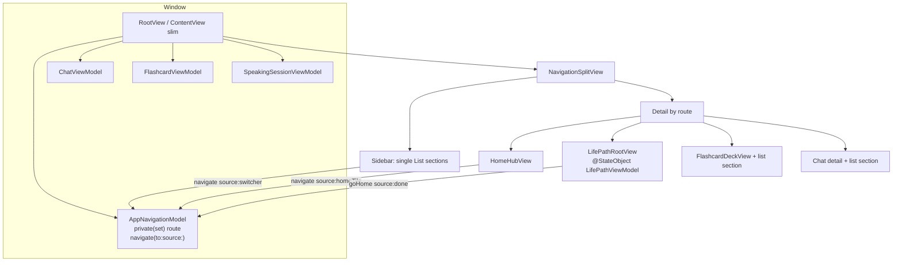
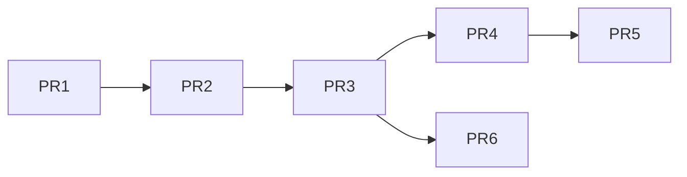

# Multi-feature Home Screen & App Navigation Redesign

| Field | Value |
|-------|--------|
| **Author** | TBD — assign owner before implementation kickoff |
| **Date** | 2026-07-13 |
| **Status** | Draft (revised after design review) |
| **App** | DeveloperChatbot (`chatbot-app/`) |
| **Packages** | `DeveloperChatbot` (executable), `DeveloperChatbotCore` (`Sources/`) |
| **Related** | `docs/life-path-vocab-stages.md`, `docs/design-library-vs-gym.md`, `docs/design-essential-vocab-list.md`, `docs/design-speaking-with-ai.md` |

---

## Overview

DeveloperChatbot began as a chat-first macOS SwiftUI app. It now hosts three primary product surfaces—**Life Path** (Baby→Child progressive vocab game), **Flashcards** (FSRS library/gym + study/practice/speak), and **Chat** (conversations + tools)—plus nested flows (Essential Vocab, practice packs, speaking sessions). Chat is no longer the default product; users should land on a **home hub** that presents feature tiles, then navigate between features without restarting the app.

Today, navigation is a two-segment sidebar picker (`AppSection.conversations | .flashcards`) inside a monolithic `ContentView` (~2.4k LOC). `AppSection` is **declared** in `FlashcardViewModel.swift` but **owned** as `@State private var appSection` on `ContentView`. Life Path and Essential Vocab are **sheets** over flashcards (`flashcardVM.isShowingLifePath` / `isShowingEssentialVocab`), which buries the growth feature and makes cross-feature switching awkward.

This design proposes an incremental navigation model:

1. **`AppRoute`** top-level destinations: `.home`, `.lifePath`, `.flashcards`, `.chat`.
2. **Home hub** as cold-start default (feature cards with due / stage badges where cheap).
3. **Persistent app switcher** (single sidebar `List` with sections on macOS) so any feature is one click away.
4. **Life Path promoted** from sheet → first-class detail route (same `LifePathRootView` body, new hosting).
5. **Single-path navigation** via `AppNavigationModel.navigate(to:source:)` (no direct `$route` writes).
6. **Leave-feature teardown** using **real** ContentView / ChatViewModel / FlashcardViewModel / SpeakingSessionViewModel APIs (D21 helpers stay on root).
7. **Feature shells** extracted from `ContentView` later so sheets and VMs stay coherent without a big-bang rewrite.

**Release constraint:** Do **not** ship Home-as-default without the Life Path route **and** leave-feature audio/session policy in the same release train (see PR Plan).

---

## Background & Motivation

### Current state (verified)

```
WindowGroup
└── ContentView  (@StateObject ChatViewModel, FlashcardViewModel, SpeakingSessionViewModel)
    └── NavigationSplitView
        ├── Sidebar
        │   ├── Picker(AppSection)  // .conversations | .flashcards only
        │   ├── Conversations list  OR  Flashcard list
        │   ├── LanguageToggle
        │   └── DEBUG Speak Debug
        └── Detail
            ├── FlashcardDeckView  (if .flashcards)
            └── Chat UI / empty state  (if .conversations)
    └── Sheets (hosted on detail VStack):
        prompts, endpoints, create flashcard, essential vocab,
        life path, review, practice preview/session, speaking setup/session
```

**Key files:**

| File | Role today |
|------|------------|
| `Sources/App.swift`, `App/App.swift` | `WindowGroup { ContentView() }`, macOS `.hiddenTitleBar` |
| `Sources/ContentView.swift` | Root shell; owns all VMs; `@State appSection`; split view; all major sheets; D21 helpers `dismissPracticeForSpeaking()` / `endSpeakingForPractice()` / `configureSpeakingFromChat()` |
| `Sources/FlashcardViewModel.swift` | **Declares** `enum AppSection` (type only); deck/practice/review flags; `isShowingLifePath`, `isShowingEssentialVocab`; `discardPracticePack()`, `endReviewSession()` |
| `Sources/FlashcardDeckView.swift` | Deck chrome; Essential Words + Life Path header controls; study/practice/speak |
| `Sources/LifePathViews.swift` | `LifePathRootView` — `@StateObject private var vm = LifePathViewModel()`; full game UI; Done → `flashcardVM.isShowingLifePath = false`; `onDisappear` → `chatVM.clearEphemeralAudioCache()` |
| `Sources/LifePathViewModel.swift` | Game state; `endSession()` (not `endSessionIfNeeded`); `cancelLanguagePicker()` sets `flashcardVM?.isShowingLifePath = false`; `dismissLevelUp()`; `attach(flashcardVM:dbManager:)` before `load()` |
| `Sources/ChatViewModel.swift` | Shared TTS/STT; `yieldAudioHardwareForExternalSession()` (safe mic+player yield); `stopPlayback()` (**re-arms mic** if `isMicrophoneActive`); `clearEphemeralAudioCache()` (calls `stopPlayback()`); `playEphemeralSpeech`; private `stopMicrophonePipeline()` |
| `Sources/SpeakingSessionViewModel.swift` | `endSession()`, `discardSession()`; presentation flags `isShowingSetup` / `isShowingSession` / `pendingSessionStart` / `pendingSetupAfterHostDismiss` / `pendingConfig` |
| `Sources/ChatToolsMenu.swift` | Chat-only tools catalog |
| `Sources/Localization.swift` | `L10n` en/zh; Life Path strings already exist |
| `create_xcodeproj.py` | **Explicit** Sources file list for Xcode monorepo target (SPM picks up `Sources/` automatically) |

**Pain points:**

1. **Wrong default.** Cold start opens Conversations (`appSection = .conversations`). Growth/learning users must switch sections and open a sheet to reach Life Path.
2. **Life Path is second-class.** Entry points only on Flashcard vocab tab (header + empty state). Docs already describe it as a *parallel system* to Essential Vocab (`docs/life-path-vocab-stages.md`).
3. **No global “apps” navigation.** Switching Chat ↔ Flashcards works via segmented control; Life Path has no place in that model.
4. **`ContentView` density.** One file owns navigation, chat chrome, log console, modals, speaking configuration, and every feature sheet.
5. **Sheet stacking risk (D21).** Practice ↔ Speak coordinate via `dismissPracticeForSpeaking` / `endSpeakingForPractice` / `pendingSetupAfterHostDismiss`. Life Path as another sheet competes for the same presentation surface; promoting it to a route *reduces* sheet pressure.
6. **Section switches lack teardown today.** Chat ↔ Flashcards already leaves practice/speak/review sheets hosted on the detail container if those flags stay true. Multi-route navigation must **fix** this when leaving Flashcards, not regress it.

### Product framing

Binary/package name stays **DeveloperChatbot** / `DeveloperChatbotCore` (out of scope). UI copy should present a **learning suite** hub: Life Path, Flashcards, Chat—not “chat with flashcard extras.”

---

## Goals & Non-Goals

### Goals

1. **Home hub on startup** with clear tiles for Life Path, Flashcards, Chat (order: Life Path → Flashcards → Chat).
2. **Always-reachable cross-feature navigation** without app restart (home + app switcher).
3. **Life Path as first-class top-level destination** (not a flashcard-owned sheet).
4. **Preserve deep flows** with minimal behavior change: study, practice, speak, essential vocab, chat tools, STT/TTS, D21 mutual exclusion.
5. **Shared VM lifetime** across routes: one `ChatViewModel`, one `FlashcardViewModel`, one `SpeakingSessionViewModel` for the window.
6. **macOS-primary** NavigationSplitView patterns; iOS `#if os(iOS)` is best-effort residue only (`Package.swift` is macOS 15).
7. **Incremental PR train**—each PR reviewable; **release** only when Home + Life Path route + leave-feature policy are present together.
8. **L10n** for all new chrome via existing `AppLanguage` / `L10n` patterns.
9. **Single navigation choke-point** so last-route persistence, logging, and teardown always run.

### Non-Goals

- Renaming the binary, bundle ID, or SPM package.
- Multi-window feature isolation (one window remains one set of VMs).
- Tab bar as primary macOS chrome.
- Full rewrite of chat UI or flashcard deck.
- Promoting Essential Vocab to top-level.
- Persisting in-flight practice packs or speaking sessions across feature switches.
- Deep linking / URL schemes / Continuity handoff.
- New onboarding carousel or account system.
- Long-lived dual navigation (legacy segmented picker + hub) behind a production feature flag.
- Dock / app-icon due badges.
- Confirm dialogs when leaving Speak/Practice (v1 hard-end, same spirit as D21).

---

## Proposed Design

### Navigation model

#### Top-level route enum

```swift
/// Top-level app destinations. Owned by AppNavigationModel (window-scoped).
enum AppRoute: String, CaseIterable, Identifiable, Codable {
    case home
    case lifePath
    case flashcards
    case chat

    var id: String { rawValue }
}
```

**Migration:** `AppSection` (declared in `FlashcardViewModel.swift`, stored as `ContentView` `@State`) is replaced by `AppRoute`. Temporary bridge only during early PRs:

```swift
extension AppRoute {
    /// Maps the two legacy sections during PR1–PR2.
    var legacyAppSection: AppSection? {
        switch self {
        case .chat: return .conversations
        case .flashcards: return .flashcards
        default: return nil
        }
    }
}
```

Delete `AppSection` once no call sites remain.

#### Navigation state ownership — single mutation path

```swift
enum AppNavigationSource: String {
    case coldStart
    case homeTile
    case switcher
    case done          // Life Path toolbar Home / language-picker cancel
    case programmatic  // tests / deep internal
}

@MainActor
final class AppNavigationModel: ObservableObject {
    /// Mutate only via `navigate(to:source:)`.
    @Published private(set) var route: AppRoute

    /// Default false. UI toggle deferred to polish PR; key reserved now.
    var restoreLastRouteOnLaunch: Bool {
        get { UserDefaults.standard.bool(forKey: Self.restoreFlagKey) }
        set { UserDefaults.standard.set(newValue, forKey: Self.restoreFlagKey) }
    }

    private static let lastRouteKey = "app.navigation.lastRoute.v1"
    private static let restoreFlagKey = "app.navigation.restoreLastRoute.v1"

    /// - Parameter defaultRoute: `.chat` in PR1–PR2 (behavior-neutral);
    ///   `.home` starting when Home ships (same train as Life Path route).
    init(defaultRoute: AppRoute = .home) {
        if restoreLastRouteOnLaunch,
           let raw = UserDefaults.standard.string(forKey: Self.lastRouteKey),
           let saved = AppRoute(rawValue: raw) {
            route = saved
        } else {
            route = defaultRoute
        }
    }

    func navigate(to newRoute: AppRoute, source: AppNavigationSource) {
        guard newRoute != route else { return }
        let from = route
        route = newRoute
        UserDefaults.standard.set(newRoute.rawValue, forKey: Self.lastRouteKey)
        // Logging is done by root observer (has ChatViewModel.log); model stays UI-free.
        lastTransition = (from, newRoute, source)
    }

    func goHome(source: AppNavigationSource = .done) {
        navigate(to: .home, source: source)
    }

    /// Last transition for root `onChange` / logging (optional helper).
    private(set) var lastTransition: (from: AppRoute, to: AppRoute, source: AppNavigationSource)?
}
```

**Cold-start product default (final):** `defaultRoute: .home`, `restoreLastRouteOnLaunch == false`.  
**PR1–PR2 only:** construct with `defaultRoute: .chat` so launch stays chat-first until the Home+Life Path train lands.

**Do not** bind `$nav.route`. Switcher and tiles call `navigate` / `goHome` only:

```swift
// Switcher: selected is read-only; taps call navigate
AppSwitcherView(
    selected: nav.route,
    flashcardDue: flashcardVM.dueCount,
    onSelect: { nav.navigate(to: $0, source: .switcher) }
)
```

Root still uses `onChange(of: nav.route)` to run `prepareRouteChange` (fires for every `navigate`).

#### Who owns what

| Concern | Owner | Lifetime |
|---------|--------|----------|
| Top-level `AppRoute` | `AppNavigationModel` (`@StateObject` on root) | Window |
| Chat state, endpoints, TTS/STT hardware | `ChatViewModel` | Window |
| Deck, FSRS, practice, essential flags | `FlashcardViewModel` | Window |
| Speaking session | `SpeakingSessionViewModel` | Window |
| Life Path game UI state | **`LifePathViewModel` as `@StateObject` inside `LifePathRootView`** (v1) | **While Life Path detail is on-screen** (recreated on re-enter; reloads from DB) |
| Feature-local UI | See “UI state that survives route changes” below | |

#### LifePathViewModel ownership (v1 locked — K12)

**v1 = in-view VM (matches sheet today).** Do **not** hoist to root in the navigation MVP.

| Concern | v1 rule |
|---------|---------|
| Where created | `@StateObject private var vm = LifePathViewModel()` in `LifePathRootView` (unchanged) |
| Attach | `onAppear`: `vm.attach(flashcardVM: flashcardVM, dbManager: flashcardVM.dbManager)` then `vm.load()` — **always** use `flashcardVM.dbManager`, never leave the default empty `DatabaseManager()` after appear |
| Root `prepareRouteChange` | **Does not** hold or call `LifePathViewModel`. No `lifePathVM?.endSession…` |
| Leave via switcher / home tile | Route change removes `LifePathRootView` → VM deallocated → in-memory play queue gone; progress already in SQLite. Root runs **shared audio** teardown only |
| Leave via toolbar Home / language Cancel | View calls `onExit()` → `nav.goHome(source: .done)` → same route change path |
| Level-up sheet (`vm.showLevelUp`) | Destroyed with the view on route leave; profile/`pendingNotifyJSON` remain DB-backed and `restorePendingNotify()` on next `load()` |
| Sidebar progress summary | **Out of v1** (needs hoisted VM). Sidebar Life Path zone is empty or a static caption only |
| Fast-follow (post-MVP) | Optional hoist `@StateObject LifePathViewModel` to root/shell for snappier return + `endSession()` from root + sidebar summary |

There is **no** `endSessionIfNeeded()` API. Real method is `LifePathViewModel.endSession()`. Under v1, call it only from in-view chrome (e.g. “End Round” toolbar already does); root never needs it because VM death ends the play session.

#### UI state that survives route changes

| State | Survives leave? | Notes |
|-------|-----------------|-------|
| `ChatViewModel` conversations, active conversation, endpoints, generation | Yes | In-flight **LLM** text generation continues unless user cancels elsewhere |
| Ephemeral TTS / message TTS after leave | **Stopped** on leave (see teardown); in-flight generate may finish into cache only if cancelled mid-flight (`generateAndPlayEphemeralSpeech` already no-ops play if cancelled) |
| `textInput` (`@State` on ContentView) | Yes (feature-local) | Harmless when not on Chat |
| `selectedFlashcard` (`@State`) | Yes | Harmless when not on Flashcards |
| Practice pack / review / speak presentation | **No** — torn down when leaving `.flashcards` |
| Life Path in-memory play | **No** — VM deallocated |
| Life Path / essential / FSRS DB progress | Yes | SQLite |
| `lastStudySession` snapshot | Yes | UserDefaults TTL; not cleared by nav |

---

### Route transition policy (`prepareRouteChange`)

Hosted on **root** next to existing D21 helpers. Uses **only real APIs** (or one thin new public wrapper called out below).

#### Safe shared-audio helpers (verified)

| API | Behavior | When to use on route leave |
|-----|----------|------------------------------|
| `ChatViewModel.yieldAudioHardwareForExternalSession()` | Calls private `stopMicrophonePipeline()` first, then stops player **without** re-arming mic. Clears playing/generating ephemeral IDs. | **Default leave-audio path** whenever chat mic *might* be active (always safe). Prefer this as the single “release hardware” call at the start of teardown. |
| `ChatViewModel.stopPlayback()` | Stops player; **if `isMicrophoneActive`, restarts recorder**. Documented unsafe while chat mic active. | Only when mic is known off (e.g. after yield, or Life Path-only paths that never arm chat mic). Prefer yield instead of guessing. |
| `ChatViewModel.clearEphemeralAudioCache()` | Calls `stopPlayback()` then clears cache — **inherits re-arm risk**. | After yield (mic already false), or when leaving Life Path if chat mic was never used. Safer pattern: `yieldAudioHardwareForExternalSession()` then `ephemeralAudioCache` clear only if we add a mic-safe clear — **v1:** after yield, call `clearEphemeralAudioCache()` only if `!isMicrophoneActive` (true after yield). Actually `clearEphemeralAudioCache` → `stopPlayback` with mic false is fine. Order: **yield first**, then `clearEphemeralAudioCache()` when leaving Life Path / Flashcards ephemeral users. |
| `stopMicrophonePipeline()` | **private** | Do not call from ContentView. Use `yieldAudioHardwareForExternalSession()` or `toggleMicrophone()` when already active. |
| Invented `stopListeningIfNeeded()` | **Does not exist** | Do not invent. |

**v1 leave-audio primitive (root):**

```swift
/// Always safe: kills chat mic pipeline + shared player without re-arm.
private func releaseSharedAudioHardware() {
    viewModel.yieldAudioHardwareForExternalSession()
}
```

Optional thin public alias later (`stopMicrophoneAndPlaybackForRouteChange`) is unnecessary if root always calls `yieldAudioHardwareForExternalSession()`.

#### Teardown matrix (fromRoute × subsystem)

Actions run on **leaving** `from` (and always `releaseSharedAudioHardware()` once at the start of every transition).

| Leaving ↓ / Subsystem → | Shared audio | Speaking (`SpeakingSessionViewModel`) | Practice (`FlashcardViewModel`) | Review | Create card / Essential | Life Path | Chat LLM |
|-------------------------|--------------|----------------------------------------|----------------------------------|--------|-------------------------|-----------|----------|
| **`.home`** | `releaseSharedAudioHardware()` | no-op (should be idle) | no-op | no-op | no-op | n/a | keep |
| **`.chat`** | `releaseSharedAudioHardware()` (stops mic via yield) | no-op | no-op | no-op | no-op | n/a | **keep** in-flight text gen |
| **`.flashcards`** | `releaseSharedAudioHardware()`; if Life Path sheet was open (PR2 only), then **`clearEphemeralAudioCache()`** after yield | **`endSpeakingForPractice()`** (existing: `endSession()` + `discardSession()` when setup/session/pending/config active) | if preview/session/pending/generating → **`discardPracticePack()`** | **`endReviewSession()`** (explicit; do not only set `isShowingReviewSession = false`) | `isShowingCreateSheet = false` (+ `cancelDraft()` if draft); `isShowingEssentialVocab = false` | **Until PR3 (sheet still hosted):** also `flashcardVM.isShowingLifePath = false` so the sheet does not cover Chat after switcher leave. **After PR3:** property deleted; Life Path is its own route (see `.lifePath` row) | keep |
| **`.lifePath`** (PR3+) | `releaseSharedAudioHardware()` then **`clearEphemeralAudioCache()`** (mic already false after yield; matches today’s `onDisappear`) | no-op | no-op | no-op | no-op | **VM deallocated** with view; level-up sheet goes away; **no** root `endSession()` | keep |

**PR2 intermediate note (Life Path still a sheet):** Between PR2 and PR3, Life Path remains `.sheet(isPresented: $flashcardVM.isShowingLifePath)` on the detail container (same as today). That flag **survives** Chat ↔ Flashcards section switches unless teardown clears it—so leave-`.flashcards` **must** set `isShowingLifePath = false` in PR2. After yield, if the flag was true, also call `viewModel.clearEphemeralAudioCache()` so in-sheet autoplay does not keep speaking over Chat. Do **not** wait for PR3 for this dismiss. After PR3 deletes the property, the assignment is removed (compile-checked).

**Entering:**

| Entering | Action |
|----------|--------|
| `.flashcards` | `flashcardVM.loadFlashcards()` |
| `.home` | `flashcardVM.loadFlashcards()` if due badge may be stale (cheap); optional |
| `.lifePath` | `LifePathRootView.onAppear` attach + load |
| `.chat` | none |

**Illustrative root implementation:**

```swift
private func prepareRouteChange(from: AppRoute, to: AppRoute) {
    // 1) Always release mic + player without re-arm (ChatViewModel.yieldAudioHardwareForExternalSession).
    releaseSharedAudioHardware()

    switch from {
    case .flashcards:
        endSpeakingForPractice() // existing D21 helper on ContentView
        if flashcardVM.isShowingPracticePreview
            || flashcardVM.isShowingPracticeSession
            || flashcardVM.pendingPracticeSessionStart
            || flashcardVM.isGeneratingPractice {
            flashcardVM.discardPracticePack()
        }
        if flashcardVM.isShowingReviewSession {
            flashcardVM.endReviewSession()
        }
        if flashcardVM.isShowingCreateSheet {
            flashcardVM.isShowingCreateSheet = false
            if flashcardVM.draft != nil { flashcardVM.cancelDraft() }
        }
        flashcardVM.isShowingEssentialVocab = false
        // PR2–PR3 only: Life Path is still a sheet on the detail container.
        // Dismiss so switcher → Chat does not leave the sheet covering Chat.
        // Delete this block in PR3 when `isShowingLifePath` is removed.
        if flashcardVM.isShowingLifePath {
            flashcardVM.isShowingLifePath = false
            // Mic already off after yield; clear Life Path ephemeral TTS cache.
            viewModel.clearEphemeralAudioCache()
        }

    case .lifePath:
        // PR3+: view teardown drops LifePathViewModel; clear ephemeral TTS (mic already off).
        viewModel.clearEphemeralAudioCache()

    case .chat, .home:
        break
    }

    if to == .flashcards || to == .home {
        flashcardVM.loadFlashcards()
    }

    viewModel.log("Nav: \(from.rawValue) → \(to.rawValue)", tag: "NAV")

    #if DEBUG
    assertRouteAudioIdle(afterLeaving: from)
    #endif
}

#if DEBUG
private func assertRouteAudioIdle(afterLeaving from: AppRoute) {
    // After teardown, speak UI should be down; shared player should be idle.
    assert(!speakingVM.isShowingSession && !speakingVM.isShowingSetup,
           "Speak UI still presented after leaving \(from)")
    assert(!viewModel.isPlayingAudio,
           "Shared player still active after leaving \(from)")
    // Already public @Published on ChatViewModel — no DEBUG-only expose needed.
    // Life Path playback ids use prefix "lifepath-" (LifePathRootView.frontPlaybackId).
    if let id = viewModel.currentlyPlayingEphemeralId, id.hasPrefix("lifepath-") {
        assertionFailure("Life Path ephemeral id still set after leave: \(id)")
    }
}
#endif
```

**DEBUG observability note:** `ChatViewModel.currentlyPlayingEphemeralId` is already **public** `@Published var currentlyPlayingEphemeralId: String?` (same for `generatingEphemeralId`). Prefer asserting `!viewModel.isPlayingAudio && !speakingVM.isShowingSession` after teardown; optionally also assert `viewModel.currentlyPlayingEphemeralId?.hasPrefix("lifepath-") != true`. **No** new DEBUG-only property is required for that check.

**Chat leave + TTS:** Yielding hardware cancels play and clears generating ephemeral IDs inside `yieldAudioHardwareForExternalSession()`. In-flight TTS network may still complete and no-op play (existing `shouldPlay` guard in `generateAndPlayEphemeralSpeech`). Do **not** cancel the main chat LLM stream on leave.

---

### Architecture (target)



```mermaid
sequenceDiagram
    participant User
    participant Home as HomeHubView
    participant Nav as AppNavigationModel
    participant Root as ContentView
    participant LP as LifePathRootView
    participant Chat as Chat detail

    User->>Home: Cold start tiles
    User->>Home: Tap Life Path
    Home->>Nav: navigate(.lifePath, source: .homeTile)
    Nav->>Root: route did change
    Root->>Root: prepareRouteChange(home→lifePath)
    Root->>LP: show detail; onAppear attach+load
    User->>Nav: Switcher → Chat
    Nav->>Root: route = .chat
    Root->>Root: prepareRouteChange(lifePath→chat)<br/>yield audio + clearEphemeral
    Note over LP: View removed; LifePathViewModel deallocated
    Root->>Chat: show detail
    User->>Nav: Switcher → Home
    Nav->>Root: route = .home
```

---

### Wireframes (prose + structure)

#### Cold start → Home

```
┌──────────────────────────────────────────────────────────────────────┐
│  Sidebar (~200–240pt)          │  Detail                             │
│  ┌──────────────────────────┐  │                                     │
│  │  APPS (section)          │  │   Choose what you want to do        │
│  │  • Home          ✓       │  │                                     │
│  │  • Life Path             │  │   ┌─────────────┐ ┌─────────────┐   │
│  │  • Flashcards (3 due)    │  │   │ Life Path   │ │ Flashcards  │   │
│  │  • Chat                  │  │   │ …           │ │ 3 due       │   │
│  ├──────────────────────────┤  │   └─────────────┘ └─────────────┘   │
│  │  (no contextual section) │  │   ┌─────────────┐                   │
│  ├──────────────────────────┤  │   │ Chat        │                   │
│  │  [EN | 中文]             │  │   └─────────────┘                   │
│  └──────────────────────────┘  │                                     │
└──────────────────────────────────────────────────────────────────────┘
```

Tile order: **Life Path → Flashcards → Chat**.

| Tile | Title | Subtitle rule (v1) | SF Symbol |
|------|--------|--------------------|-----------|
| Life Path | `L10n.lifePathTitle` | `L10n.lifePathBrowseHelp` (stage name deferred to polish PR) | `figure.and.child.holdinghands` (already used on deck) |
| Flashcards | `L10n.flashcards` | `L10n.flashcardsWithDue(due: flashcardVM.dueCount)` | `rectangle.on.rectangle.angled` |
| Chat | `L10n.conversations` | Active conversation `title` if any; else `L10n.startNewChat` | `bubble.left.and.bubble.right` |

#### Life Path route

```
┌──────────────────────────────────────────────────────────────────────┐
│  APPS (Life Path selected)     │  LifePathRootView fills detail      │
│  (no extra progress section)   │  Toolbar: End Round / Home          │
│  Language toggle               │  No sheet min-size frame            │
└──────────────────────────────────────────────────────────────────────┘
```

#### Flashcards / Chat routes

Contextual **second section** in the same sidebar `List`: flashcard rows or conversations + New Chat. Header Life Path control **removed** from deck after Life Path route ships.

#### Cross-feature without home

Switcher → any route; `prepareRouteChange` always runs. Home remains first APPS row.

---

### Sidebar structure (macOS v1 — concrete)

**One `List`, two sections — avoid dual `List(selection:)`.**

Switcher rows are plain buttons (or `Label` rows) that call `navigate`; they are **not** a second `List(selection: AppRoute)`. Conversation / flashcard selection keeps the existing selection binding only in the contextual section.

```swift
List {
    Section {
        sidebarRouteRow(.home, title: L10n.home(lang), systemImage: "square.grid.2x2")
        sidebarRouteRow(.lifePath, title: L10n.lifePathTitle(lang),
                        systemImage: "figure.and.child.holdinghands")
        sidebarRouteRow(.flashcards, title: L10n.flashcardsWithDue(lang, due: flashcardVM.dueCount),
                        systemImage: "rectangle.on.rectangle.angled")
        sidebarRouteRow(.chat, title: L10n.conversations(lang),
                        systemImage: "bubble.left.and.bubble.right")
    } header: {
        Text(L10n.appsSection(lang)) // "Apps" / "功能"
    }

    switch nav.route {
    case .home, .lifePath:
        EmptyView()
    case .flashcards:
        Section {
            // Existing flashcard rows; selection: $selectedFlashcard
            ForEach(flashcardVM.flashcardsForSelectedKind) { card in
                // ... same row chrome as today ...
            }
        }
    case .chat:
        Section {
            Button { viewModel.startNewConversation() } label: { /* New Chat */ }
            // Existing conversation list + selection binding
        }
    }
}
.listStyle(.sidebar)

// Footer outside List (unchanged pattern):
// LanguageToggle + DEBUG speak button in VStack below List, or list safeAreaInset.
```

```swift
@ViewBuilder
private func sidebarRouteRow(_ route: AppRoute, title: String, systemImage: String) -> some View {
    Button {
        nav.navigate(to: route, source: .switcher)
    } label: {
        Label(title, systemImage: systemImage)
            .frame(maxWidth: .infinity, alignment: .leading)
            // highlight when nav.route == route (listRowBackground / font weight)
    }
    .buttonStyle(.plain)
}
```

| Topic | v1 decision |
|-------|-------------|
| Dual `List` | **No** |
| Route selection type | Not `List(selection: AppRoute)`; button rows + visual selected state |
| Conversation / card selection | Existing `List`/`ForEach` selection **inside contextual Section only** |
| Collapsed sidebar | System `NavigationSplitView` behavior; no custom column-visibility work in v1 |
| Empty lower zone (Home / Life Path) | Only Apps section + footer language toggle; no fake spacer section required — put `LanguageToggle` in `safeAreaInset(edge: .bottom)` of the sidebar column |
| iOS | **Best-effort** `#if os(iOS)` only (Package is macOS 15). If compact UI is built, reuse the same `navigate` API from a toolbar `Menu`; do not design a separate TabView product |

---

### Home hub view

New file: `Sources/HomeHubView.swift`

```swift
struct HomeHubView: View {
    @ObservedObject var nav: AppNavigationModel
    @ObservedObject var flashcardVM: FlashcardViewModel
    @ObservedObject var chatVM: ChatViewModel
    @Environment(\.appLanguage) private var lang

    private var columns: [GridItem] {
        [GridItem(.adaptive(minimum: 220), spacing: 16)]
    }

    private var chatSubtitle: String {
        if let title = chatVM.activeConversation?.title,
           !title.trimmingCharacters(in: .whitespacesAndNewlines).isEmpty {
            return title
        }
        return L10n.startNewChat(lang)
    }

    var body: some View {
        ScrollView {
            VStack(alignment: .leading, spacing: 24) {
                Text(L10n.homeTitle(lang))
                    .font(.largeTitle.weight(.bold))
                Text(L10n.homeSubtitle(lang))
                    .foregroundStyle(.secondary)

                LazyVGrid(columns: columns, spacing: 16) {
                    featureCard(
                        title: L10n.lifePathTitle(lang),
                        subtitle: L10n.lifePathBrowseHelp(lang),
                        systemImage: "figure.and.child.holdinghands",
                        route: .lifePath
                    )
                    featureCard(
                        title: L10n.flashcards(lang),
                        subtitle: L10n.flashcardsWithDue(lang, due: flashcardVM.dueCount),
                        systemImage: "rectangle.on.rectangle.angled",
                        route: .flashcards
                    )
                    featureCard(
                        title: L10n.conversations(lang),
                        subtitle: chatSubtitle,
                        systemImage: "bubble.left.and.bubble.right",
                        route: .chat
                    )
                }
            }
            .padding(32)
            .frame(maxWidth: 900, alignment: .leading)
        }
        .frame(maxWidth: .infinity, maxHeight: .infinity)
        .background(Color.platformControlBackground)
    }

    private func featureCard(
        title: String,
        subtitle: String,
        systemImage: String,
        route: AppRoute
    ) -> some View {
        Button {
            nav.navigate(to: route, source: .homeTile)
        } label: {
            // large card chrome…
            VStack(alignment: .leading, spacing: 8) {
                Label(title, systemImage: systemImage)
                    .font(.title2.weight(.semibold))
                Text(subtitle)
                    .font(.subheadline)
                    .foregroundStyle(.secondary)
                    .multilineTextAlignment(.leading)
            }
            .frame(maxWidth: .infinity, minHeight: 120, alignment: .topLeading)
            .padding()
        }
        .buttonStyle(.plain)
        .accessibilityHint(L10n.featureCardOpen(lang))
    }
}
```

**Due badge:** Root `onAppear` and enter-home/flashcards call `flashcardVM.loadFlashcards()` (today load only runs when switching `appSection` to flashcards).

**Stage subtitle on Life Path tile:** **Not in MVP.** Optional polish: if `LifePathPreferences.language` is set, `flashcardVM.dbManager.fetchLifePathProfile(language:)` + stage title from catalog — only in polish PR, not a `HomeHubView` constructor parameter in v1.

---

### Life Path migration (sheet → route)

| Step | Change |
|------|--------|
| 1 | Root detail hosts `LifePathRootView` when `nav.route == .lifePath` |
| 2 | Remove `.sheet(isPresented: $flashcardVM.isShowingLifePath)` from `ContentView` |
| 3 | Remove `lifePathControl` + empty-state Life Path button from `FlashcardDeckView` (no transitional deck link) |
| 4 | Replace dismiss paths with `onExit: () -> Void` → `nav.goHome(source: .done)` |
| 5 | Delete `@Published var isShowingLifePath` when unused |
| 6 | `cancelLanguagePicker()` must not set sheet flag — view Cancel button calls `onExit()` (or VM gets `var onCancelLanguagePicker: (() -> Void)?` set from view) |
| 7 | **Remove** sheet-only `.frame(minWidth: 480, minHeight: 560)` so detail fills the split view |
| 8 | Grep and clear **all** `isShowingLifePath` call sites (Done, cancel picker, deck, ContentView sheet) |

#### Exit rules (v1 frozen)

| Exit path | Behavior |
|-----------|----------|
| Toolbar **Home** (`L10n.backToHome`) | `chatVM.stopPlayback` only if mic already off is wrong — prefer rely on route change `releaseSharedAudioHardware`; view may call `chatVM` stop only via yield through parent. Practical: `onExit()` → navigate home → root teardown. View can still `stopPlayback` only after ensuring mic off; simplest: **only** `onExit()` and let root yield. |
| Language picker **Cancel** | **Same as Home** — leave feature (`onExit()`). Parity with today’s `cancelLanguagePicker` closing the sheet. Not “stay on Life Path with picker dismissed.” |
| App switcher to another route | Does **not** call `onExit`; root `prepareRouteChange` + view destruction. Same end state for audio/progress. |
| Level-up sheet open during switcher leave | Sheet dismissed with view; progress/notify DB-backed; next enter may `restorePendingNotify()` |
| End Round (playing) | Existing: `chatVM.stopPlayback()` + `vm.endSession()` — stays in Life Path feature |

**Toolbar label:** use **`L10n.backToHome`** (“Home” / “主页”), not “Done”, so leave-to-hub is obvious.

```swift
struct LifePathRootView: View {
    @ObservedObject var flashcardVM: FlashcardViewModel
    @ObservedObject var chatVM: ChatViewModel
    var onExit: () -> Void = {}
    @StateObject private var vm = LifePathViewModel()
    // ...
    // Language picker cancel:
    Button(L10n.cancel(lang)) {
        // First-time picker cancel leaves the feature (sheet parity).
        onExit()
    }
    // Non-playing toolbar:
    Button(L10n.backToHome(lang)) {
        onExit()
    }
}
```

`LifePathViewModel.cancelLanguagePicker()` today sets the sheet flag — **remove that side effect**. Either delete the method and handle only in the view, or set:

```swift
// View onAppear
vm.onRequestExit = onExit
// cancelLanguagePicker:
func cancelLanguagePicker() { onRequestExit?() }
```

**Attach invariant:** Every appear path must `attach(flashcardVM:dbManager: flashcardVM.dbManager)` before `load()`. Never read game state from a default-constructed VM that owns a separate DB file.

---

### Essential Vocab placement

**Stays under Flashcards** as a sheet. No home tile. No top-level route.

---

### State ownership & ContentView decomposition

| Component | Responsibility |
|-----------|----------------|
| `ContentView` (slim root) | VMs + `AppNavigationModel`; `NavigationSplitView`; `prepareRouteChange`; D21 helpers; global sheets |
| `AppNavigationModel` | `private(set) route` + `navigate` |
| `HomeHubView` | Tiles |
| Feature shells (later PR) | Extract chat/flashcard detail only after nav is stable |

**Sheet hosting (v1):** Keep sheets on root detail container (K8). Do not move practice/speak sheets into shells until nav + teardown are stable.

---

### Localization additions

| Key | EN | ZH |
|-----|----|----|
| `home` / `homeTitle` | Home | 主页 |
| `homeSubtitle` | Choose what you want to do | 选择要开始的功能 |
| `appsSection` | Apps | 功能 |
| `backToHome` | Home | 主页 |
| `featureCardOpen` (a11y) | Open | 打开 |

Reuse: `lifePathTitle`, `lifePathBrowseHelp`, `flashcards`, `flashcardsWithDue`, `conversations`, `startNewChat`.

---

### Platform notes

| Platform | Behavior |
|----------|----------|
| macOS (primary) | Single sidebar `List` + sections; hidden title bar unchanged |
| iOS | Best-effort `#if os(iOS)` only; same `AppRoute` + `navigate` |
| SPM | Auto-includes new files under `Sources/` (except `App.swift`) |
| Xcode monorepo | **Must** update `create_xcodeproj.py` `files = [...]` and regenerate `.xcodeproj` when adding Swift sources |

---

## API / Interface Changes

### New types

```swift
// Sources/AppNavigation.swift
enum AppRoute: String, CaseIterable, Identifiable, Codable { ... }
enum AppNavigationSource: String { ... }
@MainActor final class AppNavigationModel: ObservableObject { ... }
```

### Modified types

```swift
// FlashcardViewModel.swift — remove after migration:
//   enum AppSection
//   @Published var isShowingLifePath

// LifePathRootView
var onExit: () -> Void

// LifePathViewModel
// cancelLanguagePicker no longer touches isShowingLifePath
```

### ContentView body shape

```swift
NavigationSplitView {
    sidebar // single List + sections; navigate via buttons
} detail: {
    Group {
        switch nav.route {
        case .home:
            HomeHubView(nav: nav, flashcardVM: flashcardVM, chatVM: viewModel)
        case .lifePath:
            LifePathRootView(
                flashcardVM: flashcardVM,
                chatVM: viewModel,
                onExit: { nav.goHome(source: .done) }
            )
        case .flashcards:
            FlashcardDeckView(...)
        case .chat:
            chatDetail
        }
    }
    // sheets: all existing except Life Path
}
.onChange(of: nav.route) { old, new in
    prepareRouteChange(from: old, to: new)
}
.onAppear {
    flashcardVM.onLog = { viewModel.log($0, tag: "DB") }
    flashcardVM.loadFlashcards()
}
```

### Before / after

| Action | Before | After |
|--------|--------|-------|
| Launch | Conversations section | **Home** (final train) |
| Open Life Path | Flashcards → sheet | Tile / switcher → detail route |
| Leave Life Path Done | Dismiss sheet → still Flashcards | **Home** |
| Leave Life Path switcher | n/a | Other route; VM torn down |
| Essential Vocab | Sheet from deck | Unchanged |

---

## Data Model Changes

**None** for SQLite.

**UserDefaults:**

| Key | Type | Purpose |
|-----|------|---------|
| `app.navigation.lastRoute.v1` | String | Last route (written on every `navigate`) |
| `app.navigation.restoreLastRoute.v1` | Bool | Opt-in restore; default false; **UI in polish PR only** |

---

## Alternatives Considered

### A. TabView as root
Reject — poor macOS split + contextual lists fit.

### B. Nested NavigationStack only
Reject — loses persistent lists; Life Path already has internal stack.

### C. Third segment, no home
Reject — cramped; no product storytelling.

### D. One-shot home at launch, no return path
Reject — fails ongoing cross-feature nav.

### E. Chosen: Home route + single-List app switcher + feature sections
Adopt — macOS-native; incremental; promotes Life Path.

### F. Three sidebar rows without a Home route
Life Path / Flashcards / Chat only; cold start Life Path or last feature; “Done” becomes no-op or internal Life Path home.

| Pros | Cons |
|------|------|
| One fewer route; simpler Done semantics | No hub storytelling; weaker multi-feature onboarding; loses explicit “apps” landing |
| Slightly less ContentView work | Conflicts with product goal of a selection screen on startup |

**Verdict:** **Reject for v1** while hub storytelling is a stated product goal. Acceptable **fallback** only if Home UI slips but Life Path route + switcher already shipped (then cold-start `.lifePath` temporarily). Not the target architecture.

---

## Security & Privacy Considerations

| Topic | Notes |
|-------|--------|
| Threat model | Navigation-only; no new network surfaces |
| Mic | Leave-chat uses `yieldAudioHardwareForExternalSession()` so mic does not stay hot or get re-armed by bare `stopPlayback()` |
| Data | Route preference non-sensitive UserDefaults |
| Logging | `viewModel.log(..., tag: "NAV")` |

---

## Observability

| Signal | How |
|--------|-----|
| Route changes | `viewModel.log("Nav: \(from) → \(to)", tag: "NAV")` in `prepareRouteChange`; include `nav.lastTransition?.source` when set |
| Home tile vs switcher | `AppNavigationSource` on `navigate` |
| DEBUG post-teardown | Assert `!speakingVM.isShowingSession && !speakingVM.isShowingSetup` and `!viewModel.isPlayingAudio`. Optionally assert `currentlyPlayingEphemeralId` is nil or not `lifepath-` prefix — property is already public `@Published` |
| Metrics | No telemetry pipeline; structured logs only |

---

## Rollout Plan

1. **No long-lived dual navigation flag.** Do not keep production `hubEnabled` branching both UIs through ContentView. At most a **DEBUG-only** hard switch during PR1–PR2 experiments; **delete before MVP ship**. Rollback = git revert of the PR train.
2. **Release train:** Home-default ships only with Life Path route + `prepareRouteChange` leave policy (see PR Plan). Intermediate merges may land on `main` if the app remains chat-default until the final flip.
3. **Testing matrix:** cold start home; all switcher pairs; mid study/practice/speak leave; Life Path mid-round leave; language cancel; level-up then leave; essential sheet; en/zh; Xcode + SPM builds after new files. **PR2-specific:** open Life Path sheet on Flashcards → switcher to Chat → sheet must dismiss and audio stop.

---

## Risks

| Risk | Severity | Mitigation |
|------|----------|------------|
| Session interruption on switch | High (UX) | Explicit matrix; no confirm v1 |
| Audio / mic re-arm via `stopPlayback` | High | Always `yieldAudioHardwareForExternalSession()` first |
| Sheet races if Life Path sheet + route coexist | High | Remove sheet in same PR as route |
| PR train ships Home without Life Path | High | Combined Home+Life Path PR; release gate |
| Teardown lands too late | High | Minimal teardown with first multi-feature switcher |
| ContentView regression | Medium | Incremental PRs |
| Life Path VM re-init | Low | DB progress; intentional v1 |
| Due badge stale | Medium | `loadFlashcards()` on appear / enter home |
| Xcode missing new files | Medium | Update `create_xcodeproj.py` every new-file PR |
| Muscle memory chat-first | Medium | One-click Chat; optional restore later |

---

## Key Decisions

| # | Decision | Rationale |
|---|----------|-----------|
| K1 | **`AppRoute`: home, lifePath, flashcards, chat** | Three pillars + hub |
| K2 | **Cold start → Home** when product ships; last route written always; restore UI later | Discovery + Life Path promotion |
| K3 | **Single sidebar `List` with Apps section + contextual section**; button rows for routes | Avoid dual-`List` footguns; keep conversation/card selection |
| K4 | **Life Path is a route, not a sheet**; remove all deck entry points when route ships | First-class; fewer sheets |
| K5 | **Essential Vocab stays flashcard sheet**; no home tile | Frequency triage funnel |
| K6 | **Shared window-scoped Chat / Flashcard / Speaking VMs** | TTS + D21 |
| K7 | **`prepareRouteChange` teardown matrix** using real D21 helpers + `endReviewSession` / `discardPracticePack` / yield audio | Fix today’s missing section-switch teardown for flashcards; safe mic policy |
| K8 | **Major sheets stay on root in v1** | Avoid re-litigating D21 presentation |
| K9 | **Incremental shells after nav stable** | Reviewable PRs |
| K10 | **No binary rename** | Scope |
| K11 | **Tile order Life Path → Flashcards → Chat** | Growth feature first |
| K12 | **LifePathViewModel stays `@StateObject` in `LifePathRootView` for v1**; root never calls into it; no sidebar progress; hoist is post-MVP only | Coherent with sheet-era lifecycle; avoids half-wired `lifePathVM?` |
| K13 | **All route changes go through `navigate(to:source:)`**; `route` is `private(set)` | Persistence + logging + one choke-point |
| K14 | **Leave-audio = `yieldAudioHardwareForExternalSession()` first** — never bare `stopPlayback()` while mic may be active | Matches ChatViewModel D11 comments |
| K15 | **No long-lived dual navigation feature flag**; DEBUG-only at most; rollback via git | ContentView already huge |
| K16 | **Life Path leave label = Home (`backToHome`)**; language Cancel = leave feature; no confirm-on-leave Speak; no transitional deck Life Path link | Closes open product forks for implementers |
| K17 | **Do not release Home-default without Life Path route + leave-feature policy** | Product + audio safety gate |
| K18 | **New Swift files: update `create_xcodeproj.py` + regenerate Xcode project** (SPM auto-picks Sources) | Monorepo path |

---

## Open Questions

Resolved for v1 (see Key Decisions). Remaining non-blocking:

1. **macOS menu bar** “Go → …” shortcuts — nice-to-have post-MVP.
2. **Hoist LifePathViewModel** timing after MVP — when sidebar stage summary is desired.
3. **Author assignment** before kickoff (metadata).
4. **Whether polish PR reads Life Path stage** via `LifePathPreferences` + `dbManager.fetchLifePathProfile` for home tile subtitle.

*(Ephemeral playback id is already public `@Published currentlyPlayingEphemeralId` — no need to expose a DEBUG-only API.)*

---

## File-level Change Plan

| File | Action |
|------|--------|
| `Sources/AppNavigation.swift` | **Create** — route, source, model |
| `Sources/HomeHubView.swift` | **Create** — hub |
| `Sources/ContentView.swift` | Route switch, single-List sidebar, `prepareRouteChange`, remove Life Path sheet, load flashcards on appear |
| `Sources/FlashcardViewModel.swift` | Remove `AppSection`, `isShowingLifePath` |
| `Sources/FlashcardDeckView.swift` | Remove Life Path controls |
| `Sources/LifePathViews.swift` | `onExit`; Home label; remove min frame; cancel → exit |
| `Sources/LifePathViewModel.swift` | Stop setting `isShowingLifePath` |
| `Sources/Localization.swift` | Home / Apps / backToHome strings |
| `create_xcodeproj.py` | Append new filenames; regenerate `DeveloperChatbot.xcodeproj` |
| `Sources/App.swift` / `App/App.swift` | No change unless root type renamed |

---

## References

- `Sources/ContentView.swift` — split view, sheets, D21 `endSpeakingForPractice` / `dismissPracticeForSpeaking` / `configureSpeakingFromChat`
- `Sources/ChatViewModel.swift` — `yieldAudioHardwareForExternalSession`, `stopPlayback` mic re-arm, `clearEphemeralAudioCache`
- `Sources/FlashcardViewModel.swift` — `AppSection` declaration, `discardPracticePack`, `endReviewSession`, presentation flags
- `Sources/LifePathViews.swift` / `LifePathViewModel.swift` — in-view VM, `endSession`, `dismissLevelUp`, `attach`
- `Sources/SpeakingSessionViewModel.swift` — `endSession`, `discardSession`
- `create_xcodeproj.py` — explicit file list
- `docs/life-path-vocab-stages.md` — Life Path vs Essential
- `Package.swift` — macOS 15, SPM Sources layout

---

## PR Plan

Each PR is reviewable. **Product release** of Home-default requires the **release train** (PR-A through PR-C below) to land together or with chat-default retained until the final flip.

### PR1 — Navigation foundation (behavior-neutral)

- **PR title:** `nav: introduce AppRoute and AppNavigationModel`
- **Files:** `Sources/AppNavigation.swift` (new); `Sources/ContentView.swift` (use model for chat/flashcards mapping only); `create_xcodeproj.py` + regenerate
- **Dependencies:** None
- **Description:** Add `AppRoute`, `AppNavigationSource`, `AppNavigationModel` with **`init(defaultRoute: .chat)`** so launch stays on Chat. `route` is `private(set)`; only `navigate` mutates. Map `.chat`/`.flashcards` to existing UI. Do **not** default to `.home`. Unit-test navigate persistence. No Home UI. No Life Path move.

### PR2 — App switcher + minimal leave-feature teardown

- **PR title:** `nav: sidebar app switcher and minimal prepareRouteChange`
- **Files:** `Sources/ContentView.swift` (single `List` Apps section + contextual sections; remove segmented `Picker`); keep `defaultRoute: .chat`; `create_xcodeproj.py` if needed
- **Dependencies:** PR1
- **Description:** Switcher buttons call `navigate(to:source: .switcher)` for **Chat + Flashcards** (and Home row can exist but may still show empty/placeholder detail **or** omit Home until PR3 — prefer omit Home row until hub exists). Implement **minimal** `prepareRouteChange`: always `viewModel.yieldAudioHardwareForExternalSession()`; when leaving `.flashcards`, call `endSpeakingForPractice()`, `discardPracticePack()` if practice active, `endReviewSession()` if reviewing, dismiss create/essential flags, **and `flashcardVM.isShowingLifePath = false`** (Life Path is still a sheet until PR3 — without this, switcher → Chat leaves the sheet covering Chat). If Life Path was open, also `clearEphemeralAudioCache()` after yield. Fixes orphaned sheets on section switch **before** Home multiplies routes. Still chat-default.

### PR3 — Home hub + Life Path route (release train core)

- **PR title:** `nav: home hub, Life Path top-level route, remove Life Path sheet`
- **Files:** `Sources/HomeHubView.swift` (new); `Sources/ContentView.swift`; `Sources/LifePathViews.swift`; `Sources/LifePathViewModel.swift`; `Sources/FlashcardDeckView.swift`; `Sources/FlashcardViewModel.swift` (`isShowingLifePath` removal); `Sources/Localization.swift`; `create_xcodeproj.py` + regenerate
- **Dependencies:** PR2
- **Description:** **Ship Home and Life Path together.** Flip `defaultRoute` to `.home`. All three tiles + Apps rows (Home, Life Path, Flashcards, Chat). Host `LifePathRootView` in detail with `onExit → goHome(source: .done)`. Remove Life Path sheet and deck controls. Remove sheet min frame. Cancel language picker → `onExit`. Expand `prepareRouteChange` for leaving `.lifePath` (`clearEphemeralAudioCache` after yield). Toolbar Home label. **This is the first PR that may flip cold start away from Chat.**

### PR4 — Teardown polish, DEBUG asserts, logging sources

- **PR title:** `nav: harden prepareRouteChange logging and DEBUG checks`
- **Files:** `Sources/ContentView.swift`
- **Dependencies:** PR3
- **Description:** Log `AppNavigationSource`; DEBUG asserts speak UI down / player idle after teardown using existing public flags (`speakingVM.isShowingSession` / `isShowingSetup`, `viewModel.isPlayingAudio`, optional `viewModel.currentlyPlayingEphemeralId` prefix `lifepath-`). No new ChatViewModel API required. Tighten any missed flags. Not the first introduction of teardown (that is PR2/PR3).

### PR5 — ContentView slimming (feature shells)

- **PR title:** `nav: extract Chat and Flashcards shells from ContentView`
- **Files:** new shell views; slim `ContentView`; `create_xcodeproj.py`
- **Dependencies:** PR3 (PR4 preferred)
- **Description:** Extract detail builders; keep sheets/D21 on root. No product change.

### PR6 — Optional restore-last-route UI + home stage subtitle

- **PR title:** `nav: restore-last-route toggle and home Life Path subtitle`
- **Files:** prefs UI (e.g. endpoints modal); `AppNavigationModel`; `HomeHubView` optional reader via `LifePathPreferences` + `flashcardVM.dbManager.fetchLifePathProfile`
- **Dependencies:** PR3
- **Description:** Expose restore flag; optional stage subtitle; a11y polish. No dual nav UI.

---

### PR dependency graph



| Gate | Requirement |
|------|-------------|
| **Merge to main early** | PR1–PR2 OK while still chat-default |
| **MVP product ship (Home-default)** | **PR1 + PR2 + PR3** minimum; PR4 strongly recommended same release |
| **Quality follow-ups** | PR5–PR6 |

**Do not release Home-default without Life Path route + leave-feature audio/session policy** (K17).

---

*End of design document.*
