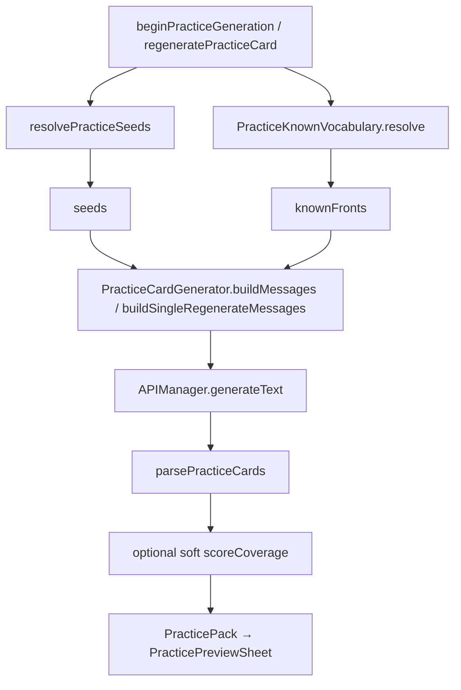
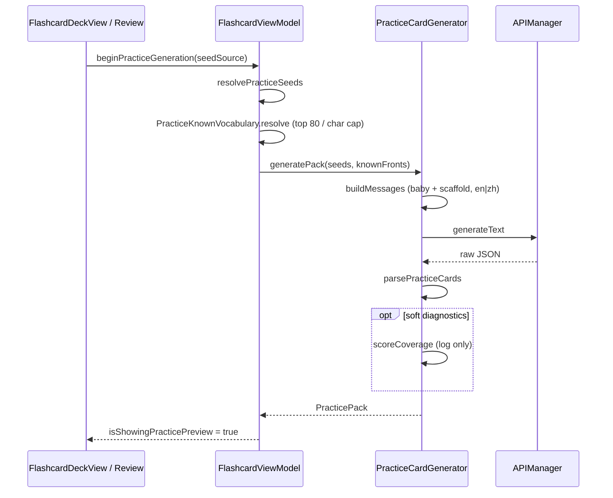
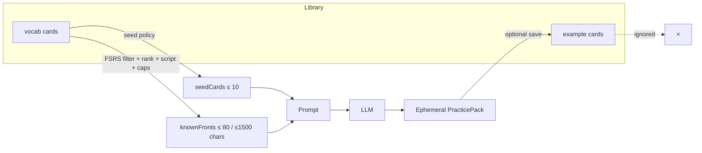

# Design: Practice with AI — Known Vocabulary Scaffolding + Baby Language

| Field | Value |
|-------|--------|
| **Status** | Draft (revised post-review round 2, 2026-07-11) |
| **Author** | — |
| **Date** | 2026-07-11 |
| **App** | DeveloperChatbot (`chatbot-app/`) |
| **Related** | `/flashcard_system.md`, `docs/design-library-vs-gym.md`, `docs/design-practice-after-study.md` |
| **Primary code** | `Sources/PracticeCardGenerator.swift`, `Sources/PracticePack.swift`, `Sources/FlashcardViewModel.swift`, `Sources/PracticeScaffolding.swift` (new) |

---

## Overview

**Practice with AI** generates ephemeral example sentences from vocabulary seed cards (`PracticeCardGenerator` → preview → session → optional save as `kind = example`). Today the system prompt asks for **natural** sentences with varied contexts (daily life, questions, negation, work/study) and does **not** constrain non-target words to the learner’s known library. The model freely invents surrounding vocabulary, so practice often introduces more unknown words than the seed itself — undermining the “gym” goal of reinforcing usage of words the learner is already studying.

This design makes practice sentences **comprehensible by construction**:

1. **Scaffold with known vocabulary** — prefer non-target words drawn from the user’s vocab library (FSRS-informed “known” set).
2. **Baby language (CEFR A0–A1)** — hard simplicity constraint on structure, length, and function words; always active on the default path, and the primary fallback when the known set is sparse.

**Default path always composes** both strategies. `.natural` is a full opt-out of composition (legacy freer prompts), deferred to PR4 — not part of the v1 default. Practice remains ephemeral; Library vs Gym is unchanged. Changes are concentrated in the generation pipeline (prompt + known-set resolver) with optional soft post-generation diagnostics and a deferred UI preference.

---

## Background & Motivation

### Current state

| Piece | Behavior today |
|-------|----------------|
| Seeds | Due vocab, last study session, or manual multi-select (`PracticeSeedSource`) |
| Cap | `PracticeGenerationConfig.maxDueSeeds` = 10; `examplesPerCard` = 2 |
| Prompt | “natural example-sentence practice”; varied contexts; no known-vocab list |
| Output | JSON `{"items":[{"parent_id","parent_front","sentence","translation","phonics"}]}` |
| Regenerate | Single-item path with “avoid” list of existing sentences; same natural-language framing |
| Persistence | Ephemeral pack; save → Examples with `parent_flashcard_id` |

Relevant APIs:

- `PracticeCardGenerator.generatePack(from:endpoint:model:appLanguage:apiManager:…)`
- `PracticeCardGenerator.regenerateExample(seed:existingSentences:…)`
- `PracticeCardGenerator.buildMessages` / `buildSingleRegenerateMessages`
- `FlashcardViewModel.beginPracticeGeneration` / `regeneratePracticeCard`
- `Flashcard.kind` (`vocab` \| `example`), `Flashcard.fsrsCard` (`CardState`, `stability`, `reps`, …)

### Pain points

1. **Comprehension cliff** — Natural sentences optimized for fluency introduce low-frequency or off-curriculum words.
2. **Weak i+1 control** — The only “new” material should be the seed (target) word in a usable frame; everything else should be familiar or trivial.
3. **Inconsistent gym quality** — Saved examples (gym) inherit whatever the model invented; over months the gym becomes harder than the library.
4. **No learner model in the prompt** — The deck already encodes “what I know” via FSRS and curated fronts; generation ignores it.

### Constraints we keep

- No FSRS writes from practice.
- Seeds remain **vocab only** (never examples).
- No new decks; kinds stay library vs gym.
- Token budgets remain modest (local / OpenAI-compatible endpoint; `maxTokens` 2500 pack / 500 single — these are **completion** budgets).

---

## Goals & Non-Goals

### Goals

1. Define a concrete **known vocabulary** set from the user’s vocab library + FSRS heuristics.
2. Inject that set into pack and single-regenerate prompts **without** blowing context (top-N, short fronts only).
3. Enforce **baby language / A0–A1** as a hard generation constraint on the default path, composing with known-vocab preference.
4. Apply the same policy to **full pack** and **per-item regenerate**.
5. Handle failure modes: empty library, all-new cards, target not “known”, model still invents hard words, multi-seed packs, mixed-script libraries.
6. Optionally soft-validate or flag hard sentences; do not block practice on imperfect validation (v1).
7. Ship incrementally with independently reviewable PRs.
8. Preserve ephemeral practice and Library vs Gym semantics.

### Non-Goals

- Changing FSRS parameters, due logic, or parent-card influence from example reviews.
- Named multi-deck / topic filters for scaffolding.
- Full CEFR classifier or external graded-reader corpus.
- Hard rejection loops that auto-retry the LLM until zero unknown tokens (expensive, flaky).
- Training a local model or embedding-based word difficulty scorer (v1).
- Changing save destination (still Examples) or making practice non-ephemeral.
- Perfect Chinese word segmentation for validation (best-effort greedy longest-match only).
- Dual-path `.natural` prompt branch in PR1–PR2 (deferred to PR4).

---

## Key Decisions

| # | Decision | Choice | Rationale |
|---|----------|--------|-----------|
| K1 | Strategy composition | **Default path always composes**: baby language (hard) + known-vocab preference (soft). `.natural` is a **full opt-out** of both (legacy freer prompts), implemented only in PR4 | Learner benefit stacks on the product path; sparse libraries still get simple sentences; rich libraries get scaffolding. Opt-out is not “composition with weaker prefs” |
| K2 | Known definition (v1) | Vocab with `fsrsCard.state != .new` **or** `reps >= 1` | Matches “touched in study”; includes learning/review/relearning. Under current `swift-fsrs`, a successful review both leaves `.new` and increments `reps`, so the two sides of the OR are **effectively equivalent** for normal rows; the OR is defensive for corrupted/legacy rows |
| K3 | Seeds vs known | Seeds are always legal targets **and** legal scaffold content across the pack. **Do not exclude seed IDs** from the known list. Prompt legal set = `KNOWN_VOCAB ∪ all seed fronts` | Multi-seed packs often co-occur related session words; excluding other seeds forbids the best scaffold atoms. Token cost of double-listing is tiny vs. fighting the scaffold goal |
| K4 | Prompt injection | Pass **front strings only**, capped by count (`maxKnownScaffoldWords` = 80) **and** secondary char budget (`maxKnownScaffoldChars` ≈ 1500), sorted by usefulness (stability ↓, then reps ↓, then front length ↑) | Token-safe **input** overhead; fronts are the learner’s lexicon; backs/phonics would bloat. `maxTokens` remains **completion-only** |
| K5 | Closed-class + sparse escape | Always allow ultra-common function words. When known set is empty/sparse, also allow ultra-high-frequency beginner **content** words needed for a grammatical SVO frame; still ban idioms/slang/domain jargon | Function words alone cannot form meaningful sentences with only the seed; absolute beginners need an explicit content-word escape hatch |
| K6 | UI preference (v1) | **Always-on** `.comprehensible`; no difficulty picker in first ship | Matches product request; avoids settings sprawl. Enum may declare `.natural` as a stub, but PR2 does not branch on it |
| K7 | Validation (v1) | Soft **diagnostics** only (log + optional preview caption); no auto-regenerate loop. English: whitespace tokenizer. Chinese: greedy longest-match CJK cover (formula specified below) | Chinese tokenization is unreliable for hard-fail; soft logs still measure leakage |
| K8 | Example-kind cards | **Not** used as known scaffold tokens | Gym sentences are multi-word; would pollute the “known word” list and bloat tokens |
| K9 | Context variety | Soften “work/study / varied natural contexts” when it conflicts with simplicity | Prefer 2 short, distinct frames over forced workplace jargon |
| K10 | Library vs Gym | Unchanged | Scaffolding is generation-only; save path untouched |
| K11 | Front length filter | **Language-aware**: if front contains CJK, max **12** characters; else max **24** characters **or** max **3** whitespace-separated tokens (whichever fails first drops the front) | Uniform 12 silently drops useful English phrases (“good morning”); Chinese 2–4 char words stay fine under 12 |
| K12 | Script congruence | Prefer known fronts that share script class with the pack’s seed fronts (majority script of seeds). Soft preference in ranking; prompt also says scaffold in the same language/script as the seed front | Mixed L1/L2 decks otherwise encourage code-switching |
| K13 | API shape (v1) | Pass **`knownFronts`** (+ optional `style` defaulting to `.comprehensible`) positionally. **No** `PracticeScaffoldContext` type in v1 | One recommended shape avoids pack vs regenerate inconsistency; context bag can return later if fields proliferate |
| K14 | Testing / packaging | Pure ranking/normalize helpers live in `PracticeScaffolding.swift` (no `@MainActor`). **Do not** gate PR1 on SPM unit tests: `DeveloperChatbotTests` depends only on FSRS, and the app is an `executableTarget`. v1 acceptance = manual checklist (+ optional string-assert helpers run by hand). Optional follow-up: split `DeveloperChatbotCore` library for real unit tests | Honesty over fake “unit-testable” claims |

---

## Decision Log (closed questions)

| Topic | Decision |
|-------|----------|
| Learning-state cards as known? | **Yes** (K2). Includes `learning` / `review` / `relearning` via `state != .new \|\| reps >= 1`. Not limited to `.review` only — broader known set helps scaffold volume. |
| Exclude seed IDs from known list? | **No** (K3). Seed fronts may appear as content for any pack item. |
| Max front length | **Language-aware** (K11). CJK ≤ 12; Latin ≤ 24 chars or ≤ 3 tokens. |
| `PracticeScaffoldContext` in v1? | **Dropped** (K13). Positional `knownFronts` + default style. |
| Dual-path `.natural` in PR2? | **No**. PR2 hardcodes comprehensible prompts only; PR4 implements opt-out. |
| Unit tests in PR1? | **Not an acceptance gate** without Package.swift change (K14). |

---

## Proposed Design

### Mental model

```
Seed (target)  +  Known library words (scaffold)  +  Baby grammar
        │                    │                            │
        └────────────────────┴────────────────────────────┘
                             ▼
              Short, comprehensible practice sentence
```

> **Study schedules memory. Practice drills usage in language the learner can already mostly read.**

### Architecture



New pure helpers live in `Sources/PracticeScaffolding.swift` (no MainActor). Config/style enum live in `PracticePack.swift` next to existing practice models:

```swift
/// How strictly sentences should stay simple / scaffolded.
/// v1 / PR2: only `.comprehensible` is implemented in prompts.
/// `.natural` is a stub for PR4 (full opt-out of baby + known constraints).
enum PracticeSentenceStyle: String, CaseIterable, Equatable {
    /// A0–A1 structure + prefer known vocab (default product behavior).
    case comprehensible
    /// Legacy natural sentences — full opt-out; prompt branch lands in PR4 only.
    case natural
}

enum PracticeGenerationConfig {
    static let maxDueSeeds = 10
    static let examplesPerCard = 2
    /// Completion token budget for pack generation (APIManager.generateText maxTokens).
    static let maxTokens = 2500
    /// Completion token budget for single regenerate.
    static let singleExampleMaxTokens = 500

    /// Max known fronts injected into the prompt (count cap).
    static let maxKnownScaffoldWords = 80
    /// Secondary cap on total characters of known fronts after ranking (input budget).
    static let maxKnownScaffoldChars = 1500
    /// Below this count, prompts emphasize baby language + sparse content-word escape.
    static let minKnownForRichScaffold = 12
    /// CJK front max length (characters).
    static let maxKnownFrontCharacterCountCJK = 12
    /// Latin / non-CJK front max length (characters).
    static let maxKnownFrontCharacterCountLatin = 24
    /// Latin / non-CJK front max whitespace-separated tokens.
    static let maxKnownFrontTokenCountLatin = 3
    /// Soft target length for generated sentences (interpolated into prompts).
    static let babyLanguageMaxCharsChinese = 20
    static let babyLanguageMaxWordsEnglish = 10
}
```

### Defining “known vocabulary”

#### Source set

```text
candidates = flashcards.filter { $0.kind == .vocab }
```

Examples (`kind == .example`) are **excluded**. Their `front` is a full sentence; using them as scaffold tokens confuses the model and wastes budget.

#### Heuristic (v1 — recommended)

A vocab card is **known** if any of:

| Condition | Meaning |
|-----------|---------|
| `fsrsCard.state != .new` | Has entered learning / review / relearning |
| `fsrsCard.reps >= 1` | Has been graded at least once |

**Note (K2):** Under `swift-fsrs`, a successful review moves `state` off `.new` **and** increments `reps`. For healthy rows the two predicates are equivalent; keep the OR as a defensive belt for corrupted/legacy data.

Seeds for the current pack are **not required** to be known (new words still need practice frames). They are always legal **targets** via `SEED_CARDS`. When a seed also passes the known filter, it **remains** in `knownFronts` (do **not** exclude by seed id) so multi-seed packs can reuse co-session fronts as scaffold content.

#### Explicit non-choices for v1

| Alternative | Why deferred |
|-------------|--------------|
| Stability ≥ N only | Arbitrary; early learners would never scaffold |
| “All vocab except seeds” | Treats unstudied headwords as known — wrong |
| Exclude all seed IDs from known | Breaks multi-seed scaffolding (other seeds’ fronts become “illegal” content words) |
| User-selected known subset | Extra UI; library already is the selection |
| Include example cards | Multi-word fronts; poor scaffold units |

#### Front eligibility (K11)

```swift
static func isEligibleKnownFront(_ front: String) -> Bool {
    let trimmed = front.trimmingCharacters(in: .whitespacesAndNewlines)
    guard !trimmed.isEmpty else { return false }
    if containsCJK(trimmed) {
        return trimmed.count <= PracticeGenerationConfig.maxKnownFrontCharacterCountCJK
    }
    let tokens = trimmed.split { $0.isWhitespace }.map(String.init)
    guard tokens.count <= PracticeGenerationConfig.maxKnownFrontTokenCountLatin else { return false }
    return trimmed.count <= PracticeGenerationConfig.maxKnownFrontCharacterCountLatin
}
```

#### Script congruence (K12)

After ranking candidates, prefer fronts that match the **majority script class of the current seed fronts** (CJK-majority vs Latin-majority). Implementation:

1. Classify each seed front as `.cjk` if it contains any CJK character, else `.latin`.
2. Majority among seeds wins (ties → no filter).
3. Reorder: congruent fronts first (preserving relative rank), then incongruent (still included if budget remains — soft preference, not hard drop).

Prompt rule reinforces: scaffold with `KNOWN_VOCAB` items written in the same language/script as the seed front.

#### Ranking for top-N

When building the known list:

1. Filter `kind == .vocab`, known heuristic, eligible front length.
2. Rank: higher `stability` → higher `reps` → shorter `front` → alphabetical on normalized key.
3. Soft-reorder by script congruence with seeds (K12).
4. Dedup by `PracticeScaffolding.normalizeFrontKey` (see below).
5. Take until `maxKnownScaffoldWords` **or** cumulative character count would exceed `maxKnownScaffoldChars` (secondary input budget).

#### Dedup key (parity with generator)

`PracticeCardGenerator`’s private helper is:

```swift
// Existing: trim + lowercased (no internal whitespace collapse)
private static func normalizeKey(_ value: String) -> String {
    value.trimmingCharacters(in: .whitespacesAndNewlines).lowercased()
}
```

Shared helper for scaffolding + generator:

```swift
enum PracticeScaffolding {
    /// Same semantics as PracticeCardGenerator.normalizeKey — trim + lowercased.
    /// Prefer making generator call this (internal/static shared) instead of a private duplicate.
    static func normalizeFrontKey(_ value: String) -> String {
        value.trimmingCharacters(in: .whitespacesAndNewlines).lowercased()
    }
}
```

Do **not** claim “whitespace-normalized” beyond trim; internal spaces are preserved in the key after lowercasing (`"Good Morning"` → `"good morning"`).

#### Pure resolver (recommended placement)

```swift
// Sources/PracticeScaffolding.swift — pure, no MainActor
enum PracticeKnownVocabulary {
    static func resolve(
        from flashcards: [Flashcard],
        seedFrontsForScriptHint: [String] = [],
        limit: Int = PracticeGenerationConfig.maxKnownScaffoldWords,
        maxChars: Int = PracticeGenerationConfig.maxKnownScaffoldChars
    ) -> [String] {
        let vocab = flashcards.filter { $0.kind == .vocab }
        let known = vocab.filter { card in
            card.fsrsCard.state != .new || card.fsrsCard.reps >= 1
        }
        let ranked = known.sorted { a, b in
            if a.fsrsCard.stability != b.fsrsCard.stability {
                return a.fsrsCard.stability > b.fsrsCard.stability
            }
            if a.fsrsCard.reps != b.fsrsCard.reps {
                return a.fsrsCard.reps > b.fsrsCard.reps
            }
            if a.front.count != b.front.count {
                return a.front.count < b.front.count
            }
            return PracticeScaffolding.normalizeFrontKey(a.front)
                < PracticeScaffolding.normalizeFrontKey(b.front)
        }
        let ordered = preferScriptCongruent(ranked, seedFronts: seedFrontsForScriptHint)
        var seen = Set<String>()
        var fronts: [String] = []
        var charBudget = 0
        for card in ordered {
            let front = card.front.trimmingCharacters(in: .whitespacesAndNewlines)
            guard isEligibleKnownFront(front) else { continue }
            let key = PracticeScaffolding.normalizeFrontKey(front)
            guard seen.insert(key).inserted else { continue }
            let added = front.count + (fronts.isEmpty ? 0 : 1) // +1 for JSON separator slack
            if charBudget + added > maxChars { continue }
            fronts.append(front)
            charBudget += added
            if fronts.count >= limit { break }
        }
        return fronts
    }
}
```

**Wiring (no seed-id exclusion):**

```swift
// FlashcardViewModel.beginPracticeGeneration
let seeds = resolvePracticeSeeds(source: source)
let known = PracticeKnownVocabulary.resolve(
    from: flashcards,
    seedFrontsForScriptHint: seeds.map(\.front)
    // Do NOT pass excludingSeedIds — multi-seed scaffold needs co-seed fronts.
)
let pack = try await PracticeCardGenerator.generatePack(
    from: seeds,
    knownFronts: known,
    style: .comprehensible, // PR2: only this path is implemented
    ...
)
```

**Cold-start:** if `knownFronts` is empty (all cards new, or empty library except seeds that fail the known filter), generation still runs with **baby language** + closed-class + sparse ultra-common content words. No user-facing error. Seed fronts remain legal via `SEED_CARDS`.

### Prompt design

#### Priority ladder (both en / zh — hard-coded into system prompts)

1. **Must** use the seed’s `front` as the learning target in `sentence`.
2. **Prefer** `KNOWN_VOCAB` for content words (nouns, verbs, adjectives).
3. **Always allow** closed-class function words (articles, pronouns, basic particles, copula, negation, question particles, basic prepositions/auxiliaries).
4. **Any front in `SEED_CARDS`** may appear as content in **any** item (multi-seed legal set).
5. **If sparse/empty known:** allow only ultra-high-frequency beginner content words needed for a grammatical SVO frame (e.g. water/person/eat/go/want · 水/人/吃/去/要); still ban idioms, slang, domain jargon, literary style.
6. **Avoid** rare / domain-specific content words; do **not** introduce new learning targets outside seed + known + (sparse) ultra-common beginners.

Soften absolute “Do NOT introduce …” to “Avoid rare / domain-specific …; do not introduce new learning targets.”

#### Composition rule (implementers)

**Compose** new scaffold + baby-language rules **onto** the current production structural skeleton — do **not** wholesale-replace the system string and drop multi-seed plumbing. Retain (and restate in the system prompt, not only the user message):

| Structural rule (pack) | Production wording to keep |
|------------------------|----------------------------|
| Exact count | Exactly `\(examplesPerCard)` items per seed card |
| Parent binding | `parent_id` MUST be the seed card `id` from the input |
| Parent front | `parent_front` should match that seed’s `front` |

| Structural rule (regenerate) | Production wording to keep |
|------------------------------|----------------------------|
| Exact count | Exactly 1 item |
| Parent binding | `parent_id` MUST equal the seed card id |
| Avoid hardness | Do not repeat or lightly rephrase any sentence under avoid |

`parsePracticeCards` can fall back to `parent_front` via `normalizeKey`, but missing explicit `parent_id` guidance regresses multi-seed parent linking (wrong save link / preview grouping).

#### English system prompt (pack) — interpolate config constants

```text
You are a language-learning tutor for absolute beginners (CEFR A0–A1).
Given seed flashcards, create VERY SIMPLE practice sentences.

Output valid JSON only — no markdown fences, no commentary.
Schema: {"items":[{"parent_id","parent_front","sentence","translation","phonics"}]}

Structural rules (output plumbing — retain from production):
- Exactly \(examplesPerCard) items per seed card.
- parent_id MUST be the seed card id from the input.
- parent_front should match that seed's front.
- sentence MUST use the seed's front word/phrase as the learning target.
- translation matches the meaning of sentence (same language as card back when possible).
- phonics: pinyin when sentence is Chinese; else empty/omit.

Hard rules (baby language):
- Short sentences: prefer ≤ \(babyLanguageMaxWordsEnglish) English words or ≤ \(babyLanguageMaxCharsChinese) Chinese characters.
- Simple SVO / everyday patterns only. No rare idioms, slang, or literary style.
- Prefer present tense / basic aspect. Avoid complex subordination.
- Vary frames slightly (statement, yes/no question, simple negation) WITHOUT raising vocabulary difficulty.

Scaffold priority (highest → lowest):
1. Use the seed front as the target.
2. Prefer non-target content words from KNOWN_VOCAB.
3. You MAY always use ultra-common function words not on the list.
4. Any front appearing in SEED_CARDS may appear as content in any item.
5. Avoid rare or domain-specific content words; do not introduce new learning targets.
6. Scaffold with KNOWN_VOCAB items written in the same language/script as the seed front.

Sparse known set:
- If KNOWN_VOCAB is empty or very small, use baby language + function words, and only the most basic beginner content words needed for a grammatical sentence (see ultraCommonBeginnerContent). Still ban idioms/slang/jargon.

Do not invent unrelated new headwords as the learning target.
```

Builder interpolates `PracticeGenerationConfig.babyLanguageMaxWordsEnglish`, `babyLanguageMaxCharsChinese`, and `examplesPerCard` (never hardcode `10` / `20` / `2` as literals in prompt strings). Tests / manual checks: prompt string contains the configured numbers **and** the structural `parent_id` / exact-count bullets.

#### Chinese system prompt (pack) — full 1:1 mirror

```text
你是面向绝对初学者（CEFR A0–A1）的语言学习助教。
根据种子闪卡，生成非常简单的练习例句。

只输出合法 JSON，不要 markdown 代码块，不要解释。
JSON 结构：{"items":[{"parent_id","parent_front","sentence","translation","phonics"}]}

结构规则（输出管线——保留现有生产要求）：
- 每张种子卡恰好 \(examplesPerCard) 条 items。
- parent_id 必须是输入中的种子卡 id。
- parent_front 应与该种子卡的 front 一致。
- sentence 必须把该种子卡的 front 作为学习目标来使用。
- translation 为 sentence 的翻译（尽量与卡片 back 语言一致）。
- phonics：若 sentence 为中文则填拼音；否则可省略或空字符串。

硬性规则（幼儿式语言）：
- 句子要短：英文优先 ≤ \(babyLanguageMaxWordsEnglish) 个词，中文优先 ≤ \(babyLanguageMaxCharsChinese) 个汉字。
- 只用简单主谓宾/日常句式。不要生僻习语、俚语或书面语。
- 优先一般现在时/基本体貌，避免复杂从句。
- 可轻微变化句式（陈述、是非问、简单否定），但不要因此提高词汇难度。

脚手架优先级（高 → 低）：
1. 必须使用种子 front 作为目标词。
2. 非目标实词优先来自 KNOWN_VOCAB。
3. 可以始终使用列表外的超常见虚词/功能词（助词、代词、系词、否定、疑问、基本介词/助动词等）。
4. SEED_CARDS 中出现的任一 front，都可以作为任意条目的内容词。
5. 避免生僻或专业领域实词；不要引入新的学习目标词。
6. 脚手架用词尽量与种子 front 同一语言/文字系统。

已知词很少时：
- 若 KNOWN_VOCAB 为空或很少，依靠幼儿式语言 + 功能词，并仅允许构成语法通顺简单句所必需的超高频初学实词（见 ultraCommonBeginnerContent）。仍禁止习语/俚语/行话。

不要发明与 front 无关的新词作为练习目标。
```

JSON keys stay English in both languages (schema parity with existing generator).

#### User message structure (en)

```text
KNOWN_VOCAB (prefer these words for scaffolding; may be empty):
["吃","水","我","学校", ...]

SEED_CARDS (generate exactly N examples each):
[{"id":"...","front":"...","back":"...","phonics":"..."}, ...]
```

#### User message structure (zh)

```text
KNOWN_VOCAB（脚手架优先用词，可为空）：
["吃","水","我","学校", ...]

SEED_CARDS（每张种子恰好生成 N 条例句）：
[{"id":"...","front":"...","back":"...","phonics":"..."}, ...]
```

#### Sparse known set

When `knownFronts.count < minKnownForRichScaffold`:

- Append extra system bullet (en): “KNOWN_VOCAB is limited — use only the simplest possible words; short pattern sentences are better than rich vocabulary. You may use ultra-common beginner content words for a basic SVO frame.”
- Append (zh): “KNOWN_VOCAB 有限——只用最简单的词；短句优于丰富词汇。可为基本主谓宾句使用超高频初学实词。”
- Temperature: keep 0.7 pack / 0.85 regenerate for v1; simplicity is prompt-driven. If evaluation shows leakage, try 0.5 for pack in a follow-up.

#### Context variety vs simplicity (K9)

Today:

> Vary context across examples (daily life, questions, negation, work/study, etc.)

Change to (en / zh):

> Vary *frame* (affirmative / question / negation) using the simplest possible words. Do not force workplace, academic, or news topics if that requires hard vocabulary.  
> 用最简单的词变化句式（肯定 / 疑问 / 否定）。若需要难词，不要强行使用职场、学术或新闻话题。

#### Single-item regenerate

`buildSingleRegenerateMessages` accepts the same `knownFronts` (and default style). **Compose** scaffold/baby rules onto the production regenerate skeleton — retain exact-1, `parent_id` equality, and avoid-list hardness.

**English system prompt (regenerate):**

```text
You are a language-learning tutor for absolute beginners (CEFR A0–A1).
Create exactly 1 new VERY SIMPLE practice sentence for the given flashcard.

Output valid JSON only — no markdown fences, no commentary.
Schema: {"items":[{"parent_id","parent_front","sentence","translation","phonics"}]}

Structural rules (output plumbing — retain from production):
- Exactly 1 item.
- parent_id MUST equal the seed card id.
- parent_front should match the seed's front.
- sentence MUST use the card's front word/phrase as the learning target.
- Do not repeat or lightly rephrase any sentence listed under avoid.
- translation is the meaning of sentence (same language as card back when possible).
- phonics: pinyin when sentence is Chinese; else empty/omit.

Hard rules (baby language) + Scaffold priority: same ladder as pack (items 1–6, sparse escape, script congruence).
Interpolate baby length constants. PR2: no `.natural` branch.
```

**Chinese system prompt (regenerate) — mirror:**

```text
你是面向绝对初学者（CEFR A0–A1）的语言学习助教。
为给定闪卡生成恰好 1 条全新的非常简单练习例句。

只输出合法 JSON，不要 markdown 代码块，不要解释。
JSON 结构：{"items":[{"parent_id","parent_front","sentence","translation","phonics"}]}

结构规则（输出管线——保留现有生产要求）：
- 恰好 1 条 item。
- parent_id 必须等于输入卡的 id。
- parent_front 应与种子卡的 front 一致。
- sentence 必须把 front 作为学习目标来使用。
- 不要与“避免使用的句子”重复或仅做微小改写。
- translation 为 sentence 的翻译（尽量与卡片 back 语言一致）。
- phonics：若 sentence 为中文则填拼音；否则可省略或空字符串。

硬性规则（幼儿式语言）+ 脚手架优先级：与 pack 相同（1–6、稀疏逃生舱、文字系统一致）。
插值 baby 长度常量。PR2：无 `.natural` 分支。
```

**User message (regenerate)** keeps production shape: single seed JSON + avoid list + “Generate 1 new…” / “请生成 1 条新例句”, plus `KNOWN_VOCAB` block (same as pack).

- Temperature stays higher (0.85) for diversity under constraints.
- Wire `FlashcardViewModel.regeneratePracticeCard` to resolve known vocab at call time (fresh library state) and pass it through — **without** excluding the seed id.

#### API surface changes

```swift
// PracticeCardGenerator — PR2
static func generatePack(
    from seedCards: [Flashcard],
    knownFronts: [String],
    style: PracticeSentenceStyle = .comprehensible, // only .comprehensible implemented until PR4
    endpoint: String,
    model: String,
    appLanguage: AppLanguage,
    apiManager: APIManager,
    ...
) async throws -> PracticePack

static func regenerateExample(
    seed: Flashcard,
    existingSentences: [String],
    knownFronts: [String],
    style: PracticeSentenceStyle = .comprehensible,
    ...
) async throws -> PracticeCard

static func buildMessages(
    seeds: [Flashcard],
    examplesPerCard: Int,
    knownFronts: [String],
    appLanguage: AppLanguage
    // PR2: always emit comprehensible prompts; ignore style until PR4
) -> [ChatMessage]
```

Log line extension:

```text
Practice generation from lastStudySession (5 seeds), 47 known-scaffold words, knownChars=312, style=comprehensible, sparse=false
```

### Sequence: pack generation



### Data flow: what the model sees



---

## API / Interface Changes

### Public / internal Swift surfaces

| Symbol | Change |
|--------|--------|
| `PracticeSentenceStyle` | **New** enum; PR2 only uses `.comprehensible` in prompts |
| `PracticeGenerationConfig` | Add scaffold/baby/script-length constants |
| `PracticeScaffolding` / `PracticeKnownVocabulary` | **New** pure helpers in `PracticeScaffolding.swift` |
| `PracticeScaffolding.normalizeFrontKey` | Shared with generator parent-key semantics |
| `PracticeCardGenerator.generatePack` | Add `knownFronts` (+ optional `style` default) |
| `PracticeCardGenerator.regenerateExample` | Same |
| `PracticeCardGenerator.buildMessages` / `buildSingleRegenerateMessages` | Include known list + simplified rules; **PR2 always comprehensible** |
| `FlashcardViewModel.beginPracticeGeneration` | Resolve + pass known set (no seed-id exclusion) |
| `FlashcardViewModel.regeneratePracticeCard` | Resolve + pass known set |
| `FlashcardViewModel.logPracticeGenerationStart` | Log known count, approx char total, style, sparse |
| `L10n.practicePreviewAINote` | **PR2** one-line update for simple/known expectations |
| JSON schema | **Unchanged** |
| DB schema | **Unchanged** |
| Save / FSRS / kinds | **Unchanged** |

### Before / after prompt intent

| Aspect | Before | After (default / PR2) |
|--------|--------|------------------------|
| Difficulty | “natural” | A0–A1 baby language |
| Non-target vocab | Unconstrained | Prefer known fronts + function words + multi-seed legal set |
| Sparse libraries | N/A | Ultra-common beginner content-word escape |
| Context variety | daily / work / study | Simple frame variety only |
| Known list | Absent | JSON array in user message |
| Regenerate | Natural + avoid list | Same constraints as pack + avoid list |
| `.natural` style | Current behavior | Deferred opt-out (PR4) |

### UI (v1 vs later)

**v1 (PR2 ship target):** no new controls. Behavior is always comprehensible composition.

**PR2 microcopy (required with behavior change):** update `practicePreviewAINote` so users understand why sentences got simpler:

| Lang | Suggested string |
|------|------------------|
| en | `AI-generated simple practice using words you know. Edit or regenerate; saves go to Examples, not Vocabulary.` |
| zh | `由 AI 用你已学的词生成简单练习句。可编辑、重生成；保存会进入「例句」库，不会写入词汇。` |

Exact L10n polish can continue in PR3; **do not ship PR2 without at least this one-line expectation set.**

**Later (PR4):** settings or practice preview footer:

- Segmented control: **Simple** (comprehensible) \| **Natural** (legacy full opt-out).
- Persist via `UserDefaults` key e.g. `practice.sentenceStyle`.
- Preview caption: “Using N known words from your library” when N > 0.
- Only then implement dual prompt path for `.natural`.

---

## Data Model Changes

**None required for v1.**

| Layer | Change |
|-------|--------|
| SQLite `flashcards` | No migration |
| `Flashcard` / `FlashcardKind` | Unchanged |
| FSRS columns | Unchanged; read-only use for known filter |
| `PracticePack` / `PracticeCard` | Unchanged structure; optional future field `scaffoldNotes` deferred |
| UserDefaults | Optional later (PR4) for `PracticeSentenceStyle` |

Known vocabulary is **derived at generation time** from in-memory `flashcards` (already loaded by `FlashcardViewModel`). No cache table.

---

## Optional Post-Generation Validation

### Goal

Detect when the model still invents hard content words; inform logs / future UI — **not** hard-fail the pack in v1.

### Legal generation set vs soft-validator allowlist

Generation (prompt) legal set is effectively:

```text
knownFronts ∪ all pack seed fronts ∪ closed-class ∪ (sparse) ultra-common beginner content words
```

Soft validation **must** use the same allowlist shape so obedient model output is not false-flagged:

```text
allowlist = knownFronts ∪ seedFronts ∪ functionWords/particles ∪ ultraCommonBeginnerContent
```

#### `seedFronts` scope (required)

| Path | `seedFronts` argument |
|------|------------------------|
| **Pack diagnostics** (each item in a multi-seed pack) | **All** seed fronts in that pack — not only the item’s parent. Co-seed content is legal by K3; parent-only allowlists inflate `practice.scaffold.low_coverage.rate`. |
| **Regenerate diagnostics** | That one seed’s front only |

#### Shared ultra-common beginner content (K5 + validator)

Ship a small shared constant used by **sparse prompt examples** and the **validator allowlist** (en + zh). This closes the gap where cold-start sentences correctly use 水/人/吃/go/eat/water etc. and would otherwise flag `< 0.5` even when the model obeyed the prompt.

```swift
enum PracticeScaffoldValidator {
    /// Sparse escape (K5) + validator allowlist. Keep small; not a graded reader.
    static let ultraCommonBeginnerContentEnglish: Set<String> = [
        "water", "person", "people", "eat", "go", "want", "like", "see",
        "come", "have", "good", "bad", "big", "small", "day", "home",
        "food", "book", "friend", "time", "make", "say", "know", "think"
    ]

    static let ultraCommonBeginnerContentChinese: Set<String> = [
        "水", "人", "吃", "去", "要", "看", "来", "有", "好", "大",
        "小", "天", "家", "书", "朋友", "说", "会", "很", "不", "在"
    ]
}
```

#### Sparse / cold-start flagging policy

When `knownFronts.count < minKnownForRichScaffold`:

- Still compute `coverageEstimate` with the full allowlist (including `ultraCommonBeginnerContent`).
- **Do not** treat low coverage alone as a quality failure for metrics dashboards: log with `sparse=true` (e.g. `Practice scaffold warn: low coverage (0.32) sparse=true for "…"`).
- PR3 acceptance for “rare word lowers coverage” applies primarily on **rich** known sets (`knownFronts.count >= minKnownForRichScaffold`); sparse paths may legitimately use only escape-hatch content and should not dominate `low_coverage.rate` interpretation.

### Feasibility by script

| Script | Tokenization | Feasibility | v1 approach |
|--------|--------------|-------------|-------------|
| English / Latin | Whitespace + punctuation split | Good | Compare tokens (lowercased) against known ∪ seedFronts ∪ function words ∪ ultra-common beginner content |
| Chinese | No spaces | Medium with greedy match | **Specified algorithm below** |
| Japanese | Mixed | Out of primary scope | Defer |

### English algorithm (v1)

1. Lowercase sentence; split on non-letter boundaries (whitespace + punctuation).
2. Drop empty tokens and pure digits.
3. Token is “covered” if it is in `knownFronts ∪ seedFronts ∪ englishFunctionWords ∪ ultraCommonBeginnerContentEnglish` (all lowercased), or equals a seed/known multi-word phrase tokenized the same way (optional: also allow whole-sentence substring match for multi-word known fronts).
4. `coverageEstimate = covered_tokens / total_tokens` (1.0 if no tokens).
5. `flagged` if `coverageEstimate < 0.5` (still log when sparse; see policy above).

### Chinese algorithm (v1) — implementable

Ship the particle set as a **code constant**, not comments only.

```swift
enum PracticeScaffoldValidator {
    static let englishFunctionWords: Set<String> = [
        "a","an","the","i","you","he","she","it","we","they","me","my","your","his","her","its",
        "our","their","is","are","am","was","were","be","do","does","did","not","no","yes",
        "to","of","in","on","at","for","with","and","or","but","this","that","what","where",
        "when","who","how","can","will","want","have","has","had","from","by","as","if","so"
    ]

    /// Closed-class / ultra-common particles & pronouns for CJK coverage matching.
    static let chineseParticles: Set<String> = [
        "的", "了", "吗", "呢", "吧", "啊", "不", "没", "是", "在", "有",
        "我", "你", "他", "她", "它", "这", "那", "什么", "很", "也",
        "都", "和", "就", "要", "会", "能" // unique set in code
    ]

    // ultraCommonBeginnerContentEnglish / Chinese — see above
}
```

**Coverage procedure:**

1. Extract all CJK unified ideograph runs from the sentence (Unicode ranges for CJK). Non-CJK segments (Latin, digits, punctuation, spaces) are **ignored** for the Chinese ratio (they do not count toward numerator or denominator). If `total_cjk_chars == 0`, return `coverageEstimate = 1.0`, `flagged = false`.
2. Build match dictionary = `knownFronts ∪ seedFronts ∪ chineseParticles ∪ ultraCommonBeginnerContentChinese`, each entry trimmed; keep only non-empty strings that contain at least one CJK char (or pure particle strings above). For pack items, `seedFronts` = **all** pack seed fronts.
3. Sort match keys by **length descending** (longest-first — critical for 学习 vs 学).
4. Walk each CJK run left-to-right with greedy longest match:
   - At index `i`, find the longest key that matches `run[i...]` prefix.
   - If found, mark those characters covered and advance by key length.
   - Else leave character uncovered and advance by 1.
5. `coverageEstimate = covered_cjk_chars / total_cjk_chars`.
6. `flagged` if `coverageEstimate < 0.5` (tunable constant `coverageFlagThreshold = 0.5`).

```swift
struct PracticeSentenceDiagnostics: Equatable {
    let sentence: String
    /// 0...1 — higher means more of the sentence is explained by known/seed/function/ultra-common pieces.
    let coverageEstimate: Double
    let flagged: Bool
}

static let coverageFlagThreshold: Double = 0.5
```

- Log: `Practice scaffold warn: low coverage (0.32) for "…"` (truncate sentence); append `sparse=true` when known set is below `minKnownForRichScaffold`.
- Preview UI badge deferred; if shipped early, use non-blocking caption only.
- PR3 may ship **English-first** if needed, but Chinese formula above is the design contract — do not invent divergent heuristics in implementation.

### Explicitly out of v1

- Automatic regenerate-until-pass (latency × N, cost, infinite loops).
- Dropping cards from pack for low coverage (hurts UX; user can regenerate one).
- Shipping a full Chinese word segmenter dependency solely for this.

---

## Failure Modes

| Case | Severity | Behavior |
|------|----------|----------|
| Empty vocab library except seeds | Medium | `knownFronts` may be empty if seeds fail known filter; baby language + function words + sparse content escape; seed fronts still legal via SEED_CARDS |
| All cards `state == .new` / `reps == 0` | Medium | Same as empty known set |
| Tiny known set (< `minKnownForRichScaffold`) | Low | Sparse prompt branch + ultra-common content escape; still generate. Soft coverage may be lower; log with `sparse=true` and do not treat as rich-path quality failure |
| Seed front not in known set | Expected | Allowed as target via SEED_CARDS; other seeds that *are* known stay in KNOWN_VOCAB |
| Multi-seed pack | Expected | Co-seed fronts remain available as scaffold (K3). Soft validator `seedFronts` = **all** pack seed fronts |
| Soft validator parent-only seedFronts | High if wrong | Co-seed content false-flags low coverage; always pass full pack seed fronts for pack diagnostics |

| Seed is a long phrase | Low | Prompt requires using `front`; length guidance still applies; may fail eligibility for known list but still in SEED_CARDS |
| Model ignores constraints | Medium | Soft diagnostics + user regenerate one; later optional temperature tweak |
| Mixed L1/L2 fronts | Medium | Script-congruence preference (K12) + prompt “same language/script as seed front” |
| Token budget | Low | Count cap 80 + char cap 1500 on **input** known list; completion budgets unchanged (2500 / 500). Seed payload still includes back/phonics (existing cost) |
| Regenerate loses constraints | High if missed | Same code path required — covered in PR2 acceptance |
| Duplicate / near-duplicate baby sentences | Medium | Keep avoid list on regenerate; pack prompt still asks for frame variety |

---

## Alternatives Considered

### A. Baby language only (no known list)

- **Pros:** Simpler prompt; no FSRS coupling; works with empty libraries.
- **Cons:** Model’s “simple” lexicon may not match the user’s actual library; misses scaffolding opportunity when the library is rich.
- **Verdict:** Insufficient alone; kept as the **hard base layer** under composition.

### B. Known list only (no simplicity constraint)

- **Pros:** Strong personalization.
- **Cons:** With sparse known sets, model still builds complex syntax; with rich sets, may produce long compound sentences using only known words (still hard for beginners).
- **Verdict:** Insufficient alone.

### C. Two user-selectable modes (Known scaffold vs Baby vs Natural)

- **Pros:** Power-user control.
- **Cons:** Product complexity; most learners want “just make it understandable”; modes invite analysis paralysis.
- **Verdict:** Defer UI; default composed behavior. Optional later escape hatch = `.natural` (full opt-out).

### D. Strict post-filter with auto-retry

- **Pros:** Higher constraint adherence.
- **Cons:** Latency, cost, Chinese segmentation quality, risk of empty packs.
- **Verdict:** Reject for v1; soft diagnostics only.

### E. Template / slot-fill sentences (no LLM freestyle)

- **Pros:** Perfect control over vocabulary.
- **Cons:** Feels robotic; poor coverage of varied frames; large template engineering cost; underuses existing LLM path.
- **Verdict:** Reject as primary design; possible future hybrid for offline mode.

### F. Stability threshold only for “known”

- **Pros:** Higher precision of “really known.”
- **Cons:** Early-stage users get empty known sets for weeks; poor cold start.
- **Verdict:** Reject as sole filter; ranking by stability is enough prioritization.

### G. Exclude seed IDs from known list (token savings)

- **Pros:** Avoids double-listing fronts already in SEED_CARDS JSON.
- **Cons:** Multi-seed packs treat other seeds as illegal rare content; fights the scaffold goal.
- **Verdict:** Reject (K3). Token savings are tiny vs. quality loss.

---

## Security & Privacy Considerations

| Topic | Notes |
|-------|-------|
| Data sent to LLM | Seed fronts/backs/phonics (already sent) **plus** up to 80 additional known fronts from the library (≤ ~1500 chars) |
| Sensitivity | User vocabulary may include personal names/places saved as cards — same trust boundary as chat/practice today |
| Mitigation | Only fronts (not full example sentences, not conversation history); count + char caps; no new endpoints |
| Auth | Unchanged (existing `APIManager.generateText` + configured endpoint) |
| Local storage | No new PII stores; derived known set is ephemeral per request |
| Logging | Log counts, approx char totals, and style — not full known lists at info level |

Threat model addition: slightly larger prompt surface for endpoint providers. Acceptable and consistent with existing practice generation.

---

## Observability

### Logs (via existing `onLog`)

| Event | Example |
|-------|---------|
| Generation start | `Practice generation from dueVocab (8 seeds), 52 known-scaffold words, knownChars=480, style=comprehensible, sparse=false` |
| Sparse path | `… sparse=true` |
| Soft validation | `Practice scaffold warn: low coverage (0.28) for "……"` (truncate sentence) |
| Regenerate | `Practice single regenerate … known=52 knownChars=480 style=comprehensible` |
| Failures | Existing generation failure paths unchanged |

### Metrics (if analytics added later)

- `practice.known_scaffold.count` histogram
- `practice.known_scaffold.chars` histogram (input overhead)
- `practice.scaffold.low_coverage.rate`
- `practice.generation.latency_ms` (unchanged plumbing)

### Alerting

None required for client app; rely on existing user-visible `practiceError`.

### Latency / load targets

| Path | Expectation |
|------|-------------|
| Known resolve | O(n log n) over deck size; n typically &lt; few thousand — negligible |
| Prompt size delta | **Input** overhead ~0.2–0.6k tokens typical for known list; secondary char cap bounds Latin multi-word fronts. Independent of **completion** `maxTokens` (2500 pack / 500 single) |
| LLM latency | Dominated by model; no extra round-trips in v1 |
| Pack size | Still ≤ 10 seeds × 2 examples |

---

## Rollout Plan

1. **PR1** — Constants + pure known resolver in `PracticeScaffolding.swift` (no prompt change). Manual verification of ranking/filters; **not** gated on SPM unit tests.
2. **PR2** — Prompt rewrite (en + zh) + plumb known list into pack + regenerate; hardcode comprehensible; update `practicePreviewAINote`. User-visible win.
3. **PR3** — Soft diagnostics logging (English + Chinese algorithms as specified); further L10n polish if needed.
4. **PR4 (optional)** — UI style toggle + `.natural` full opt-out prompt branch + optional preview caption.

### Feature flags

No remote flag infrastructure assumed. Use:

- Compile-time / default always comprehensible prompts in PR2.
- Later (PR4): UserDefaults for `.natural` escape hatch.

### Staged rollout

Client app — ship to all users of practice. Self-host LLM users see prompt change immediately.

### Rollback

- Revert prompt PR (PR2).
- After PR4: set default style to `.natural` if quality regresses.
- Known resolver can remain dead code harmlessly if prompts are reverted.

### Risks

| Risk | Severity | Mitigation |
|------|----------|------------|
| Sentences become too dull | Low | Frame variety (question/negation); user regenerate |
| Model ignores known list | Medium | Priority ladder wording + sparse emphasis; soft coverage logs to measure |
| Sparse libraries produce broken grammar | Medium | Explicit ultra-common content-word escape (K5) |
| Multi-seed co-occurrence blocked | High if wrong | Do not exclude seed IDs (K3) |
| Function-word allowlist incomplete | Medium | Prompt allows “ultra-common function words,” not only the validation set; allowlist is for scoring only |
| Validator misses sparse escape / co-seeds | Medium | Shared `ultraCommonBeginnerContent`; pack `seedFronts` = all pack seeds (Issue 18) |
| System prompt rewrite drops parent_id / count | High if wrong | Compose scaffold onto production structural skeleton (Issue 17) |

| Long multi-character Chinese words mis-flagged | Low | Validation is soft; longest-first substring match favors known fronts |
| Prompt too long for tiny models | Low | Cap 80 fronts + 1500 chars; fronts only |
| Mixed-script code-switching | Medium | Script congruence preference + prompt rule (K12) |

---

## Open Questions

1. **Include backs of vocab cards (L1 glosses) in the prompt?**  
   Not for scaffolding L2 sentences; might help translation quality slightly. Leave out of v1.

2. **Temperature reduction for comprehensible style?**  
   Empirically tune after PR2; not blocking. Default stays 0.7 / 0.85.

3. **STT / chat target language vs `appLanguage`?**  
   Practice prompts follow `appLanguage` today (UI language). Seed `front` language still drives the sentence language. Confirm no change needed (current behavior). Microcopy and system-prompt language track `appLanguage`.

4. **Optional later: split `DeveloperChatbotCore` library target** for real SPM unit tests of pure scaffolding helpers? Recommended when test coverage becomes a priority; not required for v1 ship.

---

## Testing Checklist

### Manual / pure-logic verification (PR1)

> `DeveloperChatbotTests` currently depends only on FSRS; the app is an `executableTarget`. **PR1 is not gated on automated unit tests.** Prefer pure functions so a future Core library can test them easily. Verify by temporary debug asserts, playground, or Xcode-only harness if available.

- [ ] Resolver excludes `kind == .example`
- [ ] New cards (`state == .new`, `reps == 0`) excluded
- [ ] Learning/review/relearning included
- [ ] Ranking: higher stability before lower
- [ ] Cap at 80 fronts and/or `maxKnownScaffoldChars`
- [ ] Language-aware front length (K11): CJK vs Latin
- [ ] Dedup via `normalizeFrontKey` (trim + lowercased)
- [ ] Seed IDs **not** excluded — co-seed fronts can appear when known
- [ ] Script-congruence soft preference when seeds are mixed

### PR2 acceptance (required)

1. Cold-start: one new seed, empty/tiny known → short simple sentence, **no crash**.
2. Rich library pack → spot-check ≥1 non-seed content word from known list.
3. Multi-seed pack → a sentence may legally use another seed’s front as content.
4. Built messages (pack + regenerate) include `KNOWN_VOCAB` and interpolated baby length constants (string inspect / log).
5. `appLanguage == .zh` system prompt contains Chinese scaffold priority bullets (not English-only).
6. Save still → `kind == .example` with parent link; no FSRS mutation.
7. Preview note reflects simple/known wording (`practicePreviewAINote`).
8. No `.natural` dual-path required in PR2.
9. Pack system prompts (en + zh) retain structural bullets: exactly `\(examplesPerCard)` items per seed, `parent_id` = seed id, `parent_front` matches seed front.
10. Regenerate system prompts retain: exactly 1 item, `parent_id` equality, and “do not repeat/lightly rephrase avoid list.”

Optional: commit 2–3 example prompt snapshots under `docs/` or test resources for review (not a merge gate).

### PR3 acceptance

- [ ] English soft validator: function words + ultra-common beginner content not flagged; rare word lowers coverage / flags (rich known set)
- [ ] Chinese soft validator: longest-first cover; particles + ultra-common beginner content; formula matches design
- [ ] Pack diagnostics: `seedFronts` = **all** pack seed fronts (co-seed content covered)
- [ ] Regenerate diagnostics: `seedFronts` = that one seed’s front
- [ ] Sparse path: low coverage logs include `sparse=true`; not treated as rich-path quality failure alone
- [ ] Low coverage only logs; pack still presented

### Integration / manual (all PRs)

- [ ] Due / last session / manual select all still generate packs
- [ ] Per-item regenerate respects simplicity (spot-check)
- [ ] Preview edit/remove still works
- [ ] Chinese phonics still filled (model or `FlashcardTranslator.autoFillPhonics`)

---

## References

- Product overview: `/Users/otto/Programming/conversation/flashcard_system.md`
- Library vs Gym: `/Users/otto/Programming/conversation/chatbot-app/docs/design-library-vs-gym.md`
- Practice seed sources: `/Users/otto/Programming/conversation/chatbot-app/docs/design-practice-after-study.md`
- Generator: `/Users/otto/Programming/conversation/chatbot-app/Sources/PracticeCardGenerator.swift`
- Config / pack models: `/Users/otto/Programming/conversation/chatbot-app/Sources/PracticePack.swift`
- View model: `/Users/otto/Programming/conversation/chatbot-app/Sources/FlashcardViewModel.swift`
- FSRS `CardState`: `new | learning | review | relearning` (`swift-fsrs`)
- Package layout: `chatbot-app/Package.swift` (`DeveloperChatbot` executable; `DeveloperChatbotTests` → FSRS only)

---

## PR Plan

### PR1 — Known vocabulary resolver + config constants

| | |
|--|--|
| **Title** | Practice: resolve known vocabulary for sentence scaffolding |
| **Files** | `Sources/PracticePack.swift` (config constants), `Sources/PracticeScaffolding.swift` (**new**, pure `PracticeKnownVocabulary` + `normalizeFrontKey` + eligibility/script helpers); thin call from `FlashcardViewModel` optional |
| **Dependencies** | None |
| **Description** | Add scaffold caps (count + chars), language-aware front filters, pure known-set resolution from `[Flashcard]` + FSRS heuristics, script-congruence soft sort. **Do not** exclude seed IDs. No LLM prompt change yet. Acceptance: manual verification checklist; **not** SPM unit-test gate (Package has no app-library test target). Optional follow-up: `DeveloperChatbotCore` product for tests. |

### PR2 — Prompt constraints: baby language + known list (pack + regenerate)

| | |
|--|--|
| **Title** | Practice: comprehensible prompts (A0–A1 + known vocab scaffold) |
| **Files** | `Sources/PracticeCardGenerator.swift`, `Sources/FlashcardViewModel.swift` (`beginPracticeGeneration`, `regeneratePracticeCard`), `Sources/PracticePack.swift` (`PracticeSentenceStyle` if not in PR1), `Sources/Localization.swift` (`practicePreviewAINote`) |
| **Dependencies** | PR1 |
| **Description** | Rewrite `buildMessages` and `buildSingleRegenerateMessages` by **composing** baby language + `KNOWN_VOCAB` onto the **existing structural skeleton** (exact count per seed, `parent_id` / `parent_front` binding; regenerate: exactly 1, parent_id equality, avoid-list hardness) — full en + zh. Interpolate baby length + `examplesPerCard` constants. Priority ladder + multi-seed legal set + sparse content escape. Soften context-variety rules. **Hardcode comprehensible only** — no `.natural` branch. Wire resolve without seed exclusion. Update preview AI note. **Acceptance criteria** listed in Testing Checklist → PR2. This is the user-visible quality change. |

### PR3 — Soft coverage diagnostics + copy polish

| | |
|--|--|
| **Title** | Practice: scaffold coverage logging and preview copy |
| **Files** | `Sources/PracticeScaffolding.swift` (validator), post-parse hook in generator or VM, `Sources/Localization.swift`, optionally `PracticePreviewSheet.swift` |
| **Dependencies** | PR2 |
| **Description** | Implement English token coverage and Chinese greedy longest-match CJK coverage as specified. Allowlist = known ∪ **all pack seed fronts** (pack) / single seed (regenerate) ∪ function/particles ∪ shared `ultraCommonBeginnerContent`. Log warnings only (`flagged` if &lt; 0.5); tag `sparse=true` when below `minKnownForRichScaffold`. Further microcopy polish. No auto-retry. English-first ship is OK only if Chinese formula is deferred **explicitly** in the PR description — preferred is both. |

### PR4 — Optional difficulty preference UI (deferrable)

| | |
|--|--|
| **Title** | Practice: sentence style preference (Simple vs Natural) |
| **Files** | Settings surface, `UserDefaults`, `Localization.swift`, `FlashcardDeckView` / `PracticePreviewSheet`, view model plumbing, **first** dual-path prompts for `.natural` (full opt-out of baby + known) |
| **Dependencies** | PR2 (PR3 nice-to-have) |
| **Description** | Persist user choice; default remains Simple/comprehensible. Natural restores legacy freer prompts for advanced users. Ship only if demand appears after PR2. |

### Suggested merge order

```text
PR1 → PR2 → PR3 → (optional) PR4
```

Each PR is mergeable alone: PR1 is inert infrastructure; PR2 delivers the product win; PR3 improves operability; PR4 is product polish / opt-out.
