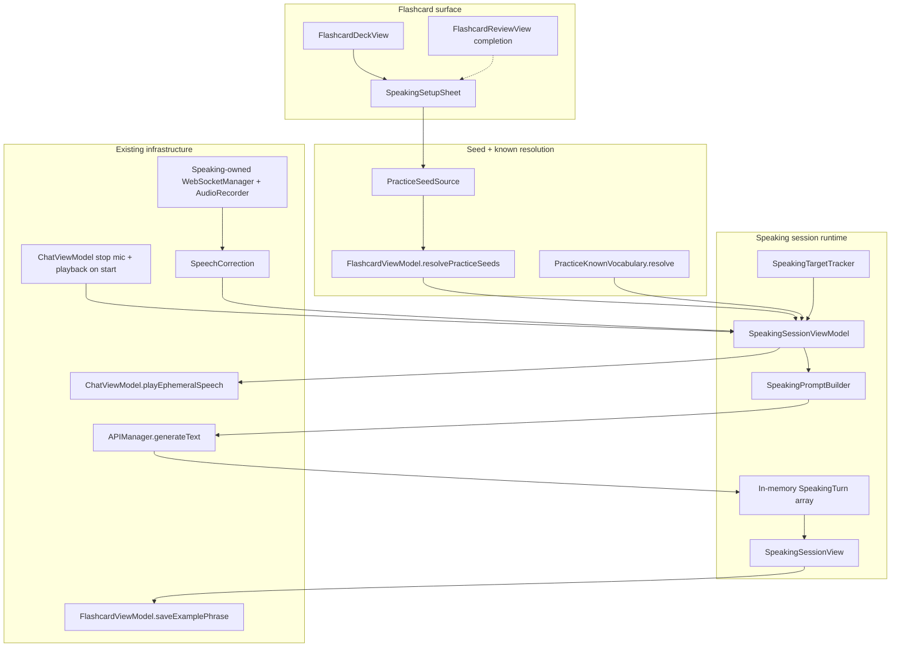
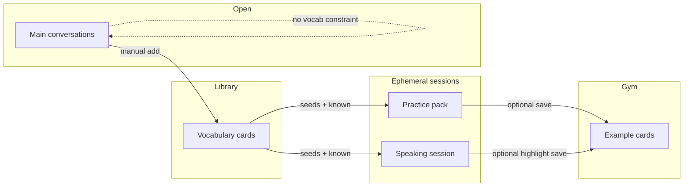

# Design: Speaking with AI — Conversational Practice Constrained to Known Vocabulary

| Field | Value |
|-------|--------|
| **Status** | Draft (post-review r2 — Issues 15–17 addressed) |
| **Author** | — |
| **Date** | 2026-07-11 |
| **App** | DeveloperChatbot (`chatbot-app/`) |
| **Related** | `/flashcard_system.md`, `docs/design-library-vs-gym.md`, `docs/design-practice-after-study.md`, `docs/design-practice-known-vocab-sentences.md` |
| **Primary code (reuse)** | `PracticeScaffolding.swift`, `PracticePack.swift`, `FlashcardViewModel.swift`, `ChatViewModel.swift`, `SpeechCorrection.swift`, `APIManager.swift`, `AudioRecorder.swift`, `AudioPlayer.swift`, `FlashcardDeckView.swift` |
| **Primary code (new)** | `SpeakingSession.swift`, `SpeakingPromptBuilder.swift`, `SpeakingTargetTracker.swift`, `SpeakingSessionViewModel.swift`, `SpeakingSessionView.swift`, `SpeakingSetupSheet.swift` |

---

## Overview

**Speaking with AI** is a flashcard-adjacent mode for **multi-turn conversational practice** that stays inside the learner’s known vocabulary. Unlike main chat (free-form, open system prompts) and **Practice with AI** (one-shot sentence packs from seed words), Speaking turns the same scaffolding machinery into a live dialogue partner: short baby-language turns, target words from due / last-session / manual seeds, and soft pressure to produce and hear those words in context.

The session is **ephemeral by default** (in-memory transcript, no FSRS writes). Optional **Save phrase → Examples** uses a **new public gym insert** that always supplies a non-empty back (see D17). Entry lives on the **Flashcards** surface next to Study and Practice with AI — not as a hijack of normal conversations. Speech reuses STT → correction → shared ephemeral TTS, with a speaking-specific system prompt rebuilt each turn so the known-word list and coverage goals do not drift.

---

## Background & Motivation

### Mental model today

| Role | Product name | What lives here |
|------|--------------|-----------------|
| Library | Vocabulary | User-curated headwords |
| Gym | Examples | Saved AI practice sentences |
| Ephemeral gym drill | Practice with AI | Pack of sentences → preview → session → discard/save |
| Open chat | Conversations | Persistent multi-turn; user system prompts; full STT/TTS |

Formal overview: `flashcard_system.md`. Library vs Gym: `docs/design-library-vs-gym.md`.

### Recently shipped scaffolding (Practice)

Practice with AI now scaffolds sentences with:

- `PracticeKnownVocabulary.resolve` — FSRS-informed known fronts (cap 80 / ~1500 chars)
- Baby language (CEFR A0–A1) hard rules in prompts
- Soft coverage diagnostics via `PracticeScaffoldValidator.diagnose` / `logCoverageForCards` / `logIfFlagged`
- Seed sources: `PracticeSeedSource` = due vocab · last study session · manual select

Design: `docs/design-practice-known-vocab-sentences.md`.

### Pain points this feature addresses

1. **No constrained conversation** — Main chat uses open system prompts (“Chinese Teacher”, “Casual Conversation”) with **no** injection of the library. Learners drown in unknown words.
2. **Practice is monologue / flashcard-shaped** — Pack → reveal → next is excellent for *usage frames*, weak for *turn-taking, listening, repair*.
3. **Voice stack is chat-bound** — STT/TTS + `SpeechCorrection` already exist for conversations (`ChatViewModel`, `SpeechCorrection.swift`) but are not attached to a vocabulary-steered session.
4. **Post-study moment is only half-closed** — After Study, “Practice these with AI” generates sentences; there is no “Speak with these words” path for production practice.

### What already works (reuse heavily)

| Subsystem | Location | Reuse in Speaking |
|-----------|----------|-------------------|
| Known vocab resolver | `PracticeKnownVocabulary.resolve` | Inject KNOWN_VOCAB every turn (snapshot frozen at session start) |
| Scaffold helpers | `PracticeScaffolding`, `PracticeUltraCommonBeginnerContent` | Prompt ladder + soft diagnostics |
| Soft leakage API | `PracticeScaffoldValidator.diagnose` (+ `logCoverageForCards` / `logIfFlagged`) | Log-only on **assistant** turns — there is **no** `scoreCoverage` API |
| Seed sources | `PracticeSeedSource`, `resolvePracticeSeeds`, `StudySessionStore`, `availableDeckPracticeSeedSources` | Same entry sources as Practice; share source-list helper, do not fork |
| Seed cap | `PracticeGenerationConfig.maxDueSeeds` (= **10**) | Same max seeds for speaking (D18) |
| Baby-language length | `PracticeGenerationConfig.babyLanguageMaxCharsChinese` (20) / `babyLanguageMaxWordsEnglish` (10) | **Reference these constants** — do not duplicate as independent speaking caps |
| LLM client | `APIManager.generateText` (instance method) | Speaking owns private `APIManager()`; **always pass** `temperature: 0.6` and `max_tokens: 120…160` (defaults are 0.7 / 199) |
| STT primitives | `WebSocketManager`, `AudioRecorder` | Speaking owns its **own** recorder + WS for session lifetime (not chat’s private instances) |
| Speech correction | `SpeechCorrection.correct` | Forced on for entire session (no mid-session off UI in MVP) |
| TTS | `ChatViewModel.playEphemeralSpeech` / `stopPlayback` / `clearEphemeralAudioCache` | **Shared** player only — do not create a second `AudioPlayer` |
| Save → gym | **New** public `FlashcardViewModel.saveExamplePhrase(...)` (reuses private insert rules: non-empty front+back, `kind = .example`, gym tab) | Practice’s `savePracticeCardsToDeck` stays private and Practice-card shaped |
| Deck entry UX | `FlashcardDeckView` menus / multi-select | Parallel **Speak with AI** control; selection mode dual CTAs |
| On-demand L1 gloss | Apple `TranslationSession` (same pattern as chat bubbles / `FlashcardCreateSheet`) | **Not** `FlashcardTranslator` alone — that only does pinyin + suggested back from *existing* translation data |

### Constraints we keep

- No silent writes to Vocabulary.
- No FSRS updates from speaking turns (v1).
- Seeds remain **vocab only**.
- Local / OpenAI-compatible endpoints; modest token budgets.
- macOS-first SwiftUI app; no multi-deck requirement.

---

## Goals & Non-Goals

### Goals

1. Let the user **speak and listen** in a multi-turn dialogue steered by **target seeds + known vocabulary + baby language**.
2. Clear product role relative to main chat and Practice with AI (see Key Decisions).
3. Reuse seed sources and `PracticeKnownVocabulary` without inventing a second “known” definition.
4. Voice-first UX that still allows typed turns; show translation / phonics optionally (on-demand polish in Phase 2).
5. Session goals that are useful without being gamified: free conversation under constraint, with optional soft target-word coverage.
6. Ephemeral by default; optional save of useful phrases as **Examples** with required back + `parent_flashcard_id` when linkable.
7. Ship in incremental PRs; MVP is a working constrained dialogue loop from the deck.
8. Handle empty known set, sparse libraries, bilingual decks, STT noise, and vocabulary leakage.

### Non-Goals (v1)

- Replacing main chat or changing global system prompts.
- FSRS grading of speaking turns or parent-vocab influence.
- Cloze, multi-speaker roleplay, or free open-topic with no seed constraint.
- Persisting full speaking transcripts across app quit (optional later).
- Hard auto-retry LLM loops until zero unknown tokens.
- Streaming chat completions (API is non-stream today; `stream: false` in `APIManager`). Accepted cost: turn latency is non-stream + correction + TTS serial.
- Perfect ASR for L2 speech (mitigate with STT+LLM, not promise perfection).
- Promoting examples into vocabulary automatically.
- True mid-utterance barge-in (MVP mirrors chat: mic paused while TTS plays).
- Mid-session known-list refresh or speech-correction toggle-off.

---

## Key Decisions

| # | Decision | Choice | Rationale |
|---|----------|--------|-----------|
| D1 | Product role | **Third mode** on Flashcards: Study · Practice with AI · **Speak with AI** | Chat stays free-form; Practice stays sentence packs; Speaking is conversational gym time |
| D2 | Session container | **Dedicated ephemeral session sheet** (like Practice), **not** a normal Conversation row | Avoid polluting chat history and title list with drill sessions; cleaner discard |
| D3 | Overlay vs new surface | New full-height sheet / window content; not an overlay on main chat | Mic pipeline, system prompt, and history isolation are simpler in a dedicated surface |
| D4 | Seed sources | **Reuse `PracticeSeedSource`** (due / last session / selected); optional phase-3 “all known” soft topic | Parity with Practice; post-study continuity (`design-practice-after-study.md`) |
| D5 | Known set | **Same** `PracticeKnownVocabulary.resolve` heuristic and caps; **frozen at session start** for MVP | One learner model; no mid-session refresh cost or drift |
| D6 | Vocabulary steering | **System prompt rebuilt each turn** with KNOWN_VOCAB + TARGET_WORDS + coverage hints; soft coverage log only | Multi-turn drift needs refresh; hard rejection is expensive |
| D7 | Session goal (MVP) | **Topic-light constrained chat** + soft target-word pressure; AI opens and gently steers seeds; optional setup **topic hint is MVP** | Forced production of all N seeds is Phase 2; topic field already on config |
| D8 | Voice | **Voice-first defaults**: STT + LLM correction **forced on for whole session** (no off toggle in MVP); auto-TTS assistant replies | Speaking is the product name; text remains available |
| D9 | Persistence | **Ephemeral transcript** in memory; optional per-phrase save → Examples | Library vs Gym; no FSRS side effects |
| D10 | FSRS | **None in v1** | Same as Practice; keeps scheduling pure |
| D11 | Main chat relationship | **No shared history**; on Speak start **force-stop** chat mic + playback; speaking owns **own** STT recorder+WS; TTS via **shared** `playEphemeralSpeech`; on end leave chat mic **off** | Hardware isolation; no silent re-enable |
| D12 | Empty known | Still allow session with baby language + sparse ultra-common content words; warn if zero vocab | Matches Practice cold-start |
| D13 | Bilingual decks | Script congruence via majority of seed fronts (existing K12) | Same as practice scaffolding |
| D14 | Orchestration owner | **`SpeakingSessionViewModel`** owned by **`ContentView` as `@StateObject`**; seeds/save from `FlashcardViewModel`; audio stop/TTS via `ChatViewModel` | Avoid ballooning both existing VMs; clear presentation ownership |
| D15 | Assistant reply format | **Plain-text replies** in MVP (no per-turn JSON gloss) | Lower latency / parse risk; on-demand meaning later |
| D16 | Feature flag | `UserDefaults` key `speaking.enabled` — **default false until PR3 lands**, then **default true**; emergency hide | First app feature-flag pattern; no schema rollback |
| D17 | Save highlight back | **Require non-empty front and back** before insert; auto-fill L1 via `TranslationSession` or prompt user; refuse with clear error if still empty | Matches real gym insert (`guard !front.isEmpty, !back.isEmpty`) |
| D18 | Seed cap | **`PracticeGenerationConfig.maxDueSeeds` (= 10)** for speaking | Parity with Practice; reuse selection cap |
| D19 | Mic mode | **Session-scoped always-on mic when not playing TTS** (chat parity: pause mic during play) | Not true barge-in; revisit push-to-talk only if echo issues |
| D20 | Save which phrases | **Both** user and assistant phrases allowed; default selection = last assistant line | Useful gym material from either side |
| D21 | Mutual exclusion | **Forbid concurrent Practice + Speak sheets**; if Practice is showing, dismiss/end it before presenting Speak (and vice versa) | One ephemeral gym surface at a time; avoids dual TTS/mic fights |
| D22 | Encourage-coverage default | Setup checkbox **defaults on** (`encourageTargetCoverage = true`) | Soft mode is the product default; user can uncheck |
| D23 | SpeechIO extract | **Copy-thin STT start/stop in speaking PR2b**; extract shared `SpeechIO` only in deferred PR6 if duplication hurts | Avoids large ChatViewModel refactor on critical path |
| D24 | Endpoint / offline failure | Banner + stay interactive: opening LLM fail → **`retryOpening()`** stays `ready` with typed path after open; mid-turn fail → keep transcript, retain **`pendingUserText`**, **`retryLastReply()`** or type | Never stuck in `generatingReply` without escape |

---

## Product Role

### Learning loop (updated)

```
Due vocab → Study (FSRS) → optional Practice with AI (sentences)
                         ↘ optional Speak with AI (dialogue)
                         → optional Save phrase → Examples
```

### Comparison matrix

| Dimension | Main Chat | Practice with AI | **Speak with AI** |
|-----------|-----------|------------------|-------------------|
| Shape | Persistent conversation | Ephemeral card pack | Ephemeral multi-turn session |
| Vocabulary control | None (user prompt) | Seed + known scaffold per generation | Seed + known scaffold **every turn** |
| User production | Free text/voice | Read / optional self-check | Speak (or type) replies |
| AI role | Partner / teacher (open) | Sentence generator (JSON) | Constrained partner (short turns) |
| Output format | Free prose | JSON practice cards | Free short replies (plain text MVP) |
| Save | N/A (messages in chat) | Save → Examples | Highlight → Examples (requires back) |
| FSRS | None | None | None (v1) |
| Entry | Conversations tab | Flashcards toolbar | Flashcards toolbar (+ post-study CTA later) |

### Positioning copy (product)

> **Study** schedules memory.  
> **Practice with AI** drills usage in short sentences.  
> **Speak with AI** practices listening and speaking with the words you already know.

---

## Proposed Design

### High-level architecture



### App graph (ownership & wiring)

Practice presentation flags live on `FlashcardViewModel` (`isShowingPracticePreview` / `isShowingPracticeSession`). Speaking keeps presentation flags on **`SpeakingSessionViewModel` only** (do not split across VMs).

| Owner | Object / flag | Responsibility |
|-------|---------------|----------------|
| `ContentView` | `@StateObject private var speakingVM = SpeakingSessionViewModel()` | Lifetime of speaking VM; sheets bound like practice |
| `ContentView` | `.sheet(isPresented: $speakingVM.isShowingSetup)` / `isShowingSession` | Present setup + session |
| `SpeakingSessionViewModel` | `isShowingSetup`, `isShowingSession`, `session` | All speaking presentation + runtime state |
| `FlashcardViewModel` | `resolveSpeakingLaunch`, `resolveSelectedVocabForSpeaking`, `saveExamplePhrase`, seed selection helpers | Data plane only — not speaking sheet flags / presentation |
| `ChatViewModel` | Injected into speaking sheets / launch | `llmURL` / model / `sttURL` / `ttsURL` / voice; `playEphemeralSpeech`; `stopPlayback`; force-stop mic pipeline; `onLog` → `chatVM.log` |

**Launch wiring (PR3):**

```swift
// ContentView (sketch)
@StateObject private var speakingVM = SpeakingSessionViewModel()

// sheets
.sheet(isPresented: $speakingVM.isShowingSetup) {
    SpeakingSetupSheet(speakingVM: speakingVM, flashcardVM: flashcardVM)
}
.sheet(isPresented: $speakingVM.isShowingSession) {
    SpeakingSessionView(speakingVM: speakingVM, chatVM: chatVM, flashcardVM: flashcardVM)
}

// Deck / launch helper calls:
speakingVM.configureEndpoints(
    llmURL: chatVM.llmURL,
    llmModel: chatVM.llmModel,      // same fields chat uses for generateText
    sttURL: chatVM.sttURL,
    ttsURL: chatVM.ttsURL,
    ttsVoice: chatVM.ttsVoice,
    appLanguage: chatVM.appLanguage,
    sttLanguage: chatVM.sttLanguage,
    onLog: { chatVM.log($0) }
)
// Then resolve seeds via flashcardVM.resolveSpeakingLaunch (or
// resolveSelectedVocabForSpeaking for multi-select) → speakingVM.prepareSetup
// → mutual exclusion → speakingVM.isShowingSetup = true
// Multi-select Practice path remains: flashcardVM.beginPracticeFromSelectedVocab(...)
// Speak multi-select: deck/ContentView wires both VMs — FlashcardVM does not set speaking flags.
```

**Mutual exclusion (D21):** before `isShowingSetup = true`, if `flashcardVM` is showing practice preview/session, dismiss practice first. Before practice starts, if speaking session/setup is open, end/dismiss speaking.

### Session model

```swift
/// Configuration frozen at session start (MVP). No mid-session known refresh.
struct SpeakingSessionConfig: Equatable {
    var seedSource: PracticeSeedSource
    /// Resolved seed cards (vocab only), already capped at `PracticeGenerationConfig.maxDueSeeds`.
    var targetCards: [Flashcard]
    /// Ranked known fronts for scaffolding — **snapshot at start only** (MVP).
    var knownFronts: [String]
    /// Optional free-text topic hint (MVP). Empty = AI chooses simple daily topic using targets.
    var topicHint: String
    /// Soft goal: encourage production of target words (not hard fail). Default **true**.
    var encourageTargetCoverage: Bool
    /// Baby-language length: **copy from** `PracticeGenerationConfig.babyLanguageMaxCharsChinese` / `babyLanguageMaxWordsEnglish` at launch — do not invent second constants.
    var maxAssistantCharsChinese: Int
    var maxAssistantWordsEnglish: Int
    /// Copied from `ChatViewModel` at launch and frozen for the session.
    var appLanguage: AppLanguage
    var sttLanguage: STTLanguage
    /// Always true for MVP speaking sessions (no UI to turn off).
    var speechCorrectionEnabled: Bool
}

enum SpeakingTurnRole: String {
    case assistant
    case user
}

struct SpeakingTurn: Identifiable, Equatable {
    /// String id (UUID string) — same style as practice card ids.
    let id: String
    let role: SpeakingTurnRole
    /// Canonical text used for dialogue history (corrected user text, or assistant text).
    var content: String
    /// Raw ASR when user spoke (optional).
    var rawASR: String?
    /// Pronunciation / phrasing tip from SpeechCorrection (optional).
    var tutorFeedback: String?
    /// Optional L1 gloss (filled on-demand in Phase 2 polish; not every-turn JSON).
    var translation: String?
    /// Optional phonics (Phase 2 polish / `FlashcardTranslator.autoFillPhonics`).
    var phonics: String?
    /// Soft target-word hits detected in **this user turn** (assistant turns leave empty).
    var targetHits: [String]
    let createdAt: Date
}

struct SpeakingSession: Identifiable, Equatable {
    let id: String
    let startedAt: Date
    var config: SpeakingSessionConfig
    var turns: [SpeakingTurn]
    var status: SpeakingSessionStatus
    /// Target fronts not yet observed in **user** turns (learner production only).
    var uncoveredTargetFronts: [String]
    /// Last error message for banner (opening/reply/STT failures).
    var lastError: String?
}

enum SpeakingSessionStatus: Equatable {
    case ready            // config set; about to open or retry open
    case waitingUser
    case correctingSpeech
    case generatingReply
    case playingTTS
    case ended
}
```

### Vocabulary steering (multi-turn)

#### What is injected each turn

1. **Role** — Patient beginner conversation partner (A0–A1), not free chat.
2. **TARGET_WORDS** — seed fronts (and optional backs for AI understanding only; AI should use **front** script in speech).
3. **KNOWN_VOCAB** — frozen snapshot from session start (`PracticeKnownVocabulary.resolve`).
4. **Legal set ladder** — identical priority to Practice comprehensible prompts:
   - Prefer known + targets for content words  
   - Always allow closed-class function words  
   - Sparse: ultra-common beginner content (`PracticeUltraCommonBeginnerContent`)  
   - Avoid rare / domain jargon; do not introduce new learning targets  
5. **Length** — one or two very short sentences; prefer questions that invite reuse of targets.
6. **History** — last **12** speaking turns of **role + content only** (≈ 6 exchanges).  
   - Payload shape: **one** rebuilt `system` message + history of `user`/`assistant` messages.  
   - **Never** re-include prior system messages in history (easy footgun if copying chat patterns).
7. **Coverage hint** — soft: “Gently try to create situations where the learner can use: …” for still-uncovered targets (**learner-production** uncovered list only). Never dump a vocabulary quiz list as dialogue.  
   - When `encourageTargetCoverage == false` (D22): **omit** the `UNCOVERED_TARGETS` block and any “gently invite uncovered” steering lines from the system prompt. **TARGET_WORDS** and **KNOWN_VOCAB** still inject (session still uses seeds). UI **still shows** coverage chips for curiosity (chips are observational; only prompt steering turns off).

#### Why rebuild the system message every turn

Main chat freezes `activeSystemPrompt` and only appends history (`ChatViewModel.runTextGeneration`). For speaking, **target coverage state** changes each user turn. Rebuilding system content each turn costs ~1–2 KB and keeps the model on rails better than a single open-ended system string at t0. Known list does **not** refresh mid-session in MVP.

#### Token budgets (recommended)

| Budget | Value | Notes |
|--------|-------|-------|
| Known fronts | same as Practice: 80 / 1500 chars | Shared resolver |
| Seed targets | `PracticeGenerationConfig.maxDueSeeds` (10) | Shared cap |
| History window (LLM reply) | last **12** turns (role+content) | Cap long sessions |
| SpeechCorrection history | last **≤8** turns mapped to `ChatMessage(role:content:)` | Use **corrected/canonical** `content` only; drop tips / raw ASR |
| Completion `max_tokens` | **120–160** **explicit on every call** | Defaults in `APIManager` are 199 — do not rely on defaults |
| Temperature | **0.6** **explicit on every call** | Defaults are 0.7; lower for less lexical invention |
| Speech correction | existing 120 tokens / 0.25 temp / 2.5s timeout | Unchanged |

#### Soft leakage diagnostics (assistant turns)

Reuse **`PracticeScaffoldValidator.diagnose`** (and optionally `logIfFlagged` / `logCoverageForCards`-style logging) on **assistant** turns — **log-only**. If coverage is chronically low, log a warning; do **not** auto-retry in MVP (latency kills conversation feel).

**One silent regenerate on leakage** lives only in **Phase 3** (deferred) — not in MVP and not double-booked as a Phase 2/PR5 deliverable.

#### Target tracking (`SpeakingTargetTracker`)

Coverage chips and `uncoveredTargetFronts` measure **learner production only** (user turns). AI may already utter a target; that does **not** mark the chip covered. The prompt’s UNCOVERED list must stay this same learner-based set so UI chips and AI steering agree.

Pure helper (new file `SpeakingTargetTracker.swift`, required in **PR1**):

```swift
enum SpeakingTargetTracker {
    /// Returns subset of `targets` found in `userText` (normalized).
    static func hits(in userText: String, targets: [String], script: SpeakingScript) -> [String]

    static func remaining(targets: [String], covered: Set<String>) -> [String]
}
```

**Language-aware hit rules** (unit-testable; manual checklist like Practice K14):

| Script | Rule |
|--------|------|
| **English** | Normalize via `PracticeScaffolding.normalizeFrontKey`. Single tokens: **word-boundary / letter-run token** membership (not raw substring inside longer words). Multi-word **and hyphenated** fronts (`self-study`, `ice cream`): **contiguous token-sequence** match after treating hyphen/en-dash/em-dash as separators (not raw normalized substring — avoids `"in the"` ⊆ `"within the"`). |
| **Chinese** | Normalize via `normalizeFrontKey`. Match as substring only for fronts with **length > 1**. Length-1 targets (是, 在, 好, …): skip auto-hit (soft AI only). Hits are non-exclusive (nested fronts like 图书馆 + 图书 both credit if both are targets). |
| **Mixed** | **Per-target script**: CJK front → Chinese rules; otherwise English. Session majority (`SpeakingScript.resolve`) still steers content language / AI speech; it does **not** force all chips through one matcher (so bilingual seeds do not silently mis-score). |

**Do not** reuse `PracticeScaffoldValidator.diagnose` for user target hits — that scores **coverage of a sentence by an allowlist** (assistant leakage), not “did each target appear in user text.”

UI shows chips: covered / remaining. End-of-session summary: “You used 4 of 6 target words.” **No grade, no FSRS.**

#### Status transitions & error recovery

```text
prepareSetup → ready
startSession → generatingReply (opening)
  success → playingTTS (covers TTS generate + play) → waitingUser
  failure → ready + lastError banner + [Retry opening]  (no partial open; all-or-nothing to ready)
waitingUser + final STT → correctingSpeech → (always continues) → generatingReply
waitingUser + typed send → generatingReply (skip correction)
generatingReply success → append assistant turn → playingTTS → waitingUser
generatingReply failure → waitingUser + banner + keep transcript;
  retain pendingUserText; [Retry last reply] or type a new turn
playingTTS (speaking mic paused for whole generate+play window)
  → leave when TTS idle for playbackId (play end OR generate fail) → resume speaking mic → waitingUser
endSession → stop speaking STT + stop shared player → ended → dismiss; chat mic stays off
```

Opening failure must **never** leave the UI stuck in `generatingReply` without Retry. Mid-turn reply failure retains `pendingUserText` so `retryLastReply()` can re-send without retyping (D24).

#### SpeechCorrection history mapping

```swift
func correctionHistory(from turns: [SpeakingTurn], limit: Int = 8) -> [ChatMessage] {
    turns.suffix(limit).map { turn in
        ChatMessage(
            role: turn.role == .user ? "user" : "assistant",
            content: turn.content  // corrected/canonical only; no tips
        )
    }
}
```

### Conversation UX

#### Entry points & deck toolbar density

1. **FlashcardDeckView** header — keep density manageable by **mirroring Practice menus**, not adding a third free-floating button cluster:

```
[ Select cards ]  [ Style ]  [ Practice ▾ ]  [ Speak ▾ ]  [ Study ]
```

- **Practice ▾** and **Speak ▾** each list the same sources from `availableDeckPracticeSeedSources` (due / last session) via a **shared** source-list helper — do not duplicate source enumeration.
- If only one source is available, a single button (no menu) is fine for each, same as Practice today.
- **Multi-select mode** (`isSelectingVocabForPractice` — keep existing flag name for MVP to limit FlashcardVM churn; speaking reuses the same selection set): dual CTAs:

```
[ Practice with selected ]   [ Speak with selected ]   [ Cancel ]
```

  Both capped at `maxDueSeeds`. Selecting for Speak does not require a rename of the selection mode in MVP.

2. **Post-study completion** (Phase 2 / PR4): secondary button **Speak with these words** beside Practice.  
3. **Not** on Conversations tab for MVP.

#### Setup sheet (MVP)

Topic field is **in MVP** (D7). On-demand 文/译 chrome is **not** (Phase 2).

```
┌─────────────────────────────────────────────┐
│  Speak with AI                              │
│  Seeds: 6 from last study session           │
│  Known scaffold: 42 words                   │
│                                             │
│  Topic (optional): [_______________]        │
│  ☑ Encourage me to use target words         │
│                                             │
│  Targets: 吃 · 水 · 学校 · …                 │
│                                             │
│         [ Cancel ]   [ Start speaking ]     │
└─────────────────────────────────────────────┘
```

Empty seeds → disable Start (same as Practice). Zero known → allow Start with warning: “You’ll practice with baby language only.”

#### Session layout (voice-first)

```
┌──────────────────────────────────────────────────────────┐
│ Speak with AI          2/6 targets used    [Mic] [Done]  │
│ Targets: [吃✓] [水✓] [学校 ] [朋友 ] …                    │
├──────────────────────────────────────────────────────────┤
│                                                          │
│  AI: 你好！你今天吃什么？                    🔊           │
│                                                          │
│  You: 我吃米饭。                             (corrected)  │
│       ↳ tip: tone on 米 was a bit flat                   │
│                                                          │
│  AI: 很好。米饭好吃吗？                      🔊           │
│                                                          │
├──────────────────────────────────────────────────────────┤
│  [ Listening when idle ]  or type…  [Send]               │
│  Status: Listening · Correcting · Thinking · Speaking    │
│  [Error banner + Retry when lastError set]               │
└──────────────────────────────────────────────────────────┘
```

**Behaviors:**

| Behavior | MVP | Later |
|----------|-----|-------|
| AI opens conversation | Yes — first assistant turn on Start | — |
| Auto-TTS assistant | Yes (default on, toggle) | — |
| Mic mode | **Always-on when not in `playingTTS`** (pause speaking mic for whole TTS generate+play window; see Mic/TTS contract) | Push-to-talk if echo issues |
| True barge-in mid-TTS | **No** — user cannot produce final STT until TTS idle for the turn’s playbackId (mic stopped during generate+play) | Phase 3+ if product wants interruption |
| STT language | Frozen from chat `sttLanguage` at launch | Per-session override |
| Speech correction | **Forced on** whole session; no off control | Optional off for advanced |
| Show translation / phonics | **Not in MVP chrome** (no 文/译 on bubbles) | Phase 2: on-demand “Show meaning” via `TranslationSession` + pinyin via `FlashcardTranslator` |
| Correction feedback | Show under user bubble (reuse `tutorFeedback` UX from chat) | — |
| End session | Done → summary → Discard / Save highlights | Persist transcript |
| Save highlight | Select assistant or user phrase → Save as Example (**requires back**) | Batch save |

#### Turn sequence

```mermaid
sequenceDiagram
    participant U as User
    participant UI as SpeakingSessionView
    participant VM as SpeakingSessionViewModel
    participant Chat as ChatViewModel
    participant STT as Speaking STT WS+Recorder
    participant Corr as SpeechCorrection
    participant LLM as APIManager
    participant TTS as Chat playEphemeralSpeech

    UI->>VM: startSession(config)
    VM->>Chat: yieldAudioHardwareForExternalSession
    Note over Chat: stop chat mic pipeline first (isMicrophoneActive=false), then stop player without re-arm
    VM->>STT: connect session-owned pipeline
    VM->>LLM: opening via private APIManager temp=0.6 max_tokens=120..160
    alt opening fails
        VM-->>UI: ready + error banner + retryOpening
    else success
        LLM-->>VM: assistant text
        VM->>VM: status=playingTTS; pause speaking recorder
        VM->>TTS: playEphemeralSpeech(text, id: speaking-turnId)
        Note over STT,TTS: mic paused for generate+play; observe isGenerating/isPlayingEphemeralAudio
        TTS-->>VM: idle (play end or generate fail) → resume speaking mic → waitingUser
    end

    U->>STT: speak (mic active)
    STT-->>VM: raw ASR final
    VM->>Corr: correct(raw, last≤8 ChatMessages)
    Corr-->>VM: corrected + feedback
    VM->>VM: SpeakingTargetTracker hits on user text
    VM->>LLM: reply (one system + history role/content)
    alt reply fails
        VM-->>UI: waitingUser + banner + pendingUserText; retryLastReply
    else success
        LLM-->>VM: assistant text
        VM->>VM: diagnose soft log on assistant
        VM->>VM: status=playingTTS; pause speaking recorder
        VM->>TTS: playEphemeralSpeech
    end

    UI->>VM: endSession
    VM->>STT: disconnect
    VM->>Chat: stop player only (chat mic already off; do not re-arm)
```

#### Error correction policy

- **ASR repair** — `SpeechCorrection` already infers intent from history; keep that as the primary safety net for learner pronunciation.
- **Pedagogical correction** — assistant may gently rephrase a broken learner sentence **once**, still in baby language, then continue. Do not lecture.
- **Do not** block the turn on correction timeout (existing fallback to raw ASR).
- **Endpoint/offline (D24)** — opening: banner + `retryOpening()` while `ready`. Mid-turn: keep transcript, retain `pendingUserText`, banner + `retryLastReply()` (or user types a new turn via `sendTypedText`). Never dead-end in `generatingReply`.

### Session goals

| Mode | MVP | Description |
|------|-----|-------------|
| **A. Constrained free talk** | **Ship** | AI picks simple daily situation using targets (or setup topic hint); no hard checklist |
| **B. Soft coverage** | **Ship** (default on) | UI tracks which targets appeared in **user** speech; when encourage is **on**, AI gently steers remaining uncovered via `UNCOVERED_TARGETS`. When **off**, omit that steering; chips still show |
| **C. Forced production of N seeds** | Phase 2 / PR5 | Session incomplete until each target used once — optional setting, off by default |
| **D. Free topic, no seeds** | Phase 3 | Known-only chat with no targets (requires non-empty known set) |
| **E. Multi-speaker / roles** | Deferred | Out of scope |
| **F. Leakage one-shot regenerate** | Phase 3 only | Single silent rewrite if `diagnose` flagged && coverage low — **not** MVP, not PR5 |

### Persistence & Library vs Gym

| Action | Effect |
|--------|--------|
| Speak session turns | Memory only |
| Done / discard | Drop session; no DB rows |
| Save highlight phrase | `FlashcardViewModel.saveExamplePhrase(front:back:phonics:parentId:)` → `kind = .example`; **both sides non-empty** |
| Create vocab from session | **Not** offered in v1 |
| FSRS | Unchanged |

#### Save path (concrete — Issue 1 fix)

Existing `savePracticeCardsToDeck` is **private**, takes `[PracticeCard]`, and **skips** cards with empty front or back. Speaking must **not** call it or claim `translation?` optional works.

**MVP public API on `FlashcardViewModel`:**

```swift
/// Insert one Example into the gym. Requires non-empty front and back.
/// Reuses duplicate checks, kind=.example, optional parent, gym tab switch.
@discardableResult
func saveExamplePhrase(
    front: String,
    back: String,
    phonics: String? = nil,
    parentId: String? = nil
) -> PracticeSaveResult
```

**Before insert, Speaking UI must obtain a non-empty back:**

1. Prefer on-demand Apple **`TranslationSession`** (same pattern as chat bubble translation / `FlashcardCreateSheet`) to L1 for the phrase front.  
2. Optionally seed phonics with `FlashcardTranslator.autoFillPhonics(for:)` when CJK.  
3. If translation fails or user rejects, show a small prompt for manual back.  
4. If still empty → **refuse save** with clear error (“Add a meaning before saving”).

**Parent linking:** if the saved phrase contains exactly one target front as a clear hit per `SpeakingTargetTracker` rules, set `parent_flashcard_id`; else nil.

**Do not** auto-save transcripts into Conversations. Optional phase 3: “Export to chat” or “Save transcript” table.

### Technical architecture detail

#### New files (recommended)

| File | Responsibility |
|------|----------------|
| `Sources/SpeakingSession.swift` | Models: config, turn, session, status |
| `Sources/SpeakingPromptBuilder.swift` | Pure prompt construction (system/user payloads); unit-testable |
| `Sources/SpeakingTargetTracker.swift` | Pure user-side target hit detection (language-aware) |
| `Sources/SpeakingSessionViewModel.swift` | Session state machine, LLM calls, coverage, STT lifecycle, save orchestration |
| `Sources/SpeakingSessionView.swift` | UI sheet |
| `Sources/SpeakingSetupSheet.swift` | Pre-start config |

#### Touch existing files

| File | Change |
|------|--------|
| `FlashcardDeckView.swift` | Speak ▾ menu sharing `availableDeckPracticeSeedSources`; multi-select dual CTAs |
| `FlashcardViewModel.swift` | `resolveSpeakingLaunch`, `resolveSelectedVocabForSpeaking`, `saveExamplePhrase`, optional `canStartSpeaking`; selection reused as-is (no presentation-owning Speak launch) |
| `FlashcardReviewView.swift` | Phase 2: Speak CTA on completion |
| `Localization.swift` | All user-facing strings |
| `ContentView.swift` | `@StateObject speakingVM`; setup + session sheets; mutual exclusion with practice sheets |
| `PracticeScaffolding.swift` | Only if sharing `normalizeFrontKey` helpers is cleaner for tracker tests |
| `ChatViewModel.swift` | **Minimal:** `yieldAudioHardwareForExternalSession()` (stop chat mic pipeline **then** player without re-arm); TTS already public via `playEphemeralSpeech` / ephemeral observe helpers. Prefer **no** full SpeechIO extract until PR6 |

#### Prompt sketch (assistant reply — English)

```text
You are a patient conversation partner for absolute beginners (CEFR A0–A1).
You are NOT a free chat bot. Stay inside the learner's known vocabulary.

Hard rules:
- Replies: 1–2 very short sentences (≤ {maxWords} English words or ≤ {maxChars} Chinese characters).
- Prefer TARGET_WORDS situations; gently invite the learner to use uncovered targets.
- Content words: prefer KNOWN_VOCAB ∪ TARGET_WORDS; always allow common function words.
- If KNOWN_VOCAB is sparse, only ultra-common beginner content words beyond targets.
- Do not introduce new learning targets, slang, idioms, or domain jargon.
- Same script/language as the target words.
- If the learner's last message is unclear, ask a simple yes/no or choice question.

TARGET_WORDS: [...]
UNCOVERED_TARGETS (soft, learner has not produced yet): [...]
  // ↑ omit this entire block (and “gently invite uncovered” hard-rule lines) when
  // config.encourageTargetCoverage == false
KNOWN_VOCAB: [...]
TOPIC_HINT (optional): [...]

Conversation (oldest → newest) — role/content only; do not repeat old system messages:
...
```

MVP: **plain text reply**. Phase 2: on-demand “Show meaning” via `TranslationSession` + optional pinyin — not every-turn JSON.

#### Mic / TTS ownership (MVP contract)

Chat’s playback callbacks only pause/resume **chat’s private** `audioRecorder` when `isMicrophoneActive` is true. They do **not** stop a speaking-owned recorder. Practice can fire-and-forget ephemeral TTS because it has no STT; **speaking must** own the generate+play window end-to-end.

| Concern | Owner | Rule |
|---------|-------|------|
| Chat mic + recorder | `ChatViewModel` | On Speak **start**: `yieldAudioHardwareForExternalSession()` — see ordering below |
| Speaking STT | `SpeakingSessionViewModel` | **Own** `WebSocketManager` + `AudioRecorder` for sheet lifetime |
| TTS playback | `ChatViewModel` shared | Call `playEphemeralSpeech` / `stopPlayback` / `clearEphemeralAudioCache` — **no second AudioPlayer** |
| During TTS (`playingTTS`) | Speaking | **Pause speaking recorder for the whole generate+play window** (not only while `isPlayingAudio`) |
| Leave `playingTTS` | Speaking | Observe chat ephemeral state for a stable `playbackId` (below); never stick on TTS error |
| After TTS idle | Speaking | Resume **speaking** mic only (chat mic stays off) |
| Speak **end** | Speaking + Chat | Disconnect speaking STT; stop shared player; **leave chat mic off** |
| “Barge-in” | MVP | **Not** mid-utterance interrupt — only mic off while TTS generate+play |

##### `yieldAudioHardwareForExternalSession` (ordering / non-resume)

`stopPlayback()` alone is **unsafe** while chat mic is still “active”: it stops the player then **restarts chat’s recorder** if `isMicrophoneActive` (~375–378). Contract:

1. **First** force-stop chat mic pipeline with `stopMicrophonePipeline` semantics: `isMicrophoneActive = false`, stop chat recorder, disconnect chat STT WS. (`stopMicrophonePipeline` is private today — yield API must perform the same steps, or call a package-visible helper that does.)
2. **Then** stop the shared player (`audioPlayer.stop()`, clear `isPlayingAudio` / ephemeral ids / `generatingEphemeralId`) **without** the “if mic active → restart recorder” branch — i.e. **do not call bare `stopPlayback()` while chat mic is still marked active**.

Invariant after yield: chat mic off, no chat WS, player idle. Speaking may then start its own recorder.

##### TTS lifecycle for speaking (observation contract — PR2b)

On assistant text ready (opening or reply):

1. Set `status = .playingTTS`.
2. **Stop speaking recorder** immediately (before network TTS generate starts).
3. Call `chatVM.playEphemeralSpeech(text:playbackId:)` with a **stable id**, e.g. `speaking-\(turnId)`.
4. Stay in `playingTTS` and keep speaking mic off while **either** generating or playing that id.

**Leave `playingTTS` → `waitingUser` and resume speaking mic** when the turn’s TTS is idle:

```text
// After having started playEphemeralSpeech for playbackId:
idle = !chatVM.isGeneratingEphemeralAudio(id: playbackId)
    && !chatVM.isPlayingEphemeralAudio(id: playbackId)
```

Implement via Combine/`onChange` on `chatVM`’s published ephemeral fields (`generatingEphemeralId`, `currentlyPlayingEphemeralId`, `isPlayingAudio`) — same flags Practice already reads with `isGeneratingEphemeralAudio` / `isPlayingEphemeralAudio`. Optional future: completion callback on play/failure; MVP does not require a ChatViewModel API change beyond yield.

**TTS generate failure** (`generateAndPlayEphemeralSpeech` clears `generatingEphemeralId` without setting `isPlayingAudio`): treat as idle — optional soft banner, **never** stick in `playingTTS` with mic still paused.

**Status vs latency:** `playingTTS` means “assistant audio pipeline busy” = network **generate** + **play**, not play-only. User must not talk over synthesis.

**End session / Done:** stop speaking STT; stop shared player (chat mic already false from yield — safe to call `stopPlayback` or a stop-player-only helper). Clear ephemeral cache if desired.

#### LLM call path

Do **not** call `ChatViewModel.runTextGeneration` (it persists messages). Speaking owns a **private** `APIManager()` instance (same pattern as `FlashcardViewModel` / `ChatViewModel`) and calls the **instance** method `generateText` with builder-produced messages — same as Practice generation / SpeechCorrection. `configureEndpoints` wires URLs/models/voice/`onLog` only; it does **not** need to inject the manager unless preferred later.

Every speaking completion call (reply + SpeechCorrection uses its own call sites as today):

```swift
// SpeakingSessionViewModel
private let apiManager = APIManager()

// Real signature: instance method; parameter is max_tokens (not maxTokens)
try await apiManager.generateText(
    endpoint: llmURL,
    model: llmModel,
    messages: messages,
    temperature: 0.6,
    max_tokens: 140  // in 120...160; always pass explicitly (defaults are 0.7 / 199)
)
```

### Relationship diagram (product surfaces)



---

## API / Interface Changes

No network API schema changes (still OpenAI-compatible chat completions + existing STT/TTS). Client-side interfaces:

```swift
// SpeakingPromptBuilder.swift
enum SpeakingPromptBuilder {
    static func buildReplyMessages(
        config: SpeakingSessionConfig,
        turns: [SpeakingTurn],
        uncoveredTargets: [String],
        historyLimit: Int = 12
    ) -> [ChatMessage]  // [system] + last N user/assistant only

    static func buildOpeningMessages(
        config: SpeakingSessionConfig
    ) -> [ChatMessage]
}

// SpeakingTargetTracker.swift
enum SpeakingTargetTracker {
    static func hits(in userText: String, targets: [String], script: SpeakingScript) -> [String]
}

// SpeakingSessionViewModel.swift
@MainActor
final class SpeakingSessionViewModel: ObservableObject {
    @Published private(set) var session: SpeakingSession?
    @Published var isShowingSetup = false
    @Published var isShowingSession = false
    /// Last user utterance that failed mid-turn LLM reply (typed or corrected STT). Cleared on success.
    @Published private(set) var pendingUserText: String?

    private let apiManager = APIManager()  // own instance; do not inject via configureEndpoints

    func configureEndpoints(/* llm/stt/tts URLs, models, voice, languages, onLog */)
    func prepareSetup(
        seedSource: PracticeSeedSource,
        targets: [Flashcard],
        knownFronts: [String],
        topicHint: String,
        encourageTargetCoverage: Bool
    )
    func startSession() async
    func retryOpening() async
    /// Re-send `pendingUserText` through the reply path after mid-turn LLM failure (D24).
    func retryLastReply() async
    func handleFinalTranscription(_ raw: String) async
    func sendTypedText(_ text: String) async
    func endSession()
    /// Orchestrates translation-if-needed then flashcardVM.saveExamplePhrase.
    func saveHighlight(turnId: String, parentHintId: String?, back: String) -> PracticeSaveResult
}
```

`FlashcardViewModel` additions (data plane only — D14):

```swift
var canStartSpeaking: Bool { /* same seed availability as practice */ }

func resolveSpeakingLaunch(
    source: PracticeSeedSource
) -> (targets: [Flashcard], knownFronts: [String])?

/// Optional: resolve current multi-select seeds + known without owning presentation.
/// Prefer this over a method that sets speaking sheet flags on FlashcardVM.
func resolveSelectedVocabForSpeaking() -> (targets: [Flashcard], knownFronts: [String])?

/// Public gym insert for free-form phrases (speaking highlights, etc.).
@discardableResult
func saveExamplePhrase(
    front: String,
    back: String,
    phonics: String? = nil,
    parentId: String? = nil
) -> PracticeSaveResult

// Multi-select (existing Practice path — correct names):
//   beginVocabPracticeSelection / selectedVocabSeedIds / isSelectingVocabForPractice
//   beginPracticeFromSelectedVocab(appLanguage:llmEndpoint:llmModel:)  // Practice launch
// L10n.practiceSelectedWithAI is a string helper only — not a FlashcardVM method.
//
// Speak multi-select launch lives on deck / ContentView (holds both VMs):
//   let resolved = flashcardVM.resolveSelectedVocabForSpeaking()
//   // mutual exclusion with Practice sheets
//   speakingVM.prepareSetup(seedSource: .selectedVocab(...), targets:..., knownFronts:..., ...)
//   speakingVM.isShowingSetup = true
//   exit selection mode (clear isSelectingVocabForPractice / selection as Practice does)
// Do NOT add speakWithSelectedVocab() on FlashcardVM that owns presentation (fights D14).
```

`ChatViewModel` minimal addition:

```swift
/// Speak start: stop chat mic pipeline (clear isMicrophoneActive, disconnect WS)
/// THEN stop player without re-enabling chat mic.
/// Must not call bare stopPlayback() while isMicrophoneActive == true
/// (that restarts chat's recorder).
func yieldAudioHardwareForExternalSession()
```

---

## Data Model Changes

### MVP

**No SQLite migration.** Session is in-memory. Highlight save reuses existing columns:

```text
flashcards.kind = 'example'
flashcards.front = phrase
flashcards.back = required non-empty L1/meaning
flashcards.parent_flashcard_id = optional
```

### Optional later (phase 3)

```sql
-- Only if we add resume / history
CREATE TABLE speaking_sessions (
  id TEXT PRIMARY KEY,
  started_at REAL NOT NULL,
  ended_at REAL,
  seed_source TEXT,
  topic_hint TEXT,
  summary_json TEXT
);
CREATE TABLE speaking_turns (
  id TEXT PRIMARY KEY,
  session_id TEXT NOT NULL,
  role TEXT NOT NULL,
  content TEXT NOT NULL,
  raw_content TEXT,
  tutor_feedback TEXT,
  created_at REAL NOT NULL,
  FOREIGN KEY(session_id) REFERENCES speaking_sessions(id) ON DELETE CASCADE
);
```

Not required for MVP success criteria.

---

## Alternatives Considered

### Alternative 1 — Mode flag on main Conversations

Inject known vocab into the active system prompt when a “Practice mode” toggle is on.

| Pros | Cons |
|------|------|
| Fastest path to voice (reuse 100% of chat UI) | Pollutes conversation list and titles |
| | Hard to discard “drill” without deleting chats |
| | User system prompts fight scaffolding |
| | Unclear separation from free chat |

**Rejected** for MVP. May revisit as “Constrain this chat” power feature later.

### Alternative 1b — Disposable conversation row

Create a normal Conversation, inject known vocab, auto-delete on Done.

| Pros | Cons |
|------|------|
| Reuses chat persistence and full speech stack | Still fights user system prompts and title list flicker |
| | Easy to leak drill into history if auto-delete fails |
| | Harder isolation of system rebuild-each-turn |

**Rejected** — same pollution risks as Alt 1 with extra cleanup fragility.

### Alternative 2 — Extend Practice pack into “dialogue cards”

Generate a scripted multi-turn dialogue as a pack of lines (AI / You alternating), practice by reading.

| Pros | Cons |
|------|------|
| Reuses PracticePack almost entirely | Not true interaction; no repair, no STT loop |
| Easy offline preview | Weak “speaking” product claim |

**Rejected** as the main design; scripted dialogues could be a **Practice style** later, not Speak with AI.

### Alternative 2b — Reuse Practice session chrome for turn-taking

Skin Practice’s card session UI as alternating lines.

| Pros | Cons |
|------|------|
| Less new UI | Still pack-shaped; poor mic status / repair UX |

**Rejected** as primary surface; ephemeral sheet pattern is fine to **mirror**, but chrome is purpose-built for dialogue.

### Alternative 3 — Full server-side tutor agent

Backend session with tool calls, grading, and vocabulary graph.

**Deferred** indefinitely; client-orchestrated prompts match Practice and SpeechCorrection.

### Alternative 4 — Speaking as only post-study

Only available after a review session.

**Rejected** as sole entry; post-study remains a **priority** entry (Phase 2), not exclusive.

### Alternative 5 — Extract shared `SpeechIO` in PR1

Pull mic/TTS out of `ChatViewModel` before speaking ships.

| Pros | Cons |
|------|------|
| Clean dual-owner model | Large refactor of ~1k-LOC ChatViewModel on critical path |
| | Delays demoable typed loop |

**Rejected for MVP path** (D23). Copy-thin speaking STT + shared `playEphemeralSpeech`; extract in **PR6** if duplication is painful.

### Alternative 6 — Streaming completions for lower perceived latency

**Rejected for now**: `APIManager` is `stream: false`. Accepted cost of non-stream + correction + TTS serial; revisit only if product prioritizes latency over API simplicity.

---

## Security & Privacy Considerations

| Topic | Notes |
|-------|-------|
| Audio | Same as main chat: streamed to configured STT endpoint; not stored by app in MVP |
| Transcripts | Ephemeral in RAM; not uploaded except as LLM/STT/TTS request payloads to user-configured endpoints |
| Flashcard content | Seed fronts/backs and known list sent to LLM each turn — already true for Practice generation |
| Endpoint trust | User-configured local/remote URLs; no new third parties |
| PII | No accounts; local SQLite only |
| Prompt injection | Learner speech could try to jailbreak constraints; system prompt restated every turn; low impact |

---

## Observability

| Signal | How |
|--------|-----|
| Session start | Log seed source, seed count, known count, sparse flag (mirror practice logs) |
| Each turn | Log role, lengths, correction fallback, target hit count |
| Assistant leakage | `PracticeScaffoldValidator.diagnose` (+ log helpers) on assistant text |
| Errors | LLM/STT/TTS failures with existing `onLog` tags (`LLM`, `STT`, `TTS`, `ERROR`) |
| End summary | Duration, turn count, targets covered / total |
| Metrics (future) | Local counters: sessions_started, mean_coverage, correction_fallback_rate |

No remote analytics required for MVP.

---

## Rollout Plan

### Feature flag

```swift
enum SpeakingFeature {
    /// UserDefaults key `speaking.enabled`.
    /// Default **false** until PR3 (first user-visible ship) lands, then default **true**.
    /// First feature-flag pattern in this codebase — keep the helper tiny.
    static var isEnabled: Bool { ... }
}
```

Hide Speak controls when false for emergency disable. PR2a/PR2b may read the flag for debug entry but **deck UI ships with PR3**.

### Staged delivery

See **PR Plan** below. Each PR is independently reviewable and runnable.

### Rollback

- Flag off hides UI; no migration to reverse.
- No schema risk in MVP.
- Audio isolation (own speaking STT + force-stop chat mic) limits blast radius to the speaking sheet.

### Risks

| Risk | Severity | Mitigation |
|------|----------|------------|
| STT accuracy for L2 speech | **High** | Force STT+LLM correction; show raw vs corrected; allow type fallback |
| AI vocabulary leakage over multi-turn | **High** | Rebuild system each turn; short max_tokens; `diagnose` soft logs; lower temperature |
| Empty / sparse known set | **Medium** | Baby language + ultra-common content; setup warning |
| Bilingual deck code-switch | **Medium** | Script congruence (K12) on known list + prompt rule |
| Latency kills conversation feel | **High** | Correction timeout 2.5s; max_tokens small; plain-text replies; accept non-stream cost |
| Mic conflict with main chat | **High** | Yield: stop chat mic pipeline then player without re-arm; speaking-owned recorder+WS; observe ephemeral TTS idle before resume speaking mic; leave chat mic off on end |
| Scope creep into full tutor | **Medium** | Strict non-goals; PR plan gates phases |
| Double LLM cost (correct + reply) | **Medium** | Accept for voice quality; typed path skips correction |
| Target hit false positives (short Chinese chars) | **High** (Chinese decks) | Longest-first; auto-hit only for fronts length > 1; English word boundaries |
| Save skipped / silent no-op | **High** if ignored | Required back via TranslationSession or prompt; public `saveExamplePhrase` |

---

## Open Questions

| # | Question | Status |
|---|----------|--------|
| Q3 | Should post-study Speak ship in same PR as deck entry? | **Closed for plan:** Deck first (PR3); post-study PR4 |
| Q4 | Cap session length (turns or minutes)? | Soft UI hint at 20 turns; no hard stop — leave soft for polish |
| Q6 | “All known” seed source without targets? | Phase 3 free-topic |

*(Former Q1 mic mode, Q2 plain-text, Q5 SpeechIO timing, Q7 save user vs AI are now D15–D20 / D23.)*

---

## MVP vs Phases

| Phase | Ships | Does not |
|-------|-------|----------|
| **MVP (PR1–PR3)** | Models, `SpeakingTargetTracker`, prompts, deck entry, setup (**topic + encourage**), session UI voice+text, soft **user** coverage chips, discard, highlight save **with required back**, mutual exclusion with Practice, feature flag default on at PR3 | Transcript DB, forced coverage game, post-study CTA, bubble 文/译, every-turn JSON gloss, leakage regenerate, SpeechIO extract |
| **Phase 2 (PR4–PR5)** | Post-study Speak CTA; on-demand translation/phonics polish; optional **forced coverage mode** (PR5, default off) | Multi-speaker; leakage regenerate |
| **Phase 3 (PR6+)** | Persist/resume transcript; free-topic known-only; **one soft regenerate on leakage**; SpeechIO extract if needed | Cloze, grading, multi-deck topics |
| **Later** | Parent FSRS opt-in, cloze production, multi-speaker, true barge-in | — |

---

## Success Criteria

1. User can start Speak with AI from Vocabulary with due / last session / selection seeds.
2. Assistant turns are short and predominantly use known + target + function words (spot-check + `diagnose` soft logs).
3. User can complete ≥5 exchanges by voice with correction fallback when ASR fails.
4. Ending session without save leaves Vocabulary and FSRS unchanged.
5. Saving a highlight creates `kind = example` only, with **non-empty back**.
6. Empty known library still produces a baby-language dialogue rather than hard error.
7. Main Conversations list is untouched by speaking sessions.
8. Starting Speak while chat mic was live does not leave two recorders fighting; ending Speak does not auto-restart chat mic.

### Manual QA checklist (PR3 ship gate)

| # | Check |
|---|--------|
| M1 | 6 seeds, encourage on: **opening** assistant turn uses or clearly invites **≥1** target |
| M2 | After **6 exchanges**, AI has mentioned or prompted **≥ half** of still-uncovered (or total) targets in questions/context |
| M3 | Spot-check assistant turns: **no rare domain nouns** outside known/ultra-common ladder |
| M4 | User produces 3 targets → chips show 3/N; AI uttering a target alone does **not** flip chip |
| M5 | Single-char Chinese target does **not** false-positive on every sentence |
| M6 | Save highlight without meaning → blocked or prompted; with TranslationSession back → gym example appears |
| M7 | Start Speak with chat mic previously on → chat mic stops; end Speak → chat mic stays off |
| M8 | Opening LLM failure → `retryOpening` works; typed path still usable |
| M8b | Mid-turn LLM failure → transcript kept; `retryLastReply` resends without retyping |
| M8c | TTS generate fail mid-session → leave `playingTTS`; speaking mic resumes (not stuck) |
| M9 | Practice sheet open → Speak launch dismisses Practice first (and vice versa) |
| M10 | Feature flag off → Speak controls hidden |
| M11 | Encourage unchecked → prompts omit UNCOVERED steering; chips still visible |

---

## References

- `/Users/otto/Programming/conversation/flashcard_system.md` (repo-root relative path; monorepo root)
- `chatbot-app/docs/design-library-vs-gym.md`
- `chatbot-app/docs/design-practice-after-study.md`
- `chatbot-app/docs/design-practice-known-vocab-sentences.md`
- `Sources/PracticeScaffolding.swift` — `PracticeKnownVocabulary`, `PracticeScaffoldValidator.diagnose`
- `Sources/PracticeCardGenerator.swift` — comprehensible prompt patterns
- `Sources/PracticePack.swift` — `PracticeGenerationConfig` (seed cap, baby-language lengths)
- `Sources/FlashcardViewModel.swift` — seeds, practice orchestration, private save path to extend
- `Sources/ChatViewModel.swift` — mic, STT, TTS, pause-mic-during-play
- `Sources/SpeechCorrection.swift` — STT+LLM correction
- `Sources/APIManager.swift` — `generateText` / `generateSpeech` (non-stream)
- `Sources/FlashcardDeckView.swift` — Practice entry UX to mirror
- `Sources/PracticeSessionView.swift` — ephemeral session chrome + TTS autoplay pattern
- `Sources/ContentView.swift` / `FlashcardCreateSheet.swift` — `TranslationSession` patterns for L1 gloss

---

## PR Plan — concrete ordered PRs with title, files, dependencies, description

### PR1 — Speaking models + prompt builder + target tracker (no UI)

| Field | Content |
|-------|---------|
| **Title** | Speaking with AI: session models, prompt builder, target tracker |
| **Depends on** | None (Practice scaffolding already on main) |
| **Files** | **Add** `Sources/SpeakingSession.swift`, `Sources/SpeakingPromptBuilder.swift`, `Sources/SpeakingTargetTracker.swift`; **touch** `create_xcodeproj.py` / project membership if needed |
| **Description** | Introduce `SpeakingSessionConfig` (frozen known, topic, encourage default, length from `PracticeGenerationConfig`), `SpeakingTurn`, `SpeakingSession`, status enum. Implement `SpeakingPromptBuilder` for opening + reply: one system + history role/content only; TARGET_WORDS, KNOWN_VOCAB, learner UNCOVERED list, baby-language rules, history window 12. Implement `SpeakingTargetTracker` with English boundary + Chinese longest-first length>1 rules (required, not optional). Manual checklist: printed prompts contain caps/seeds; tracker unit-style checks for false positives on 是/在. |

### PR2a — Session VM typed loop + coverage (no mic)

| Field | Content |
|-------|---------|
| **Title** | Speaking with AI: session VM text loop and soft coverage |
| **Depends on** | PR1 |
| **Files** | **Add** `Sources/SpeakingSessionViewModel.swift`; private `APIManager()` for completions; optional debug TTS only |
| **Description** | State machine for **typed** turns: start → opening LLM → waitingUser → sendTypedText → reply. Own `APIManager` instance: `generateText(endpoint:model:messages:temperature:max_tokens:)` with explicit `0.6` / `120…160`. Prompt builder respects `encourageTargetCoverage == false` (omit UNCOVERED block). Target coverage via tracker on user text; soft assistant `diagnose` log-only. Error recovery: opening fail → ready + `retryOpening()`; mid-turn fail → waitingUser + retain `pendingUserText` + `retryLastReply()` + banner. **Required** minimal debug sheet or DEBUG menu entry. Feature flag helper exists but deck UI still hidden (`speaking.enabled` default false). No STT in this PR. |

### PR2b — STT + correction + shared TTS + chat mic yield

| Field | Content |
|-------|---------|
| **Title** | Speaking with AI: session STT, speech correction, TTS |
| **Depends on** | PR2a |
| **Files** | `SpeakingSessionViewModel.swift`; **touch** `ChatViewModel.swift` (`yieldAudioHardwareForExternalSession`); reuse `SpeechCorrection`, `WebSocketManager`, `AudioRecorder`, `playEphemeralSpeech` |
| **Description** | Session-owned STT WS + recorder. On start: `yieldAudioHardwareForExternalSession` (stop chat mic pipeline **first**, then player **without** re-arming chat mic). Auto-TTS: `status = .playingTTS` → stop speaking recorder → `playEphemeralSpeech(text:playbackId: speaking-\(turnId))` → leave `playingTTS` only when `!isGeneratingEphemeralAudio(id) && !isPlayingEphemeralAudio(id)` (covers generate failure; never stick). Resume speaking mic only. `SpeechCorrection.correct` with last ≤8 turns as `ChatMessage`. On end: disconnect speaking STT; stop player; leave chat mic off. Extend debug sheet for voice path. |

### PR3 — Deck entry + session UI + highlight save (**MVP ship gate**)

| Field | Content |
|-------|---------|
| **Title** | Speaking with AI: deck entry, setup sheet, session UI, save to Examples |
| **Depends on** | PR2b |
| **Files** | **Add** `Sources/SpeakingSetupSheet.swift`, `Sources/SpeakingSessionView.swift`; **touch** `FlashcardDeckView.swift`, `ContentView.swift` (`@StateObject speakingVM` + sheets), `FlashcardViewModel.swift` (`resolveSpeakingLaunch`, `resolveSelectedVocabForSpeaking`, `saveExamplePhrase`), `Localization.swift` |
| **Description** | ContentView owns speaking VM; mutual exclusion with Practice sheets. Deck: Speak ▾ sharing `availableDeckPracticeSeedSources`; multi-select dual CTAs — Practice uses existing `beginPracticeFromSelectedVocab`; Speak resolves seeds via flashcardVM then `speakingVM.prepareSetup` + `isShowingSetup` on the view that holds both VMs (no presentation-owning `speakWithSelectedVocab` on FlashcardVM). Setup: seeds, known count, **topic**, encourage checkbox default on — **no** 文/译. Session UI: transcript, chips (always for curiosity), mic status, opening Retry + mid-turn Retry last reply, Done summary. Save highlight → TranslationSession/manual back → `saveExamplePhrase`. Flag **default true** when this PR ships. Run **Manual QA checklist** M1–M10. |

### PR4 — Post-study Speak CTA + help affordances

| Field | Content |
|-------|---------|
| **Title** | Speaking with AI: post-study entry and on-demand help |
| **Depends on** | PR3 |
| **Files** | `FlashcardReviewView.swift`, `Localization.swift`, `SpeakingSessionView.swift` |
| **Description** | On vocab review completion, secondary **Speak with these words** beside Practice. On-demand “Show meaning” via **`TranslationSession`** (chat/`FlashcardCreateSheet` pattern); pinyin via `FlashcardTranslator` where useful. Soft session length hint. Polish end summary copy. |

### PR5 — Forced coverage mode only (optional, default off)

| Field | Content |
|-------|---------|
| **Title** | Speaking with AI: optional hard target coverage mode |
| **Depends on** | PR4 |
| **Files** | `SpeakingSession.swift`, `SpeakingSessionViewModel.swift`, `SpeakingPromptBuilder.swift`, setup UI |
| **Description** | Optional setting: session wants each target used once (AI more assertive; completion banner). **Default off.** Does **not** include leakage regenerate (that is Phase 3 / PR6). |

### PR6 — Persistence / free-topic / leakage regenerate / SpeechIO (deferred)

| Field | Content |
|-------|---------|
| **Title** | Speaking with AI: transcript persistence, free talk, leakage rewrite, SpeechIO |
| **Depends on** | PR3+ (can skip PR5) |
| **Files** | `DatabaseManager.swift` (tables if approved), `SpeakingSessionViewModel.swift`, `SpeakingPromptBuilder.swift`, possible `SpeechIO.swift` from chat + speaking |
| **Description** | Optional save/resume transcript. Free-topic mode with empty targets but non-empty known. **One silent regenerate** when assistant `diagnose` flagged && coverage low. Extract shared speech pipeline if duplication from PR2b hurts. Out of MVP critical path. |

---

## Key Decisions — with brief rationale each

1. **Third flashcard mode, not a chat toggle (D1)** — Keeps Conversations free-form and Speaking vocabulary-safe.
2. **Ephemeral session sheet (D2)** — Users already understand discard/save for AI practice.
3. **Reuse `PracticeSeedSource` + `PracticeKnownVocabulary` (D4–D5)** — One definition of known/seeds; known frozen at start.
4. **Rebuild constrained system prompt every turn (D6)** — Multi-turn dialogue drifts; refresh is cheap.
5. **Soft target coverage, not forced production in MVP (D7, D22)** — Encourage default on; forced mode later opt-in.
6. **Voice-first with STT+LLM forced on (D8, D19)** — Always-on mic when not playing TTS; no mid-session correction off.
7. **Plain-text assistant replies (D15)** — Lower latency and parse risk; translation on demand in Phase 2.
8. **No FSRS writes (D10)** — Same contract as Practice.
9. **Save only to Examples with required back (D9, D17, D20)** — Public `saveExamplePhrase`; both user/AI phrases; TranslationSession or prompt for back.
10. **Session-owned STT + yield chat hardware (D11)** — Own recorder+WS; shared TTS; leave chat mic off on end.
11. **Dedicated `SpeakingSessionViewModel` on ContentView (D14)** — Clear ownership of flags and state machine.
12. **Incremental PR plan models → typed VM → voice → UI (PR1–PR3)** — Demoable typed loop before mic risk.
13. **Feature flag default off until PR3, then on (D16)** — Rollback without schema.
14. **Baby language + sparse escape (D12)** — Aligns with Practice cold-start.
15. **Seed cap = Practice maxDueSeeds (D18)** — Parity.
16. **Mutual exclusion Practice ↔ Speak (D21)** — One ephemeral gym surface.
17. **SpeechIO extract deferred (D23)** — Copy-thin first.
18. **Endpoint failure recoverable (D24)** — Banner + Retry + typed path.
